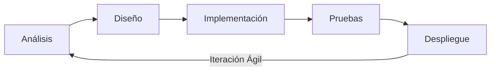

- [1. Fundamentos de la Programación](#1-fundamentos-de-la-programación)
  - [1.1. ¿Qué es Programar?](#11-qué-es-programar)
  - [1.2. Algoritmos](#12-algoritmos)
    - [1.2.1. Características Esenciales](#121-características-esenciales)
    - [1.2.2. Diferencia entre Algoritmo y Programa](#122-diferencia-entre-algoritmo-y-programa)

# 1. Fundamentos de la Programación

## 1.1. ¿Qué es Programar?

**Programar** es el proceso de crear software. Esta disciplina abarca desde la concepción inicial de una idea hasta que el programa está implementado y funcionando en un ordenador, enfocándose en los principios y metodologías para el desarrollo y mantenimiento de sistemas de software. Algunos autores consideran que el término "desarrollo de software" es más apropiado que "ingeniería de software".

**Definición de Programa Software**
Un **programa software** es la parte intangible o lógica de un sistema informático, un conjunto de programas que actúan sobre el hardware para ejecutar las tareas deseadas por el usuario. Los programas son métodos para resolver problemas, procesando información para obtener un resultado a partir de datos de entrada. Para que un programa comience a funcionar, sus instrucciones deben ser traducidas a un lenguaje que la máquina entienda.

**El Proceso de Desarrollo de Software**
El desarrollo de software implica una serie de etapas obligatorias para construir software fiable y de calidad. Estas fases se dividen en tres pasos genéricos: definición (qué desarrollar), desarrollo, y mantenimiento.
Las fases principales del desarrollo de una aplicación informática son:
*   **Fase de Resolución del Problema**:
    *   **Análisis**: Requiere que el problema sea definido y comprendido claramente. Se establecen los objetivos, el alcance y se realiza un estudio de viabilidad y costes. Se identifican los requisitos funcionales (qué funciones realizará la aplicación) y no funcionales (características de calidad del sistema). También implica analizar la documentación, investigar y recopilar información útil. La culminación es el Documento de Especificación de Requisitos del Software (ERS), que actúa como contrato entre cliente y desarrollador.
    *   **Diseño**: Se define "cómo" hacer la solución. Se convierte la especificación del análisis en un diseño detallado, indicando el comportamiento o la secuencia lógica de instrucciones que resuelvan el problema. Se descompone la aplicación en operaciones más sencillas y se asignan a módulos. Incluye el diseño arquitectónico, diseño detallado, diseño de datos y de interfaz de usuario. Es crucial realizar una **prueba o traza del programa** para asegurar la solución antes de la implementación.
*   **Fase de Implementación**:
    *   **Codificación o Construcción**: Consiste en transformar o traducir los resultados obtenidos a un determinado lenguaje de programación. Se escribe el **código fuente** siguiendo las reglas gramaticales y la sintaxis del lenguaje. El código debe ser modular, correcto, legible, eficiente y portable.
    *   **Pruebas de Ejecución y Validación**: Se implanta la aplicación en el sistema y se verifica su funcionamiento. Se utilizan diferentes datos de prueba para ver si el programa responde a los requerimientos. Incluye pruebas unitarias, de integración, funcionales, estructurales y beta testing.
    *   **Documentación**: Es vital para el desarrollo y mantenimiento. Se distinguen la **documentación interna** (comentarios en el código fuente) y **documentación externa** (manuales técnicos, de usuario, de instalación, diagramas).
*   **Fase de Explotación y Mantenimiento**:
    *   **Explotación (Despliegue)**: Los usuarios finales utilizan la aplicación. Implica instalación, puesta a punto y funcionamiento en el equipo del cliente.
    *   **Mantenimiento**: Periódicamente, se realizan evaluaciones y modificaciones para adaptar el programa a nuevas necesidades, corregir errores o actualizarlo.
    *   **Retirada del Software**: Ocurre cuando el software llega al final de su vida útil y no es rentable mantenerlo.

A lo largo de todo el proceso de desarrollo de software, se debe aplicar siempre un **modelo de ciclo de vida**. Estos modelos son la serie de pasos a seguir para desarrollar un programa.

**Nota sobre Metodologías Actuales**:
Históricamente se usó el modelo en **Cascada** (fases lineales y rígidas). Sin embargo, en la industria DAW actual, predominan las **Metodologías Ágiles** (como Scrum), donde las fases se repiten en ciclos cortos o iteraciones, permitiendo entregas rápidas y adaptación al cambio.

## 1.2. Algoritmos

**Concepto de Algoritmo y sus Características**
Un **algoritmo** es una serie de pasos claros y ordenados que te permiten resolver un problema específico. No es un programa de computadora en sí mismo, sino la **idea** detrás del programa. Piensa en él como una receta de cocina: sin importar si la preparas en una estufa de gas, eléctrica o de leña, el resultado es el mismo porque la receta (el algoritmo) es independiente de la herramienta. Un algoritmo te dice **qué hacer** y en qué **orden**, sin importar la máquina o el lenguaje de programación.

### 1.2.1. Características Esenciales

Para que un algoritmo sea considerado de calidad, debe cumplir con las siguientes características:

* **Finito**: Siempre debe terminar en un número limitado de pasos. No puede ser un proceso infinito.
* **Preciso**: Cada paso debe ser claro y no dar lugar a ambigüedades.
* **Definido**: Si usas los mismos datos de entrada, el algoritmo siempre debe producir el mismo resultado.
* **Eficiente**: Debe utilizar la menor cantidad de recursos (tiempo y memoria) posible.
* **General**: Debe servir para resolver una clase de problemas, no solo un caso particular.
* **Correcto**: Debe resolver el problema para el cual fue diseñado.

Además de estas características fundamentales, un buen algoritmo debe ser **comprensible**, **modificable** y **reutilizable**, lo que facilita su uso y mantenimiento a lo largo del tiempo. Para lograrlo, es crucial que esté bien **estructurado** y **documentado** con comentarios. Finalmente, todo algoritmo debe ser **probado** para asegurar que funciona correctamente en todos los casos posibles.

**Reglas para el Diseño de Algoritmos (Abstracción, Modularidad)**
Para diseñar soluciones correctas y eficientes, se deben considerar los siguientes conceptos:
1.  **Abstracción**: Realizar un análisis del problema para descomponerlo en problemas más pequeños y de menor complejidad, describiendo cada uno de manera precisa.
2.  **Divide y vencerás**: Una filosofía general para resolver problemas, central en el enfoque de abstracción y modularidad.
3.  **Encapsulación**: Ocultar la información para poder implementarla de diferentes maneras sin que esto influya en el resto de elementos.
4.  **Modularidad**: Estructurar cada parte en módulos independientes, donde cada uno tendrá su función correspondiente. El diseño modular (top-down design) descompone un problema en subproblemas más sencillos.

Para representar los algoritmos gráficamente, se pueden usar herramientas como **diagramas de flujo** (que usan símbolos gráficos y se utilizan en fases de análisis) y **pseudocódigo** (basado en palabras clave en lenguaje natural y es la técnica más utilizada).

### 1.2.2. Diferencia entre Algoritmo y Programa
La **diferencia fundamental entre algoritmo y programa** radica en que el algoritmo es una descripción de los pasos para resolver un problema de forma genérica e independiente de la máquina y del lenguaje de programación. En cambio, el **programa** consiste en esos mismos pasos, pero escritos en un lenguaje de programación específico para que puedan ser ejecutados en un ordenador y obtener la solución. Los lenguajes de programación son solo un medio para expresar el algoritmo, y el ordenador es el procesador para ejecutarlo.

**Tabla 1: Comparación entre Algoritmo y Programa**

| Característica           | Algoritmo                                                     | Programa                                                 |
| :----------------------- | :------------------------------------------------------------ | :------------------------------------------------------- |
| **Nivel de Abstracción** | Genérico, independiente de la máquina y el lenguaje.          | Específico, escrito en un lenguaje de programación.      |
| **Formato**              | Secuencia de pasos lógicos, pseudocódigo, diagramas de flujo. | Código fuente, instrucciones en un lenguaje concreto.    |
| **Ejecución**            | No ejecutable directamente por una máquina.                   | Ejecutable por un ordenador después de ser traducido.    |
| **Objetivo**             | Describir la solución a un problema.                          | Implementar la solución para que una máquina la ejecute. |
