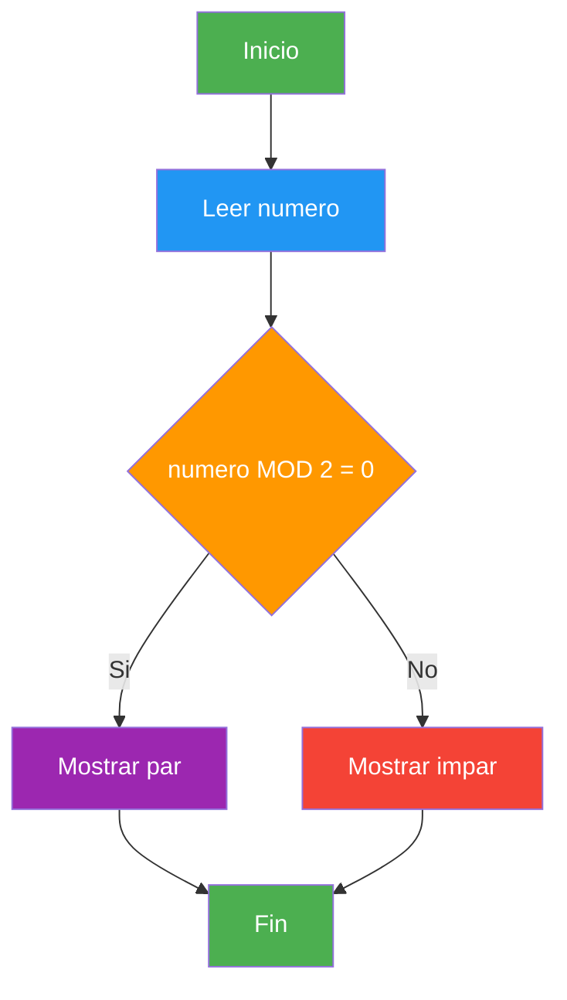
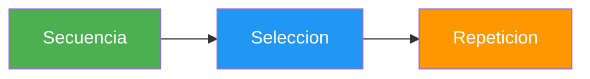

- [1. Qué es la Programación](#1-qué-es-la-programación)
  - [1.1. Definición y conceptos básicos](#11-definición-y-conceptos-básicos)
  - [1.2. Algoritmos](#12-algoritmos)
    - [1.2.1. Características de un algoritmo](#121-características-de-un-algoritmo)
    - [1.2.2. Ejemplo cotidiano: Preparar un café](#122-ejemplo-cotidiano-preparar-un-café)
    - [1.2.3. Representación de algoritmos](#123-representación-de-algoritmos)
  - [1.3. Paradigmas de programación](#13-paradigmas-de-programación)
    - [1.3.1. Imperativo](#131-imperativo)
    - [1.3.2. Estructurado](#132-estructurado)
    - [1.3.3. Modular](#133-modular)
    - [1.3.4. Orientado a objetos (POO)](#134-orientado-a-objetos-poo)
    - [1.3.5. Funcional](#135-funcional)
    - [1.3.6. Declarativo](#136-declarativo)
    - [1.3.7. Basado en eventos](#137-basado-en-eventos)
  - [1.4. Lenguajes de programación](#14-lenguajes-de-programación)
  - [1.5. Diferencia entre algoritmo y programa](#15-diferencia-entre-algoritmo-y-programa)
  - [1.6. Resumen](#16-resumen)


# 1. Qué es la Programación

> 💡 **Punto de partida:** ¿Alguna vez has pensado cómo funciona Netflix cuando te recomienda una serie, o cómo Instagram decide qué posts ves primero? Todo eso es programación. Pero, ¿qué es exactamente programar?

En este tema aprenderás qué es la programación, qué son los algoritmos y cómo se organizan los programas en paradigmas diferentes.

**Objetivos de aprendizaje:**

- Definir qué es la programación y por qué es importante
- Comprender qué es un algoritmo, sus características y cómo se representa
- Conocer los principales paradigmas de programación
- Entender por qué C# es el lenguaje que usaremos

## 1.1. Definición y conceptos básicos

**Programar** es escribir instrucciones que un ordenador pueda entender y ejecutar para resolver un problema o realizar una tarea.

> 💡 **Analogía:** Programar es como escribir las instrucciones de un GPS. Le dices al ordenador: "ve hasta aquí, gira a la derecha, para cuando veas aquello". La diferencia es que el ordenador es muy literal — no admite ambigüedades.

Un **programa informático** es un conjunto de instrucciones escritas en un lenguaje de programación que el ordenador puede ejecutar. Desde una app móvil hasta el sistema operativo de tu ordenador, todo es un programa.

```csharp
// Tu primer programa en C# 14 (Top-Level Statements)
Console.WriteLine("¡Hola, mundo!");
Console.WriteLine("Estoy aprendiendo a programar");
```

| Concepto | Definición | Ejemplo |
|----------|------------|---------|
| **Programa** | Conjunto de instrucciones que ejecuta el ordenador | Calculadora, navegador, videojuego |
| **Algoritmo** | Secuencia ordenada de pasos para resolver un problema | Receta de cocina, plan de estudios |
| **Lenguaje de programación** | Sistema de signos y reglas para escribir programas | C#, Python, Java, JavaScript |

📌 **Ejemplo real:** Cuando abres Spotify y le dices "reproduce mi lista de favoritos", el programa ejecuta un algoritmo que: busca tu lista → verifica tus permisos → conecta con el servidor → descarga el audio → lo reproduce en tu dispositivo. Todo eso en menos de un segundo.

## 1.2. Un algoritmo

Un **algoritmo** es una secuencia finita, ordenada y definida de pasos o instrucciones que permiten resolver un problema o realizar una tarea específica. Es el "plan" antes de programar.

### 1.2.1. Características de un algoritmo

Todo algoritmo debe cumplir **6 características fundamentales**:

| Característica | Descripción | Ejemplo con el café |
|----------------|-------------|---------------------|
| **Finito** | Debe terminar en algún momento (no puede ser infinito) | El café se acaba de preparar, no dura eternamente |
| **Definido** | Cada paso es claro y sin ambigüedades | "Pon 2 cucharadas de café" no es "pone más o menos café" |
| **Preciso** | Los pasos están en un orden específico, no se pueden cambiar | No puedes servir el café antes de prepararlo |
| **Entrada** | Tiene datos de entrada (lo que le das al algoritmo) | El agua, el café, el azúcar, la taza |
| **Salida** | Produce un resultado (lo que obtienes) | Un café listo para beber |
| **Efectividad** | Cada paso es realizable con los recursos disponibles | No pides un ingrediente que no tienes |

> 💡 **Analogía:** Un algoritmo es como una receta de cocina. Sin importar si la preparas en una estufa de gas, eléctrica o de leña, el resultado es el mismo porque la receta (el algoritmo) es independiente de la herramienta.

### 1.2.2. Ejemplo cotidiano: Preparar un café

Veamos las 6 características aplicadas a algo que todos conocemos:

```
ALGORITMO: Preparar un café

ENTRADA (datos de entrada):
  - Agua
  - Café en polvo
  - Azúcar (opcional)
  - Taza limpia
  - Cucharita

PASOS:
  1. Llenar la cafetera con agua
  2. Verter café en el filtro (1 cucharada por taza)
  3. Encender la cafetera
  4. Esperar a que el agua hierva y pase por el filtro
  5. Cuando la cafetera deje de hacer ruido, apagarla
  6. Verter el café en la taza
  7. Añadir azúcar si se desea (y remover)
  8. Servir el café

SALIDA (resultado):
  - Un café listo para beber
```

> 📝 **Nota:** Fíjate que cada paso es **definido** (no dice "pon un poco de café", dice "1 cucharada por taza"). El algoritmo es **finito** (tiene 8 pasos, no infinitos). Es **preciso** (el orden importa: no puedes servir el café antes de prepararlo). Tiene **entrada** (los ingredientes) y **salida** (el café listo).

**Versión en pseudocódigo:**

```
INICIO
    LEER agua, cafe, taza
    LLENAR cafetera CON agua
    VERTER cafe EN filtro
    ENCENDER cafetera
    MIENTRAS cafetera NO haya terminado ESPERAR
    APAGAR cafetera
    VERTER cafe EN taza
    SI usuario Quiere azucar ENTONCES
        ANADIR azucar
        REMOVER
    FIN SI
    SERVIR cafe
FIN
```

**Versión en C#:**

```csharp
// Algoritmo: Preparar un café (simulación)
string cafe = "café";
string agua = "agua";
string taza = "taza";

Console.WriteLine($"Paso 1: Llenar la cafetera con {agua}");
Console.WriteLine($"Paso 2: Verter {cafe} en el filtro");
Console.WriteLine("Paso 3: Encender la cafetera");
Console.WriteLine("Paso 4: Esperar a que hierva...");
Console.WriteLine("Paso 5: Apagar la cafetera");
Console.WriteLine($"Paso 6: Verter el café en la {taza}");
Console.WriteLine("Paso 7: ¿Azúcar? Sí/No");
Console.WriteLine("Paso 8: Servir el café");
Console.WriteLine("¡Café listo!");
```

### 1.2.3. Representación de algoritmos

Los algoritmos se pueden representar de tres formas principales:

**1. Pseudocódigo:** Lenguaje natural estructurado

```
INICIO
    LEER numero
    SI numero MOD 2 = 0 ENTONCES
        ESCRIBIR El numero es par
    SINO
        ESCRIBIR El numero es impar
    FIN SI
FIN
```

**2. Diagrama de flujo:** Representación gráfica



**3. Lenguaje natural:** Descripción en español

> "Pido un número al usuario. Si el resto de dividirlo entre 2 es 0, muestro que es par. Si no, muestro que es impar."

> ⚠️ **Advertencia:** Antes de escribir una sola línea de código, siempre debemos diseñar el algoritmo. Es como hacer los planos antes de construir una casa. Los programadores novatos suelen querer escribir código directamente, pero eso suele llevar a problemas.

### Reglas para el diseño de algoritmos

Para diseñar buenos algoritmos se usan estas estrategias:

| Estrategia | Descripción | Ejemplo |
|------------|-------------|---------|
| **Abstracción** | Descomponer un problema complejo en problemas más pequeños | Un "portal web" se divide en:-login, perfil, búsqueda... |
| **Divide y vencerás** | Dividir el problema en partes independientes hasta que cada una sea fácil de resolver | Buscar un nombre en una agenda: mirar primero la inicial, luego la página, luego la línea |
| **Encapsulación** | Ocultar información compleja, solo mostrar lo necesario | Un coche tiene volante y pedales, pero no ves el motor ni la ECU |
| **Modularidad** | Descomponer en módulos independientes y reutilizables | Separar lógica de negocio, acceso a datos e interfaz de usuario |

### Características adicionales de algoritmos

Además de las 6 básicas, un buen algoritmo debe ser:

| Cualidad | Descripción |
|----------|-------------|
| **Correcto** | Produce la salida esperada para toda entrada válida |
| **Eficiente** | Usa la menor cantidad de recursos posibles (tiempo y memoria) |
| **General** | Resuelve el problema para un conjunto amplio de entradas, no solo un caso concreto |
| **Comprensible** | Fácil de entender por otros programadores |
| **Modificable** | Fácil de cambiar cuando los requisitos cambian |
| **Reutilizable** | Sirve para resolver problemas similares |
| **Estructurado** | Organizado de forma lógica y ordenada |

## 1.3. Paradigmas de programación

Un **paradigma de programación** es un estilo o forma de programar. No es un lenguaje, sino una forma de pensar y organizar el código. C# es **multiparadigma**, lo que significa que soporta varios paradigmas.

### Programación imperativa

El programador dice al ordenador **cómo** hacer las cosas, paso a paso. Es el paradigma más antiguo y básico. El código se ejecuta línea por línea, modificando el estado del programa.

> 💡 **Analogía:** Es como dar instrucciones de GPS: "ve recto, gira a la derecha, para en el semáforo". Le dices al ordenador el camino exacto a seguir.

```csharp
// Imperativo: le digo al ordenador CÓMO hacer cada paso
int[] numeros = { 3, 1, 4, 1, 5, 9 };
int suma = 0;

for (int i = 0; i < numeros.Length; i++)
{
    suma = suma + numeros[i];
}

Console.WriteLine($"La suma es: {suma}");  // 23
```

**Características:**
- El código se ejecuta secuencialmente (línea a línea)
- Se modifica el estado del programa (las variables cambian)
- Se especifica **cómo** hacer cada operación

### Programación estructurada

Es una evolución del imperativo. Introduce **estructuras de control** para organizar el código: secuencia, selección (if/switch) y repetición (while/for). Evita el uso de `goto` (saltos indiscriminados).

> 💡 **Analogía:** En vez de decir "anda hasta allá, luego vuelve, luego ve a la otra parte", organizas las instrucciones en bloques claros: "si necesitas esto, haz esto; si no, haz lo otro; repite esto 5 veces".

```csharp
// Estructurado: uso de if, for, while (sin goto)
int edad = 25;

// Selección
if (edad >= 18)
{
    Console.WriteLine("Eres mayor de edad");
}
else
{
    Console.WriteLine("Eres menor de edad");
}

// Repetición
for (int i = 1; i <= 5; i++)
{
    Console.WriteLine($"Iteración {i}");
}
```

**Estructuras de control:**

| Estructura | Tipo | Ejemplo C# |
|------------|------|------------|
| `if / else` | Selección | `if (x > 0) { } else { }` |
| `switch` | Selección múltiple | `switch (dia) { case 1: ... }` |
| `for` | Repetición contada | `for (int i=0; i<10; i++)` |
| `while` | Repetición condicional | `while (x > 0) { }` |
| `do-while` | Repetición (al menos una vez) | `do { } while (x > 0);` |

**Las 3 estructuras básicas:**



📌 **Ejemplo real:** Un cajero automático usa estructurado: "si el PIN es correcto → muestra opciones; si no → bloquea la tarjeta".

### Programación modular

Organiza el código en **módulos** o **funciones** reutilizables. Cada módulo hace una cosa concreta y bien hecha. Se concentra en **dividir el problema** en partes más pequeñas.

> 💡 **Analogía:** Es como armar un mueble de IKEA. Cada módulo (tornillo, tabla, junta) tiene una función específica. Juntos forman algo más grande. No tienes que fabricar cada pieza desde cero.

```csharp
// Modular: el código se divide en funciones reutilizables

// Función que calcula el IVA
double CalcularIva(double precio, double porcentaje)
{
    return precio * porcentaje / 100;
}

// Función que muestra un resumen
void MostrarResumen(string producto, double precio)
{
    double iva = CalcularIva(precio, 21);
    double total = precio + iva;
    Console.WriteLine($"{producto}: {precio}€ + {iva}€ IVA = {total}€");
}

// Uso
MostrarResumen("Portátil", 899.0);
MostrarResumen("Ratón", 25.0);
```

**Características:**
- Código reutilizable (una función se llama varias veces)
- Código más legible (funciones con nombres descriptivos)
- Mantenimiento más fácil (cambiar una función afecta a todas las llamadas)
- C# usa `using` para importar módulos externos

📌 **Ejemplo real:** Netflix usa módulos: uno para recomendaciones, otro para reproducción, otro para pagos. Si cambian el módulo de pagos, no se rompen las recomendaciones.

### Programación orientada a objetos (POO)

Organiza el código en **objetos** que contienen **datos** (atributos) y **comportamientos** (métodos). Es el paradigma principal de C#.

> 💡 **Analogía:** Un objeto es como una persona real. Tiene nombre, edad, color de pelo (atributos) y puede hablar, caminar, comer (métodos). Cada persona es una **instancia** de la clase "Persona".

**Los 4 pilares de la POO:**

| Pilar | Descripción | Ejemplo |
|-------|-------------|---------|
| **Encapsulamiento** | Ocultar los datos internos, solo mostrar lo necesario | Un coche tiene volante, pero no ves el motor |
| **Herencia** | Una clase hereda propiedades de otra | Un "Perro" hereda de "Animal" |
| **Polimorfismo** | Un mismo método se comporta diferente según el objeto | `hablar()` dice "guau" en Perro y "miau" en Gato |
| **Abstracción** | Mostrar solo lo esencial, ocultar la complejidad | Un móvil tiene botón de encender, no ves los circuitos |

```csharp
// POO: modelar una Persona
Persona ana = new Persona("Ana", 22);
Persona luis = new Persona("Luis", 20);

ana.Saludar();  // Hola, soy Ana y tengo 22 años
luis.Saludar(); // Hola, soy Luis y tengo 20 años
```

> 📝 **Nota:** En esta unidad empezaremos con programación procedural. Cuando avancemos, llegaremos a la POO, que es el paradigma principal de C#.

📌 **Ejemplo real:** Instagram modela cada usuario como un objeto (nombre, foto, seguidores), cada foto como un objeto (imagen, filtros, comentarios), y cada "like" como un evento.

### Programación funcional

Trata la programación como **evaluación de funciones matemáticas**. Evita cambiar el estado y los datos mutables. Las funciones son **puras**: mismos datos de entrada → siempre mismo resultado.

> 💡 **Analogía:** Es como una calculadora. Siempre que pulses 2+2, sale 4. No importa cuántas veces lo hagas, el resultado no cambia. No hay "estado" que recuerde cálculos anteriores.

```csharp
// Funcional: funciones puras, sin modificar estado

// Función pura (no modifica nada externo)
int Doble(int x) => x * 2;

// Uso de LINQ (paradigma funcional en C#)
int[] numeros = { 1, 2, 3, 4, 5, 6, 7, 8, 9, 10 };

var pares = numeros.Where(n => n % 2 == 0);          // Filtrar
var dobles = pares.Select(n => n * 2);                // Transformar
var suma = numeros.Aggregate((a, b) => a + b);        // Acumular

Console.WriteLine($"Pares: {string.Join(", ", pares)}");    // 2, 4, 6, 8, 10
Console.WriteLine($"Dobles: {string.Join(", ", dobles)}");  // 4, 8, 12, 16, 20
Console.WriteLine($"Suma: {suma}");                          // 55
```

**Características:**
- Funciones puras (sin efectos secundarios)
- Inmutabilidad (los datos no cambian, se crean nuevos)
- Funciones de orden superior (reciben o retornan funciones)
- En C# se usa con **LINQ**, lambdas y expresiones

📌 **Ejemplo real:** Netflix usa programación funcional para procesar millones de registros de visualización: filtrar→ordenar→transformar→agregar, todo sin modificar los datos originales.

### Programación declarativa

Se describe **qué** se quiere obtener, no **cómo** hacerlo. El ordenador figure el camino. SQL es el ejemplo más claro.

> 💡 **Analogía:** En vez de decir "abre el cajón, busca el libro tercero de la estantería, ábrelo en la página 50", dices "dame el libro que está en la página 50". No dices cómo llegar, solo qué quieres.

```csharp
// Imperativo (cómo hacerlo)
int[] numeros = { 5, 3, 8, 1, 9, 2, 7 };
int[] ordenados = new int[numeros.Length];
// ... algoritmo de ordenación paso a paso ...

// Declarativo (qué quiero, sin decir cómo)
int[] numeros2 = { 5, 3, 8, 1, 9, 2, 7 };
var ordenados2 = numeros2.OrderBy(n => n).ToArray();
// El ordenador sabe CÓMO ordenar
```

```sql
-- SQL es declarativo puro: dices QUÉ quieres, no CÓMO obtenerlo
SELECT nombre, edad FROM usuarios WHERE edad >= 18 ORDER BY nombre;
```

📌 **Ejemplo real:** Cuando buscas en Google, usas declarativo: escribes "restaurante italiano cerca de mí". No le dices a Google cómo recorrer su base de datos.

### Programación basada en eventos

El flujo del programa se controla por **eventos**: clics, pulsaciones de tecla, mensajes, etc. Es el paradigma de las interfaces gráficas y aplicaciones interactivas.

> 💡 **Analogía:** Es como un timbre. No haces nada hasta que alguien llama (evento). Cuando suena, ejecutas la acción correspondiente (abrir la puerta).

```csharp
// Eventos: el código responde a acciones del usuario
// (Ejemplo conceptual con consola)

Console.Write("Escribe algo: ");
string? texto = Console.ReadLine();

// El evento "ReadLine" se dispara cuando el usuario escribe
// El programa se queda esperando (como un timbre)
// Cuando el usuario pulsa Enter, se ejecuta el siguiente código

Console.WriteLine($"Escribiste: {texto}");
```

```csharp
// En una app real (WinForms/WPF/MAUI), los eventos se usan así:
button.Click += (sender, args) =>
{
    Console.WriteLine("Botón pulsado");
};
```

📌 **Ejemplo real:** Tu móvil es 100% basado en eventos. Haces clic en una app (evento), deslizas la pantalla (evento), recibes un mensaje (evento). Cada acción dispara una respuesta del programa.

### Tabla comparativa de paradigmas

| Paradigma | Pregunta clave | Ejemplo C# |
|-----------|---------------|------------|
| **Imperativo** | ¿Cómo lo hago? | `for`, `while` línea a línea |
| **Estructurado** | ¿Cómo lo organizo? | `if`, `switch`, `for`, `while` |
| **Modular** | ¿Cómo lo divido? | Funciones, `using` |
| **POO** | ¿Cómo lo modelo? | Clases, objetos, herencia |
| **Funcional** | ¿Qué función aplico? | LINQ, lambdas, `Select`, `Where` |
| **Declarativo** | ¿Qué quiero? | LINQ, SQL, expresiones |
| **Eventos** | ¿Qué pasa cuando...? | `Click +=`, `ReadLine`, `async` |

> 💡 **Analogía:** Los paradigmas son como herramientas de un taller. Un martillo (imperativo) es útil para clavar, pero no sirve para atornillar. Un desatornillador (POO) es genial para tornillos, pero no para clavar. Un buen programador conoce todas las herramientas y sabe cuándo usar cada una.

📌 **Ejemplo real:** C# es multiparadigma. Netflix usa programación reactiva (eventos) para notificaciones, funcional (LINQ) para procesar datos, POO para modelar usuarios, y estructurado para la lógica de negocio.

## 1.4. Lenguajes de programación

Un **lenguaje de programación** es el "idioma" que usamos para comunicarnos con el ordenador.

**¿Por qué C#?**

- Es el lenguaje principal del ecosistema **.NET** de Microsoft
- Es moderno, seguro y multipropósito
- Se usa en desarrollo web, móvil, escritorio, videojuegos y más
- Tiene una comunidad enorme y excelente documentación
- Es el lenguaje que usaremos todo el curso

### Elementos de un lenguaje de programación

| Elemento | Descripción | Ejemplo en C# |
|----------|-------------|---------------|
| **Léxico (Alfabeto)** | Símbolos permitidos | `+`, `-`, `*`, `/`, `=`, `;`, `{}`, `()` |
| **Sintaxis** | Reglas de construcción | `int numero = 10;` es válido, `int = 10 numero;` no |
| **Semántica** | Significado de las construcciones | `int x = "hola";` es sintácticamente válido pero semánticamente incorrecto |

```csharp
// Los tres componentes del lenguaje en acción
string nombre = "Ana";    // ✅ Válido (sintaxis + semántica correctas)
// int edad = "Ana";      // ❌ Error semántico (no puedes poner texto en un número)
// string = "Ana" nombre; // ❌ Error de sintaxis (el orden no es correcto)
```

### Clasificación de lenguajes según su nivel de abstracción

| Nivel | Descripción | Ejemplo |
|-------|-------------|---------|
| **Bajo nivel** | Casi sin traducir, cercano al硬件 | Lenguaje máquina (binario), Ensamblador |
| **Medio nivel** | Acceso al hardware + abstracciones | C |
| **Alto nivel** | Cercano al lenguaje humano | C#, Python, Java, JavaScript |

### Clasificación según el mecanismo de traducción

| Tipo | Cómo funciona | Ejemplo |
|------|---------------|---------|
| **Compilado** | Se traduce todo el código antes de ejecutar (ejecutable) | C, C++, Go |
| **Interpretado** | Se traduce y ejecuta línea a línea | Python, JavaScript |
| **Mixto (Bytecode)** | Se compila a código intermedio, luego se ejecuta en una máquina virtual | C# (IL + CLR), Java (Bytecode + JVM) |
| **Transpilador** | Se traduce de un lenguaje de alto nivel a otro | TypeScript → JavaScript |

> 💡 **Analogía del traductor:** Un compilador es como traducir un libro entero del inglés al español antes de dárselo al lector. Un intérprete es como un traductor simultáneo que va traduciendo frase a frase mientras la otra persona habla.

**C# es mixto:** Se compila a IL (Intermediate Language) y la CLR (Common Language Runtime) lo ejecuta con JIT (Just-In-Time).

### Clasificación según el sistema de tipos

| Sistema | Descripción | Ejemplo |
|---------|-------------|---------|
| **Tipado estático** | El tipo se conoce en compilación | C#, Java |
| **Tipado dinámico** | El tipo se determina en ejecución | JavaScript, Python |
| **Tipado fuerte** | No permite conversiones automáticas entre tipos incompatibles | C#, Java |
| **Tipado débil** | Permite conversiones automáticas (puede dar resultados raros) | JavaScript, PHP |

> 🔧 **Truco nemotécnico:** **E**stático = **E**stable (el tipo no cambia). **D**inámico = **D**etermina en ejecución. **F**uerte = **F**allos tempranos (el compilador te avisa). **D**ébil = **D**ejas pasar errores.

```csharp
// C# es tipado estático y fuerte
int x = 42;
// x = "hola";  // ❌ Error de compilación: no puede cambiar de tipo

// JavaScript es tipado dinámico y débil
let y = 42;
y = "hola";    // ✅ Funciona (pero puede dar problemas)
```

## 1.5. Diferencia entre algoritmo y programa

| Característica | Algoritmo | Programa |
|---------------|-----------|----------|
| **Nivel de abstracción** | Genérico, independiente de la máquina | Específico, en un lenguaje concreto |
| **Formato** | Secuencia de pasos lógicos, pseudocódigo | Código fuente, instrucciones ejecutables |
| **Ejecución** | No ejecutable directamente | Ejecutable por un ordenador |
| **Objetivo** | Describir la solución | Implementar la solución |
| **Fases** | Diseño (antes de programar) | Codificación (programar) |

> 💡 **Analogía:** El algoritmo es el plano de una casa. El programa es la casa construida. Puedes tener un plano perfecto pero construir mal la casa, o construir una casa sin plano (que probablemente se caiga).

## 1.6. Resumen

| Concepto | Definición |
|----------|------------|
| **Programar** | Escribir instrucciones para el ordenador |
| **Algoritmo** | Plan ordenado para resolver un problema |
| **Características** | Finito, definido, preciso, entrada, salida, efectividad |
| **Paradigma** | Estilo de programación (imperativo, POO, funcional...) |
| **Lenguaje** | Sistema de signos para escribir programas |
| **Léxico** | Símbolos permitidos del lenguaje |
| **Sintaxis** | Reglas de construcción |
| **Semántica** | Signado de las construcciones |

> 💡 **Consejo para el examen:** Recuerda las 6 características de un algoritmo con el ejemplo del café. Sabe explicar la diferencia entre algoritmo y programa, y los tres componentes de un lenguaje (léxico, sintaxis, semántica).
