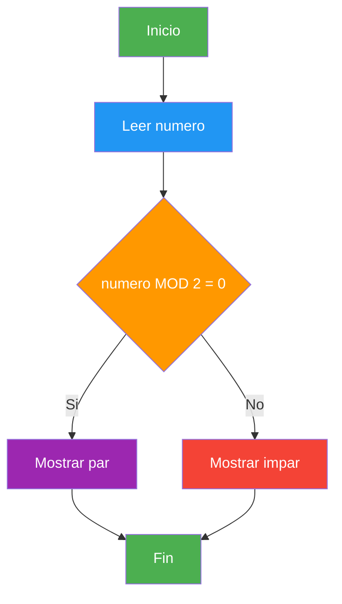

- [1. Qué es la Programación](#1-qué-es-la-programación)
  - [1.1. Definición y conceptos básicos](#11-definición-y-conceptos-básicos)
  - [1.2. Algoritmos](#12-algoritmos)
    - [1.2.1. Características de un algoritmo](#121-características-de-un-algoritmo)
    - [1.2.2. Ejemplo cotidiano: Preparar un café](#122-ejemplo-cotidiano-preparar-un-café)
    - [1.2.3. Representación de algoritmos](#123-representación-de-algoritmos)
  - [1.3. Paradigmas de programación](#13-paradigmas-de-programación)
  - [1.4. Lenguajes de programación](#14-lenguajes-de-programación)
  - [1.5. Diferencia entre algoritmo y programa](#15-diferencia-entre-algoritmo-y-programa)
  - [1.6. Resumen](#16-resumen)


# 1. Qué es la Programación

> 💡 **Punto de partida:** ¿Alguna vez has pensado cómo funciona Netflix cuando te recomienda una serie, o cómo Instagram decide qué posts ves primero? Todo eso es programación. Pero, ¿qué es exactamente programar?

En este tema aprenderás qué es la programación, qué son los algoritmos y cómo se organizan los programas en paradigmas diferentes.

**Objetivos de aprendizaje:**

- Definir qué es la programación y por qué es importante
- Comprender qué es un algoritmo, sus características y cómo se representa
- Conocer los principales paradigmas de programación
- Entender por qué C# es el lenguaje que usaremos

## 1.1. Definición y conceptos básicos

**Programar** es escribir instrucciones que un ordenador pueda entender y ejecutar para resolver un problema o realizar una tarea.

> 💡 **Analogía:** Programar es como escribir las instrucciones de un GPS. Le dices al ordenador: "ve hasta aquí, gira a la derecha, para cuando veas aquello". La diferencia es que el ordenador es muy literal — no admite ambigüedades.

Un **programa informático** es un conjunto de instrucciones escritas en un lenguaje de programación que el ordenador puede ejecutar. Desde una app móvil hasta el sistema operativo de tu ordenador, todo es un programa.

```csharp
// Tu primer programa en C# 14 (Top-Level Statements)
Console.WriteLine("¡Hola, mundo!");
Console.WriteLine("Estoy aprendiendo a programar");
```

| Concepto | Definición | Ejemplo |
|----------|------------|---------|
| **Programa** | Conjunto de instrucciones que ejecuta el ordenador | Calculadora, navegador, videojuego |
| **Algoritmo** | Secuencia ordenada de pasos para resolver un problema | Receta de cocina, plan de estudios |
| **Lenguaje de programación** | Sistema de signos y reglas para escribir programas | C#, Python, Java, JavaScript |

📌 **Ejemplo real:** Cuando abres Spotify y le dices "reproduce mi lista de favoritos", el programa ejecuta un algoritmo que: busca tu lista → verifica tus permisos → conecta con el servidor → descarga el audio → lo reproduce en tu dispositivo. Todo eso en menos de un segundo.

## 1.2. Un algoritmo

Un **algoritmo** es una secuencia finita, ordenada y definida de pasos o instrucciones que permiten resolver un problema o realizar una tarea específica. Es el "plan" antes de programar.

### 1.2.1. Características de un algoritmo

Todo algoritmo debe cumplir **6 características fundamentales**:

| Característica | Descripción | Ejemplo con el café |
|----------------|-------------|---------------------|
| **Finito** | Debe terminar en algún momento (no puede ser infinito) | El café se acaba de preparar, no dura eternamente |
| **Definido** | Cada paso es claro y sin ambigüedades | "Pon 2 cucharadas de café" no es "pone más o menos café" |
| **Preciso** | Los pasos están en un orden específico, no se pueden cambiar | No puedes servir el café antes de prepararlo |
| **Entrada** | Tiene datos de entrada (lo que le das al algoritmo) | El agua, el café, el azúcar, la taza |
| **Salida** | Produce un resultado (lo que obtienes) | Un café listo para beber |
| **Efectividad** | Cada paso es realizable con los recursos disponibles | No pides un ingrediente que no tienes |

> 💡 **Analogía:** Un algoritmo es como una receta de cocina. Sin importar si la preparas en una estufa de gas, eléctrica o de leña, el resultado es el mismo porque la receta (el algoritmo) es independiente de la herramienta.

### 1.2.2. Ejemplo cotidiano: Preparar un café

Veamos las 6 características aplicadas a algo que todos conocemos:

```
ALGORITMO: Preparar un café

ENTRADA (datos de entrada):
  - Agua
  - Café en polvo
  - Azúcar (opcional)
  - Taza limpia
  - Cucharita

PASOS:
  1. Llenar la cafetera con agua
  2. Verter café en el filtro (1 cucharada por taza)
  3. Encender la cafetera
  4. Esperar a que el agua hierva y pase por el filtro
  5. Cuando la cafetera deje de hacer ruido, apagarla
  6. Verter el café en la taza
  7. Añadir azúcar si se desea (y remover)
  8. Servir el café

SALIDA (resultado):
  - Un café listo para beber
```

> 📝 **Nota:** Fíjate que cada paso es **definido** (no dice "pon un poco de café", dice "1 cucharada por taza"). El algoritmo es **finito** (tiene 8 pasos, no infinitos). Es **preciso** (el orden importa: no puedes servir el café antes de prepararlo). Tiene **entrada** (los ingredientes) y **salida** (el café listo).

**Versión en pseudocódigo:**

```
INICIO
    LEER agua, cafe, taza
    LLENAR cafetera CON agua
    VERTER cafe EN filtro
    ENCENDER cafetera
    MIENTRAS cafetera NO haya terminado ESPERAR
    APAGAR cafetera
    VERTER cafe EN taza
    SI usuario Quiere azucar ENTONCES
        ANADIR azucar
        REMOVER
    FIN SI
    SERVIR cafe
FIN
```

**Versión en C#:**

```csharp
// Algoritmo: Preparar un café (simulación)
string cafe = "café";
string agua = "agua";
string taza = "taza";

Console.WriteLine($"Paso 1: Llenar la cafetera con {agua}");
Console.WriteLine($"Paso 2: Verter {cafe} en el filtro");
Console.WriteLine("Paso 3: Encender la cafetera");
Console.WriteLine("Paso 4: Esperar a que hierva...");
Console.WriteLine("Paso 5: Apagar la cafetera");
Console.WriteLine($"Paso 6: Verter el café en la {taza}");
Console.WriteLine("Paso 7: ¿Azúcar? Sí/No");
Console.WriteLine("Paso 8: Servir el café");
Console.WriteLine("¡Café listo!");
```

### 1.2.3. Representación de algoritmos

Los algoritmos se pueden representar de tres formas principales:

**1. Pseudocódigo:** Lenguaje natural estructurado

```
INICIO
    LEER numero
    SI numero MOD 2 = 0 ENTONCES
        ESCRIBIR El numero es par
    SINO
        ESCRIBIR El numero es impar
    FIN SI
FIN
```

**2. Diagrama de flujo:** Representación gráfica



**3. Lenguaje natural:** Descripción en español

> "Pido un número al usuario. Si el resto de dividirlo entre 2 es 0, muestro que es par. Si no, muestro que es impar."

> ⚠️ **Advertencia:** Antes de escribir una sola línea de código, siempre debemos diseñar el algoritmo. Es como hacer los planos antes de construir una casa. Los programadores novatos suelen querer escribir código directamente, pero eso suele llevar a problemas.

## 1.3. Paradigmas de programación

Un **paradigma de programación** es un estilo o forma de programar. No es un lenguaje, sino una forma de pensar y organizar el código.

### Programación imperativa/procedural

El programador dice al ordenador **cómo** hacer las cosas, paso a paso. Es como dar instrucciones de cocina.

```csharp
// Ejemplo imperativo: sumar una lista de números
int[] numeros = { 3, 1, 4, 1, 5, 9 };
int suma = 0;

for (int i = 0; i < numeros.Length; i++)
{
    suma = suma + numeros[i];
}

Console.WriteLine($"La suma es: {suma}");  // La suma es: 23
```

### Programación orientada a objetos (POO)

Se organiza el código en **objetos** que contienen datos (atributos) y comportamientos (métodos).

```csharp
// Ejemplo POO: modelar una persona
Persona persona = new Persona("Ana", 22);
persona.Saludar();  // Hola, soy Ana y tengo 22 años
```

> 📝 **Nota:** En esta unidad empezaremos con programación procedural. Cuando avancemos, llegaremos a la POO, que es el paradigma principal de C#.

### Tabla comparativa de paradigmas

| Paradigma | Descripción | Lenguaje ejemplo |
|-----------|-------------|------------------|
| **Imperativo/Procedural** | Paso a paso, cómo hacer las cosas | C, Pascal, BASIC |
| **Orientado a Objetos** | Objetos con atributos y métodos | C#, Java, Kotlin |
| **Funcional** | Funciones puras, sin estado mutable | Haskell, F#, Scala |
| **Lógico** | Reglas lógicas y deducción | Prolog |
| **Multiparadigma** | Combina varios paradigmas | C#, Python, JavaScript |

> 💡 **Analogía:** Los paradigmas son como estilos de cocina. La cocina tradicional es como la programación procedural: haces todo paso a paso. La cocina molecular es como la programación funcional: transformas ingredientes en algo completamente nuevo. Ninguno es mejor o peor; cada uno sirve para situaciones diferentes.

📌 **Ejemplo real:** Netflix usa programación reactiva para mostrarte notificaciones en tiempo real, programación funcional para procesar millones de registros de usuarios, y POO para modelar cada película, serie y usuario como objetos.

## 1.4. Lenguajes de programación

Un **lenguaje de programación** es el "idioma" que usamos para comunicarnos con el ordenador.

**¿Por qué C#?**

- Es el lenguaje principal del ecosistema **.NET** de Microsoft
- Es moderno, seguro y multipropósito
- Se usa en desarrollo web, móvil, escritorio, videojuegos y más
- Tiene una comunidad enorme y excelente documentación
- Es el lenguaje que usaremos todo el curso

**Elementos de un lenguaje de programación:**

| Elemento | Descripción | Ejemplo en C# |
|----------|-------------|---------------|
| **Léxico (Alfabeto)** | Símbolos permitidos | `+`, `-`, `*`, `/`, `=`, `;`, `{}`, `()` |
| **Sintaxis** | Reglas de construcción | `int numero = 10;` es válido, `int = 10 numero;` no |
| **Semántica** | Significado de las construcciones | `int x = "hola";` es sintácticamente válido pero semánticamente incorrecto |

```csharp
// Los tres componentes del lenguaje en acción
// Léxico: las palabras y símbolos que usamos
// Sintaxis: el orden en que los ponemos
// Semántica: lo que el código significa

string nombre = "Ana";    // ✅ Válido (sintaxis + semántica correctas)
// int edad = "Ana";      // ❌ Error semántico (no puedes poner texto en un número)
// string = "Ana" nombre; // ❌ Error de sintaxis (el orden no es correcto)
```

## 1.5. Diferencia entre algoritmo y programa

| Característica | Algoritmo | Programa |
|---------------|-----------|----------|
| **Nivel de abstracción** | Genérico, independiente de la máquina | Específico, en un lenguaje concreto |
| **Formato** | Secuencia de pasos lógicos, pseudocódigo | Código fuente, instrucciones ejecutables |
| **Ejecución** | No ejecutable directamente | Ejecutable por un ordenador |
| **Objetivo** | Describir la solución | Implementar la solución |
| **Fases** | Diseño (antes de programar) | Codificación (programar) |

> 💡 **Analogía:** El algoritmo es el plano de una casa. El programa es la casa construida. Puedes tener un plano perfecto pero construir mal la casa, o construir una casa sin plano (que probablemente se caiga).

## 1.6. Resumen

| Concepto | Definición |
|----------|------------|
| **Programar** | Escribir instrucciones para el ordenador |
| **Algoritmo** | Plan ordenado para resolver un problema |
| **Características** | Finito, definido, preciso, entrada, salida, efectividad |
| **Paradigma** | Estilo de programación (imperativo, POO, funcional...) |
| **Lenguaje** | Sistema de signos para escribir programas |
| **Léxico** | Símbolos permitidos del lenguaje |
| **Sintaxis** | Reglas de construcción |
| **Semántica** | Signado de las construcciones |

> 💡 **Consejo para el examen:** Recuerda las 6 características de un algoritmo con el ejemplo del café. Sabe explicar la diferencia entre algoritmo y programa, y los tres componentes de un lenguaje (léxico, sintaxis, semántica).
