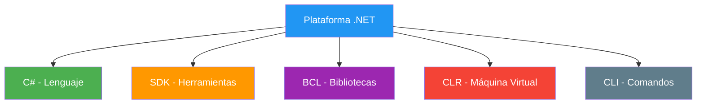

- [2. El Entorno .NET](#2-el-entorno-net)
  - [2.1. ¿Qué es .NET?](#21-qué-es-net)
  - [2.2. Instalación y verificación](#22-instalación-y-verificación)
  - [2.3. La línea de comandos (CLI)](#23-la-línea-de-comandos-cli)
  - [2.4. Scripting en C# 14](#24-scripting-en-c-14)
  - [2.5. NuGet: gestor de paquetes](#25-nuget-gestor-de-paquetes)
  - [2.6. IDEs: Rider y VS Code](#26-ideas-rider-y-vs-code)
  - [2.7. Resumen](#27-resumen)


# 2. El Entorno .NET

> 💡 **Punto de partida:** Para programar necesitas una "cocina" donde preparar tu código. En nuestro caso, esa cocina es la plataforma .NET. Sin configurar el entorno, no puedes empezar a cocinar.

En este tema aprenderás a configurar tu entorno de desarrollo con .NET, a usar la línea de comandos, a instalar paquetes con NuGet y a escribir scripts de C# sin necesidad de crear un proyecto completo.

**Objetivos de aprendizaje:**

- Entender qué es la plataforma .NET y sus componentes
- Verificar la instalación del SDK
- Usar los comandos básicos de la CLI de .NET
- Escribir scripts de C# 14 con `dotnet run`
- Configurar NuGet y entender qué es un paquete

## 2.1. ¿Qué es .NET?

**.NET** es la plataforma de desarrollo de Microsoft. No es solo un lenguaje, sino un ecosistema completo que incluye:

- **C#:** El lenguaje de programación
- **SDK (Software Development Kit):** Herramientas para compilar y ejecutar
- **Biblioteca de clases (BCL):** Miles de funciones ya hechas que puedes usar
- **CLR (Common Language Runtime):** La máquina virtual que ejecuta tu código
- **CLI (Command Line Interface):** Herramientas de línea de comandos



**¿Cómo funciona?**

Cuando escribes código en C#, el proceso es:

1. **Tú escribes** código fuente (`.cs`)
2. **El compilador (Roslyn)** traduce a código intermedio (IL)
3. **La CLR** ejecuta el código en tu máquina

> 💡 **Analogía:** .NET es como un restaurante completo. C# es el idioma en que escribes las recetas. El SDK son las herramientas de cocina. La BCL es la despensa con ingredientes ya preparados. La CLR es el chef que ejecuta las recetas.

**Versiones actuales:**

| Versión | Estado | LangVersion |
|---------|--------|-------------|
| .NET 10 | Actual (2025) | C# 14 |
| .NET 11 | Preview (2026) | C# 15 |

## 2.2. Instalación y verificación

Para trabajar con .NET necesitas instalar el **SDK** (no solo el runtime). El SDK incluye todo lo necesario para desarrollar.

**Paso 1: Descargar el SDK**

Ve a [https://dotnet.microsoft.com/download](https://dotnet.microsoft.com/download) y descarga la versión LTS o Actual.

**Paso 2: Verificar la instalación**

Abre una terminal (PowerShell, Terminal o CMD) y ejecuta:

```bash
dotnet --version
```

Debería mostrar algo como:

```
10.0.100
```

**Paso 3: Verificar el SDK completo**

```bash
dotnet --list-sdks
```

Esto muestra todos los SDKs instalados en tu máquina.

```bash
dotnet --list-runtimes
```

Esto muestra los runtimes (ejecutores) disponibles.

> ⚠️ **Advertencia:** Si el comando `dotnet` no se reconoce, necesitas reiniciar la terminal o añadir el SDK al PATH del sistema.

## 2.3. La línea de comandos (CLI)

La CLI de .NET te permite crear, compilar y ejecutar proyectos desde la terminal. Es fundamental conocer estos comandos:

### Comandos esenciales

| Comando | Descripción | Ejemplo |
|---------|-------------|---------|
| `dotnet new` | Crea un nuevo proyecto | `dotnet new console` |
| `dotnet build` | Compila el proyecto | `dotnet build` |
| `dotnet run` | Compila y ejecuta | `dotnet run` |
| `dotnet restore` | Restaura paquetes NuGet | `dotnet restore` |
| `dotnet clean` | Limpia archivos de compilación | `dotnet clean` |
| `dotnet sln` | Gestiona soluciones | `dotnet sln add` |

### Crear un proyecto paso a paso

```bash
# 1. Crear una carpeta para tu proyecto
mkdir MiPrimerProyecto
cd MiPrimerProyecto

# 2. Crear un proyecto de consola
dotnet new console

# 3. Ver los archivos creados
dir

# 4. Compilar
dotnet build

# 5. Ejecutar
dotnet run
```

> 💡 **Consejo:** El comando `dotnet new console` crea un proyecto con la estructura básica: un archivo `.csproj` (configuración del proyecto) y un `Program.cs` (tu código).

### Listar plantillas disponibles

```bash
dotnet new list
```

Esto muestra todas las plantillas que puedes usar: `console`, `webapi`, `classlib`, `xunit`, etc.

## 2.4. Scripting en C# 14

Una de las novedades de C# 14 y .NET 10 es la posibilidad de ejecutar código C# como un script, sin necesidad de crear un proyecto completo. Solo necesitas un archivo `.cs`.

### Crear y ejecutar un script

```bash
# 1. Crear un archivo .cs
echo Console.WriteLine("¡Hola desde un script!") > hola.cs

# 2. Ejecutarlo directamente
dotnet run hola.cs
```

**¿Qué ocurre por debajo?**

El comando `dotnet run` crea un proyecto temporal en una carpeta de caché, restaura paquetes, compila en segundo plano y ejecuta el resultado. Tú no ves nada de esto — solo ejecutas el script.

### Usar paquetes NuGet en scripts

Puedes importar paquetes con la directiva `#:package`:

```csharp
#:package Newtonsoft.Json@13.0.3

using Newtonsoft.Json;

var persona = new { Nombre = "Ana", Edad = 22 };
string json = JsonConvert.SerializeObject(persona);
Console.WriteLine(json);
```

### Usar SDKs en scripts

Si necesitas un SDK completo (como el web SDK para APIs mínimas):

```csharp
#:sdk Microsoft.NET.Sdk.Web

var app = WebApplication.Create(args);
app.MapGet("/", () => "¡Hola desde una API mínima!");
app.Run();
```

> 📝 **Nota:** El scripting es ideal para prototipos rápidos, probar ideas o automatizar tareas. Para proyectos reales, siempre usaremos la estructura completa con soluciones y proyectos.

📌 **Ejemplo real:** Imagina que necesitas convertir un CSV a JSON. En vez de crear un proyecto completo, puedes hacer un script de 10 líneas que lo haga en segundos.

## 2.5. NuGet: gestor de paquetes

**NuGet** es el gestor de paquetes de .NET. Es como una "tienda de aplicaciones" donde encuentras bibliotecas hechas por otros programadores que puedes usar en tus proyectos.

**¿Qué es un paquete?**

Un paquete es un conjunto de código reutilizable: bibliotecas, herramientas, frameworks. Por ejemplo:
- `Newtonsoft.Json` — para trabajar con JSON
- `Microsoft.EntityFrameworkCore` — para bases de datos
- `Serilog` — para registrar eventos (logs)

### Configuración de NuGet

El archivo de configuración de NuGet se encuentra en:

```
C:\Users\TU_USUARIO\AppData\Roaming\NuGet\NuGet.Config
```

Su contenido típico es:

```xml
<?xml version="1.0" encoding="utf-8"?>
<configuration>
  <packageSources>
    <add key="nuget.org" value="https://api.nuget.org/v3/index.json" protocolVersion="3" />
  </packageSources>
</configuration>
```

> 📝 **Nota:** `nuget.org` es el repositorio oficial, similar a npm para JavaScript o pip para Python. Contiene más de 350.000 paquetes.

### Instalar un paquete

```bash
# Usando la CLI
dotnet add package Newtonsoft.Json

# Versión específica
dotnet add package Newtonsoft.Json --version 13.0.3

# Eliminar un paquete
dotnet remove package Newtonsoft.Json
```

### Buscar paquetes

Puedes buscar paquetes en [https://www.nuget.org](https://www.nuget.org) o desde la CLI:

```bash
dotnet package search "json"
```

> 💡 **Consejo:** Antes de instalar un paquete, verifica que esté activamente mantenido (revisa la fecha de última actualización y el número de descargas).

## 2.6. IDEs: Rider y VS Code

Un **IDE (Integrated Development Environment)** es la herramienta visual donde escribes, depuras y gest tu código.

### JetBrains Rider (recomendado)

- IDE completo de JetBrains para C# y .NET
- Depurador potente, autocompletado inteligente, refactoring automático
- Incluye todo lo necesario sin necesidad de instalar extensiones
- De pago, pero gratuito para estudiantes (con licencia educativa)

### Visual Studio Code (alternativa)

- Editor ligero y gratuito de Microsoft
- Con la extensión **C# Dev Kit** se convierte en un IDE completo
- Multiplataforma (Windows, macOS, Linux)
- Más ligero pero requiere configuración

> 💡 **Consejo:** Si puedes, usa Rider. Si prefieres algo gratuito, VS Code con la extensión C# Dev Kit es una excelente opción.

**Configuración mínima en VS Code:**

1. Instala VS Code
2. Instala la extensión **C# Dev Kit** (de Microsoft)
3. Instala la extensión **.NET Install Tool**

## 2.7. Resumen

| Componente | Descripción |
|------------|-------------|
| **.NET** | Plataforma de desarrollo de Microsoft |
| **SDK** | Herramientas para desarrollar (no confundir con runtime) |
| **CLI** | Línea de comandos (`dotnet new`, `dotnet run`, etc.) |
| **Scripting** | Ejecutar C# sin proyecto, solo con un `.cs` |
| **NuGet** | Gestor de paquetes (bibliotecas reutilizables) |
| **IDE** | Entorno visual (Rider recomendado, VS Code alternativa) |

> 💡 **Consejo para el examen:** Recuerda la diferencia entre SDK y runtime, y los comandos básicos de la CLI. También saber qué es NuGet y para qué sirve.
