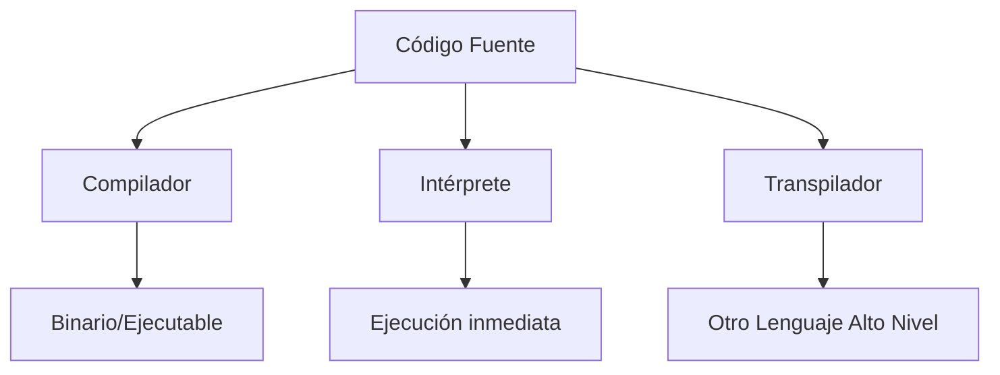
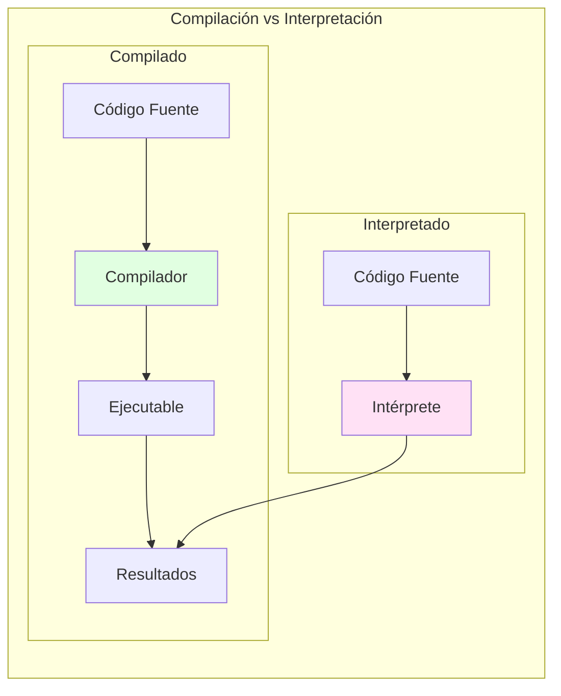

- [2. Lenguajes de Programación](#2-lenguajes-de-programación)
  - [2.1. Conceptos Fundamentales del Lenguaje](#21-conceptos-fundamentales-del-lenguaje)
  - [2.2. Paradigmas de Programación](#22-paradigmas-de-programación)
  - [2.3. Clasificación de Lenguajes de Programación](#23-clasificación-de-lenguajes-de-programación)
    - [2.3.1 Según su cercanía al lenguaje humano (Nivel de Abstracción)](#231-según-su-cercanía-al-lenguaje-humano-nivel-de-abstracción)
  - [2.3.2. Según su mecanismo de traducción (Compilados, Interpretados, Mixtos)](#232-según-su-mecanismo-de-traducción-compilados-interpretados-mixtos)
    - [2.3.3. Según su sistema de tipos (Rigidez, Momento de Verificación, Declaración, Sin Tipado)](#233-según-su-sistema-de-tipos-rigidez-momento-de-verificación-declaración-sin-tipado)
    - [2.3.4. Según Generaciones](#234-según-generaciones)


# 2. Lenguajes de Programación

## 2.1. Conceptos Fundamentales del Lenguaje

Un **lenguaje de programación** es un idioma artificial, un conjunto de reglas sintácticas y semánticas, símbolos y palabras especiales establecidas para la construcción de programas. Estos elementos permiten al programador escribir secuencias de comandos para que una máquina realice un comportamiento deseado.

Los elementos que componen un lenguaje de programación son:
*   **Léxico (Alfabeto)**: Es el conjunto finito de símbolos permitidos y palabras especiales, el vocabulario del lenguaje: letras, dígitos, operadores, signos de puntuación y palabras reservadas. Estos símbolos se combinan para formar los elementos básicos del lenguaje, como identificadores, literales y operadores. Ejemplos de léxico son: `+`, `-`, `*`, `/`, `=`, `;`, `{}`, `()`, `if`, `else`, `while`, `for`, `int`, `decimal`, `string`, `bool`, etc.
*   **Sintaxis**: Son las normas de construcción que rigen la estructura de las declaraciones y expresiones válidas en el lenguaje. Se refiere a las posibles combinaciones de los símbolos y palabras especiales. Define cómo se deben organizar los elementos léxicos para formar sentencias correctas. Por ejemplo, en muchos lenguajes, una sentencia de asignación debe seguir la estructura `identificador = expresión;`. La sintaxis es crucial para que el compilador o intérprete pueda entender y procesar el código correctamente. Ejemplo de una sentencia sintácticamente correcta: `int numero = 10;`.
*   **Semántica**: Es el significado de las construcciones y define las acciones que se llevarán a cabo con las combinaciones de los símbolos. Es importante tener en cuenta que pueden existir sentencias sintácticamente correctas, pero semánticamente incorrectas. Por ejemplo, la sentencia `int numero = "texto";` es sintácticamente correcta, pero semánticamente incorrecta porque intenta asignar un valor de tipo cadena a una variable de tipo entero. La semántica asegura que las operaciones y combinaciones de elementos tengan sentido dentro del contexto del lenguaje y el problema que se está resolviendo.

## 2.2. Paradigmas de Programación

Un **paradigma de programación** es un modelo fundamental o una filosofía para el diseño y la implementación de programas. Este modelo determina cómo será el proceso de diseño y la estructura final del código. Son como las "reglas del juego" que guían cómo se aborda la solución de un problema. El objetivo es reducir la dificultad para el mantenimiento, mejorar el rendimiento del programador y, en general, mejorar la productividad y calidad de los programas.

**Tipos de Paradigmas**
Existen diversos paradigmas, y muchos lenguajes modernos son multiparadigma, combinando características de varios para ofrecer flexibilidad (ej. Python, JavaScript, Java, Kotlin, C#).
*   **Programación Imperativa/Estructurada**: Se basa en una serie de comandos que la computadora ejecuta en orden para cambiar el estado del programa. Utiliza estructuras como sentencias secuenciales, selectivas (condicionales) y repetitivas (bucles). Ejemplos incluyen C y Pascal.
*   **Programación Procedimental**: Un subtipo del paradigma imperativo. Los programas se organizan en procedimientos (o funciones) que manipulan el estado global del programa, buscando la modularidad. Ejemplos incluyen C, Pascal y BASIC.
*   **Programación Orientada a Objetos (POO)**: Es el paradigma más utilizado. Los programas se construyen como una colección de **objetos** que interactúan entre sí. Un objeto es una instancia de una **clase** que contiene datos (atributos) y métodos para operar sobre ellos. La POO promueve la reutilización de código, depuración más sencilla y mejor mantenimiento, basándose en pilares como el polimorfismo, la herencia y la encapsulación. Ejemplos: C++, Python, Kotlin, C#. Java es un lenguaje totalmente orientado a objetos.
*   **Programación Declarativa**: Los programas describen el **resultado deseado**, no el proceso paso a paso para lograrlo. Suelen ser lenguajes interpretados.
    *   **Lógica**: Utiliza reglas y afirmaciones de lógica formal para que la computadora deduzca la respuesta, muy usada en inteligencia artificial. Ejemplo: Prolog.
    *   **Funcional**: Se enfoca en el uso de **funciones matemáticas** que no cambian el estado ni los datos externos, promoviendo código modular y estructurado. Ejemplos: Lisp, Haskell, Scala.
*   **Programación de Eventos**: El flujo del programa es impulsado por **eventos** (clics, movimientos del ratón, etc.). Común en interfaces gráficas de usuario (GUI) y servidores.
*   **Programación Reactiva**: Un subtipo de la programación de eventos que gestiona flujos de datos asincrónicos y la propagación de cambios, ideal para aplicaciones en tiempo real.
*   **Programación Multiparadigma**: Lenguajes que admiten y combinan múltiples paradigmas, permitiendo elegir el mejor enfoque para cada parte del problema. Ejemplos: C++, JavaScript, Python, Kotlin, C#.

## 2.3. Clasificación de Lenguajes de Programación

Los lenguajes de programación pueden ser clasificados en función de lo cerca que estén del lenguaje humano o del lenguaje de los computadores.

### 2.3.1 Según su cercanía al lenguaje humano (Nivel de Abstracción)
*   **Lenguajes de Bajo Nivel**: Totalmente dependientes de la máquina; un programa no puede migrarse a otras máquinas. Aprovechan al máximo las características del hardware.
    *   **Lenguaje Máquina**: Instrucciones en combinaciones de unos y ceros (código binario). Es el único lenguaje que el ordenador entiende directamente (no necesita traducción). Fue el primer lenguaje, único para cada procesador (no portable), rápido pero difícil de manejar y depurar.

        **Tabla 2: Operaciones en Lenguaje Máquina**
        | Operación | Lenguaje máquina | Decimal |
        | :-------- | :--------------- | :------ |
        | SUMAR     | 00101101         | 45      |
        | RESTAR    | 00010011         | 19      |
        | MOVER     | 00111010         | 58      |

    *   **Lenguaje Ensamblador**: Sustituyó al lenguaje máquina, utilizando mnemotécnicos (códigos de operación) en lugar de binarios. Necesita un programa ensamblador que lo traduzca a lenguaje máquina para ejecutarse. Aunque más legible, sigue siendo de bajo nivel, dependiente del hardware y difícil de usar, interpretar y modificar.

        **Tabla 3: Operaciones en Lenguaje Ensamblador**
        | Operación   | Mnemotécnico |
        | :---------- | :----------- |
        | MULTIPLICAR | MUL          |
        | DIVIDIR     | DIV          |
        | MOVER       | MOV          |

*   **Lenguajes de Medio Nivel**: Término no universalmente aceptado, se refiere a lenguajes como C que pueden acceder a registros del sistema y direcciones de memoria (características de bajo nivel) mientras realizan operaciones de alto nivel.
*   **Lenguajes de Alto Nivel**: Cercanos al lenguaje natural (inglés), independientes de la arquitectura del ordenador. Permiten al programador abstraerse del funcionamiento interno de la máquina. Utilizan sentencias y órdenes derivadas del idioma inglés. Necesitan un traductor para ser entendidos por la máquina. Incorporan librerías, funciones predeterminadas y suelen ofrecer *frameworks*. La mayoría de los lenguajes actuales se engloban aquí. Ejemplos: C++, Java, Python, JavaScript, PHP.

## 2.3.2. Según su mecanismo de traducción (Compilados, Interpretados, Mixtos)
Los programas se traducen a código binario ejecutable mediante compilación o interpretación.
*   **Lenguajes Compilados**: Necesitan un **compilador** que traduce el código fuente completo a código objeto (o código máquina) en un solo paso, antes de la ejecución. La ejecución es eficiente. Requieren un enlazador para unir el código objeto con librerías. El código es más seguro, ya que el código fuente no es directamente accesible. Ejemplos: C y C++.
    
    Un compilador realiza varias fases:
    1.  Análisis Léxico: Agrupa el código fuente en *tokens*.
    2.  Análisis Sintáctico: Comprueba la estructura gramatical y genera un árbol sintáctico.
    3.  Análisis Semántico: Verifica la lógica y compatibilidad de tipos.
    4.  Generación de Código Intermedio: Un código de bajo nivel independiente de la arquitectura.
    5.  Optimización de Código: Mejora el código para mayor eficiencia.
    6.  Generación de Código Objeto: Convierte el código a lenguaje máquina específico.
    7.  Enlazador (Linker): Une el código objeto con librerías.

*   **Lenguajes Interpretados**: No generan código objeto. Un **intérprete** lee y ejecuta el código fuente línea a línea, o instrucción por instrucción, en el momento. Son menos eficientes en ejecución que los compilados, ya que se traducen en tiempo de ejecución. Requieren que el intérprete esté cargado en memoria. El código fuente es legible, lo que puede comprometer la seguridad. Ejemplos: Perl, PHP, Python, JavaScript.
*   **Lenguajes Mixtos o Virtuales (Intermediarios)**: Combinan características de ambos. El código fuente se compila a un código binario intermedio (no ejecutable) llamado **bytecode**. Este bytecode es luego interpretado por una **máquina virtual** para ejecutarlo en cualquier plataforma compatible. Son más portables, buscando "compilar una vez y ejecutar en cualquier sistema". Java y C# son ejemplos clave de lenguajes mixtos.

*   **Transpiladores (Especial Web)**: En el desarrollo web (DAW), es muy común usar transpiladores. Un transpilador traduce código de un lenguaje de alto nivel a otro de alto nivel (por ejemplo, de **TypeScript** a **JavaScript**). Esto permite usar características modernas que luego se "traducen" a una versión que todos los navegadores entienden.




### 2.3.3. Según su sistema de tipos (Rigidez, Momento de Verificación, Declaración, Sin Tipado)
Un **tipo de dato** es una clasificación que define el conjunto de valores que una variable puede tomar y las operaciones válidas que se pueden realizar sobre esos valores. Esta clasificación es fundamental porque **determina la cantidad de memoria que el sistema operativo debe reservar** para la variable.

El **sistema de tipos** de un lenguaje de programación es un conjunto de reglas que definen cómo se manejan y verifican estos tipos de datos.

*   **Rigidez (Tipado Fuerte vs. Tipado Débil)**:
    *   **Tipado Fuerte**: Requiere que los tipos de datos sean compatibles para realizar operaciones, evitando conversiones automáticas o "implícitas" entre tipos no relacionados. Esto previene errores inesperados y hace el código más robusto. Ejemplos: Python, Java, C#, Ruby.
    *   **Tipado Débil**: Permite conversiones de tipo automáticas, lo que puede llevar a errores difíciles de detectar. Ejemplos: JavaScript, PHP, VBScript.
*   **Momento de Verificación (Tipado Estático vs. Tipado Dinámico)**:
    *   **Tipado Estático**: La verificación de tipos se realiza en **tiempo de compilación**. El tipo de cada variable debe ser conocido y, a menudo, declarado explícitamente antes de ejecutar el programa. Si hay un error de tipo, el programa no compilará. Garantiza mayor seguridad y rendimiento. Ejemplos: C++, Java, C#, Swift.
    *   **Tipado Dinámico**: La verificación de tipos se realiza en **tiempo de ejecución**. No es necesario declarar el tipo de una variable explícitamente; el intérprete lo determina automáticamente. Una misma variable puede cambiar de tipo durante la ejecución. Ofrece flexibilidad, pero los errores de tipo solo se descubren en ejecución. Ejemplos: Python, JavaScript, Ruby, PHP.
*   **Declaración (Tipado Explícito vs. Implícito - Inferencia)**:
    *   **Tipado Explícito**: El programador debe declarar manualmente el tipo de cada variable. Ejemplo en C++: `int numero = 10;`.
    *   **Tipado Implícito (Inferencia de Tipos)**: El compilador o intérprete deduce el tipo de la variable a partir del valor asignado, sin que el programador tenga que declararlo. Esto hace el código más conciso y rápido de escribir. Ejemplo en Python: `numero = 10;`.
*   **Lenguajes sin Tipado (Tipado Nulo)**: En lenguajes de muy bajo nivel, como el ensamblador, no existe un sistema de tipos formal. Las variables se manejan como secuencias de bits, y es responsabilidad del programador interpretar los datos.

**Tabla 4: Resumen de Sistemas de Tipado**
| Sistema de Tipado     | Descripción                                                       | Ejemplos de Lenguajes |
| :-------------------- | :---------------------------------------------------------------- | :-------------------- |
| **Estático y Fuerte** | Tipos verificados en compilación; no hay conversiones implícitas. | C++, Java, C#         |
| **Dinámico y Fuerte** | Tipos verificados en ejecución; no hay conversiones implícitas.   | Python, Ruby          |
| **Estático y Débil**  | Tipos verificados en compilación; sí hay conversiones implícitas. | C, VBScript (algunos) |
| **Dinámico y Débil**  | Tipos verificados en ejecución; sí hay conversiones implícitas.   | JavaScript, PHP       |

### 2.3.4. Según Generaciones
La evolución de los lenguajes de programación se puede dividir en 5 etapas o generaciones:
*   **Primera Generación**: Lenguaje máquina.
*   **Segunda Generación**: Creación de los primeros lenguajes ensambladores.
*   **Tercera Generación**: Creación de los primeros lenguajes de alto nivel (C, Pascal, Cobol).
*   **Cuarta Generación**: Lenguajes capaces de generar código por sí solos (RAD), con los cuales se pueden realizar aplicaciones sin ser experto. Incluyen lenguajes orientados a objetos, permitiendo la reutilización de código. Suelen tener acceso a bases de datos, capacidades gráficas y generación de código automática. Ej. Visual Studio, IntelliJ.
*   **Quinta Generación**: Lenguajes orientados a la inteligencia artificial (LISP).

> 📝 **Truco del Examinador:** Pregunta típica: "¿Qué diferencia hay entre compilador e intérprete?"
> - **Compilador**: Traduce TODO el código ANTES de ejecutar. Genera un ejecutable independiente.
> - **Intérprete**: Traduce y ejecuta LINEA A LINEA. No genera ejecutable.

> 💡 **Analogía del traductor:**
> - **Compilador** = Traducir un libro entero antes de leerlo (luego puedes leerlo sin ayuda)
> - **Intérprete** = Traducir frase a frase mientras lees (necesitas al traductor siempre contigo)



```csharp
// EJEMPLO PRÁCTICO: Tipado Estático vs Dinámico
// C# (Tipado Estático) - El tipo se conoce en compilación
int numero = 42;           // Tipo explícito
var texto = "Hola";        // Tipo inferido (still estático)

// JavaScript (Tipado Dinámico) - El tipo cambia en ejecución
let valor = 42;            // typeof valor = "number"
valor = "Hola";            // typeof valor = "string" (¡cambió!)
valor = true;              // typeof valor = "boolean" (¡otra vez!)

// ERROR en tiempo de compilación (C#)
int x = "texto";  // Error CS0029: No se puede convertir implícitamente

// ERROR en tiempo de ejecución (JavaScript)
let resultado = 5 * "abc";  // NaN (Not a Number) - no falla, pero da resultado incorrecto
```

> 💡 **Regla nemotécnica para recordar sistemas de tipado:**
> - **Estático** = **E**stable = En **E**jecución ya sabes el tipo
> - **Dinámico** = **D**esde ejecución = Se **D**etermina en **D**etección
> - **Fuerte** = **F**allos tempranos (compilación)
> - **Débil** = **D**ejas pasar cosas (fallos ocultos)

> 📝 **Nota del Profesor:** "El tipado fuerte te protege de ti mismo. El tipado dinámico te da flexibilidad. En desarrollo profesional, el tipado fuerte es preferible porque los errores se detectan antes, en compilación, no en producción donde pueden costar dinero."
