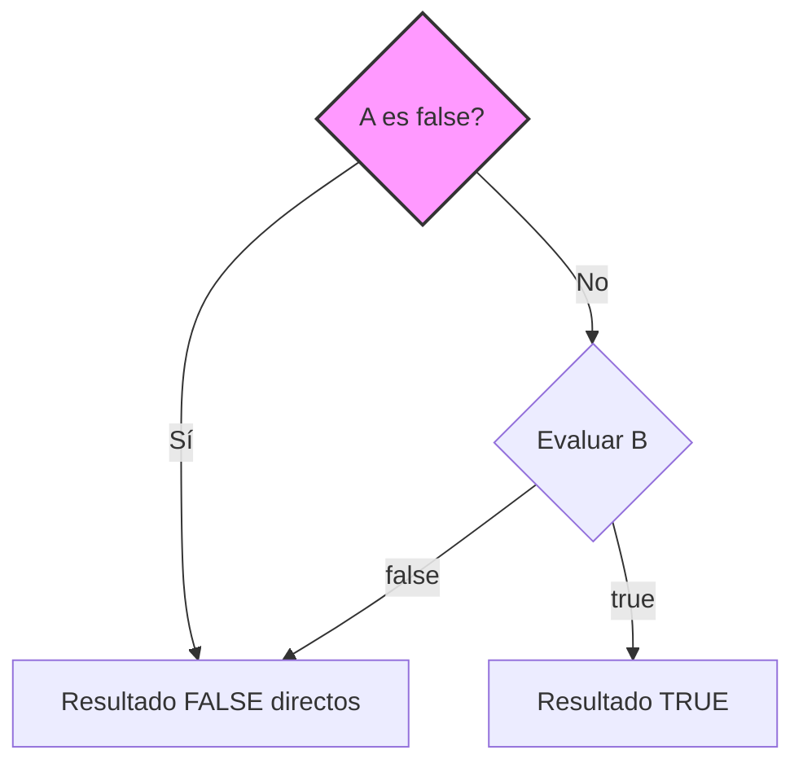

- [3. Elementos Básicos de un Programa](#3-elementos-básicos-de-un-programa)
  - [3.1. Estructura y Bloques Fundamentales de un Programa](#31-estructura-y-bloques-fundamentales-de-un-programa)
    - [3.1.1. Bloque Principal](#311-bloque-principal)
    - [3.1.2. Entrada y Salida Básica de Datos](#312-entrada-y-salida-básica-de-datos)
  - [3.2. Tipos de Datos](#32-tipos-de-datos)
  - [3.3 Variables y Constantes](#33-variables-y-constantes)
    - [3.3.1 Variables](#331-variables)
    - [3.3.4 Constantes](#334-constantes)
    - [3.3.5 Variables de solo lectura](#335-variables-de-solo-lectura)
    - [3.3.6 Valores nulos](#336-valores-nulos)
    - [3.3.7 Enumeraciones](#337-enumeraciones)
  - [3.4 Conversiones y Casting](#34-conversiones-y-casting)
    - [3.4.1 Conversión implícita](#341-conversión-implícita)
    - [3.4.2 Conversión explícita](#342-conversión-explícita)
    - [3.4.3 Comparación: implícito vs explícito](#343-comparación-implícito-vs-explícito)
    - [3.4.4 Casting con cadenas](#344-casting-con-cadenas)
    - [3.4.5 Tabla de conversiones en el pseudolenguaje](#345-tabla-de-conversiones-en-el-pseudolenguaje)
    - [3.4.6 Ejemplo didáctico de diferencias](#346-ejemplo-didáctico-de-diferencias)
    - [3.4.7 Pros y contras de los castings](#347-pros-y-contras-de-los-castings)
    - [3.4.8 Reglas prácticas para estudiantes](#348-reglas-prácticas-para-estudiantes)
  - [3.5 Operadores](#35-operadores)
    - [3.5.1 Operadores aritméticos](#351-operadores-aritméticos)
    - [3.5.2 Operadores de asignación](#352-operadores-de-asignación)
    - [3.5.2 Operadores de comparación](#352-operadores-de-comparación)
    - [3.5.3 Operadores lógicos](#353-operadores-lógicos)
      - [Leyes de De Morgan](#leyes-de-de-morgan)
    - [3.5.4 Concatenación de cadenas](#354-concatenación-de-cadenas)
    - [3.5.5 Operador ternario](#355-operador-ternario)
    - [3.5.6 Operador de coalescencia nula](#356-operador-de-coalescencia-nula)
  - [3.6 Expresiones y precedencia de operadores](#36-expresiones-y-precedencia-de-operadores)
    - [3.6.1 Precedencia de operadores](#361-precedencia-de-operadores)
    - [3.6.2 Expresiones con cadenas y números](#362-expresiones-con-cadenas-y-números)
    - [3.6.3 Expresiones booleanas complejas](#363-expresiones-booleanas-complejas)
  - [3.7 Entrada y salida de datos](#37-entrada-y-salida-de-datos)
    - [3.7.1 Salida de datos](#371-salida-de-datos)
    - [3.7.2 Entrada de datos](#372-entrada-de-datos)
    - [3.7.3 Entrada de números u otros tipos usando casting explícito](#373-entrada-de-números-u-otros-tipos-usando-casting-explícito)


# 3. Elementos Básicos de un Programa
En este apartado aprenderemos los conceptos fundamentales para entender cómo se estructura un programa, los tipos de datos básicos y sus operaciones y cómo manejar variables y constantes. Estos son los bloques de construcción esenciales para cualquier lenguaje de programación.

## 3.1. Estructura y Bloques Fundamentales de un Programa
En este tema aprenderemos los conceptos básicos de programación usando pseudocódigo DAW, un lenguaje simplificado parecido a C# y Java, pero con una sintaxis más amigable para principiantes. Nos centraremos en la estructura fundamental de un programa y los tipos de datos básicos.

Con este pseudolenguaje, aprenderemos los conceptos esenciales que luego podremos aplicar en lenguajes reales como C#, Java, Python o JavaScript, pues son comunes a todos ellos.

### 3.1.1. Bloque Principal

Todo programa tiene un **punto de entrada**, llamado `Main`. Dentro de este bloque se escriben las instrucciones que se ejecutan al iniciar el programa.

```c#
Main {
    // Esto es un comentario
    writeLine("¡Hola, mundo!");
}
```

**Explicación:**

* Las **llaves `{ }`** delimitan un bloque de código.
* Cada instrucción termina con un **punto y coma `;`**.
* La **indentación** (4 espacios por nivel) mejora la legibilidad y muestra jerarquía.
* Los **comentarios** no afectan la ejecución y sirven para explicar el código.

  * Una línea: `// Comentario`
  * Varias líneas: `/* Comentario */`

### 3.1.2. Entrada y Salida Básica de Datos

Antes de aprender variables y operaciones, es importante saber cómo mostrar y recibir información.

* `writeLine(...)` → Muestra un **texto** en la consola.
* `readLine()` → Permite **leer un texto** desde la consola.

**Notas:**

* Todo lo que se escribe o se lee se hace como **texto**.
* Por ahora no entraremos en cómo manipular números o concatenar, solo se entenderá que **la consola comunica texto**.
* Más adelante aprenderemos cómo convertir ese texto a otros tipos y trabajar con él.

```c#
Main {
  writeLine("Introduce tu nombre:"); // Muestra texto en la consola
  readLine(); // Lee lo que el usuario escribe como texto
}
```

## 3.2. Tipos de Datos

Un **tipo de dato** define **qué valores puede almacenar una variable**, qué operaciones podemos hacer con esos valores y cuánto espacio ocupa en memoria.

| Tipo    | Valores posibles  | Tamaño en memoria | Operaciones permitidas | Ejemplo de valor |
| ------- | ----------------- | ----------------- | ---------------------- | ---------------- |
| int     | Números enteros   | 4 bytes           | + - \* / %             | 20               |
| decimal | Números decimales | 8 bytes           | + - \* /               | 12.5             |
| bool    | true, false       | 1 byte            | AND, OR, NOT           | true             |
| string  | Texto             | Variable          | Se verá más adelante   | "Juan"           |

**Notas:**

* Cada tipo tiene un **conjunto de valores posibles**.
* Cada tipo ocupa **un espacio en memoria** (el ordenador reserva una "caja" para cada valor).
* Cada tipo permite **operaciones específicas** (por ejemplo, no podemos sumar `bool` con `int`).
* Los **valores por defecto** son importantes:

  * `int` → 0
  * `decimal` → 0.0
  * `bool` → false
  * `string` → "" (cadena vacía, **no nulo**)

**Ejemplos y contraejemplos de valores:**

**Correcto:**

  ```c#
  Main {
    int edad = 25;
    decimal precio = 19.99;
    bool activo = true;
    string nombre = "";
  }
  ```
**Incorrecto (no permitido para ese tipo):**

  ```c#
  Main {
    int edad = "veinticinco"; // texto no puede ir en int
    int edad = 12.5;     // decimal no cabe en int sin conversión
    bool activo = "si";  // texto no puede ir en booleano
  }
  ```

## 3.3 Variables y Constantes

En un programa necesitamos **guardar datos** en memoria para poder trabajar con ellos.
Esto lo hacemos con **variables**, **constantes** y **readonly**. Cada uno de estos elementos cumple un propósito distinto.


### 3.3.1 Variables

Una **variable** es un **contenedor en memoria** que almacena un valor de un tipo específico.

* Cada variable tiene un **nombre (alias)** que nos permite acceder a su contenido. Usamos este "nombre" porque aprender la dirección de memoria es complicado. Es mejor usar nombres descriptivos como edad, precioTotal, nombreUsuario. Esto nos ayudará por ejemplo a no usar direcciones como 0x1A2B3C4D (hexadecimal, y además difícil de recordar).
* Cada variable tiene un **tipo de dato** que define qué valores puede almacenar (int, decimal, bool, string).
* Cada variable tiene un **espacio en memoria** reservado según su tipo, que el sistema operativo gestiona automáticamente.
* El valor de la variable puede **cambiar durante la ejecución** → se dice que es de **lectura/escritura**.
* La memoria puede imaginarse como una **caja con etiqueta** (el nombre de la variable). Dentro de esa caja guardamos el valor actual. Podemos abrir la caja (leer el valor) o cambiar su contenido (asignar un nuevo valor) y lo grande o pequeño que sea el valor depende del tipo de dato.


**Valores por defecto de las variables**

En nuestro pseudolenguaje, **todas las variables siempre tienen un valor por defecto** al declararse:

| Tipo      | Valor por defecto   |
| --------- | ------------------- |
| `int`     | `0`                 |
| `decimal` | `0.0`               |
| `bool`    | `false`             |
| `string`  | `""` (cadena vacía) |

Esto significa que aunque no inicialices, la variable no queda “sin valor”.
Pero **es mala práctica depender de los valores por defecto**: siempre inicializa al declarar.

Veamos unos ejemplos:

**Ejemplo correcto:**

```c#
Main {
    int edad = 20;
    decimal consumo = 5.7;
    bool activo = true;
    string nombre = "Ana";
}
```

**Ejemplo usando valores por defecto:**

```c#
Main {
  int edad;            
  writeLine(edad);     // Muestra 0

  string apellido;     
  writeLine(apellido); // Muestra "" (cadena vacía)
}
```

**Contraejemplo (mala práctica):**

```c#
Main {
  decimal precio;
  writeLine(precio);  // Aunque imprime 0.0, es mala práctica no inicializarlo
}
```

**Nota didáctica**: siempre inicializa las variables para que el código sea **claro y entendible**.


**Inferencia de tipos en declaraciones**

En ocasiones, escribir siempre el tipo de la variable puede ser repetitivo.
Nuestro pseudolenguaje permite **inferir el tipo automáticamente** a partir del valor que se asigna en la declaración. Esto hace el código más conciso y legible. Pero **no elimina la necesidad de entender qué tipo tiene cada variable**.

Para ello se usa la palabra clave `var`.

* El **tipo real** de la variable se decide en el momento de la inicialización.
* Una vez asignado, **el tipo no puede cambiar** → la variable no es “dinámica”, sigue siendo de tipo fijo. Por ejemplo, si se infiere como `int`, no se puede luego asignar un `string`.


**Ejemplo de inferencia correcto**

```c#
Main {
  var edad = 25;        // Se infiere que es int
  var precio = 19.95;   // Se infiere que es decimal
  var activo = true;    // Se infiere que es bool
  var nombre = "Juan";  // Se infiere que es string

  writeLine(edad);      // Muestra 25
  writeLine(precio);    // Muestra 19.95
  writeLine(activo);    // Muestra true
  writeLine(nombre);    // Muestra Juan
}
```

**Restricciones**

* **Siempre debe haber una inicialización** al declarar con `var`.

  ```c#
  Main {
    var x;      // ERROR: no se puede inferir el tipo sin un valor
  }

* **Una vez inferido, el tipo es fijo y no se puede cambiar:**

  ```c#
  Main {
    var edad = 30;   // int
    edad = "Pedro";  // ERROR: no se puede convertir string a int
  }
  ```


✅ **Conclusión**: La inferencia de tipos hace el código más **claro y conciso**, pero no elimina la necesidad de conocer qué tipo tiene cada variable.


**Buenas prácticas de nombres (variables)**

* Usar **camelCase** para variables:
  `cantidadAlumnos`, `longitudPiscina`, `precioTotal`.
* Los nombres deben ser **descriptivos**, no letras sueltas ni palabras sin sentido.

**Concepto de Código Autodocumentado**:
Un buen programador escribe código que se explica por sí mismo. En lugar de usar comentarios para explicar qué hace una variable, elige un nombre tan bueno que el comentario sea innecesario.
*   *Mal*: `int d = 30; // días del mes`
*   *Bien*: `int diasDelMes = 30;`

**Ejemplo correcto:**

```c#
Main {
  int cantidadAlumnos = 25;
  decimal precioEntrada = 2.5;
}
```

**Contraejemplo:**

```c#
Main {
  int x = 25;        // Poco claro
  decimal p = 2.5;   // No describe su función
}
```


**Declaración e inicialización**

* **Declarar**: indicar el tipo y nombre de la variable.
* **Inicializar**: darle un valor inicial.
* **Asignar**: cambiar el valor posteriormente con `=`.
* El operador `=` es el operador de **asignación**.

**Ejemplo:**

```c#
Main {
  int edad;           // Declaración (vale 0 por defecto)
  edad = 18;          // Inicialización
  edad = 19;          // Nueva asignación
}
```

**Contraejemplo:**

```c#
Main {
  int edad;
  edad = "Juan";   // ERROR: no se puede asignar un string a un int
}
```

**Nota didáctica**:
El símbolo `=` no significa “igualdad matemática”. Significa **“asignar a la variable de la izquierda el valor de la derecha”**.
Al usar inferencia de tipos con `var`, la inicialización es obligatoria y con ello se declara e inicializa en un solo paso.


### 3.3.4 Constantes

Una **constante** es un contenedor, variable, pero cuyo valor **no puede cambiar nunca** después de declararse. Es decir, esta variable es de **solo lectura** y su valor es fijo.

* Se inicializa **obligatoriamente en el momento de la declaración**.
* El compilador sustituye el nombre de la constante por su valor en todo el programa. Es por ello que se llaman constantes literales o constantes en tiempo de compilación.
* Se usa la palabra clave `const` para declararla.

**Ejemplo:**

```c#
Main {
  const decimal PI = 3.1416;
  const int MAX_ALUMNOS = 30;

  writeLine(PI);          // Muestra 3.1416
  writeLine(MAX_ALUMNOS); // Muestra 30
}
```

**Contraejemplo:**

```c#
Main {
  const int edad;
  edad = 20;        // ERROR: la constante debe inicializarse al declararse

  PI = 3.14;        // ERROR: no se puede modificar
}
```

**Buenas prácticas de nombres (constantes)**

* Usar **MAYÚSCULAS\_CON\_GUIONES\_BAJOS**:
  `MAX_PLANTAS`, `PI`, `IVA`.


### 3.3.5 Variables de solo lectura

Un **readonly** es parecido a una constante, pero con una diferencia importante:

* Solo se puede **asignar una vez**, pero **no necesariamente en tiempo de compilación**. Es decir, su valor puede depender de cálculos o entradas que se conocen solo en tiempo de ejecución y una vez asignado, no puede cambiar.
* Puede inicializarse al declararse o en un paso de inicialización posterior.
* Después pasa a ser de **solo lectura**.
* Se usa la palabra clave `readonly` para declararla.

**Ejemplo:**

```c#
Main {
  readonly decimal salarioBase = 1200.0;
  readonly int añoNacimiento;

  añoNacimiento = 1990;  // Se puede asignar una vez
  writeLine(añoNacimiento);
}
```

**Contraejemplo:**

```c#
Main {
  añoNacimiento = 1991;  // ERROR: ya se había asignado
}
```

**Buenas prácticas de nombres (readonly)**
* Usar **camelCase**:
  `salarioBase`, `añoNacimiento`, `precioProducto`.

### 3.3.6 Valores nulos

En algunos casos, una variable puede **no tener ningún valor**.
En ese caso, decimos que su valor es **`null`**.
¿Por qué es util tener una zona de memoria que no apunta a ningún valor? Porque a veces necesitamos representar la ausencia de valor, por ejemplo, cuando un dato es opcional o aún no se ha asignado. Pero esto puede ser peligroso si intentamos usar la variable sin comprobar antes si tiene valor. Es uno de los errores más comunes en programación. Por eso es importante entender bien qué es `null` y cómo manejarlo correctamente.

Pero **es recomendable evitar usar `null` y los valores nulos en la medida de lo posible, ya que puede complicar el código y llevar a errores difíciles de detectar. En su lugar, es mejor usar valores por defecto o estructuras que representen la ausencia de valor de manera más segura.**

De hecho es conocido como **una de las fuente de errores y bugs más comunes en programación, el famoso error de referencia nula** (null reference error) o el "billion dollar mistake" (error de los mil millones de dólares) como lo llamó Tony Hoare, el inventor del concepto.

En nuestro lenguaje tendremos control de nulos en los tipos básicos y en las cadenas usando `?` (nullable). Esto indica que la variable puede ser `null` o tener un valor del tipo indicado.

* `null` significa que la **caja está vacía**, no apunta a ningún contenido.
* Diferencia:

  * `string nombre = "";` → caja con cadena vacía (longitud 0, pero existe un valor).
  * `string? nombre = null;` → caja vacía (no hay valor).

**Ejemplo:**

```c#
Main {
  string? apellido = null;   // Caja vacía
  string nombre = "";        // Caja con cadena vacía

  int edad = 0;              // Caja con valor 0
  int? altura = null;        // Caja vacía
  int? peso = 75;           // Caja con valor 75 pero puede ser null

  writeLine(nombre);   // Muestra nada (pero existe un valor)
  writeLine(apellido); // No muestra nada, está vacío, es null
  writeLine(edad);     // Muestra 0
  writeLine(altura);   // No muestra nada, está vacío, es null se podría operar con null
  writeLine(peso);     // Muestra 75

  edad = null;      // ERROR: int no puede ser null
  altura = 1.75;    // Ahora altura tiene un valor
  peso = null;      // Ahora peso está vacío

  writeLine(altura); // Muestra 1.75
  writeLine(peso);   // No muestra nada, está vacío, es null
}
```

**Importancia de `null`**
* `null` es útil cuando **todavía no tenemos un valor real** para la variable.
* Es una **práctica no recomendada**, pues puede complicar el código y llevar a errores difíciles de detectar.
* **Es peligroso** si intentamos usar la variable sin comprobar antes si tiene valor.
* En nuestro pseudolenguaje, los tipos básicos (`int`, `decimal`, `bool`) **nunca son null por defecto**: siempre tienen un valor inicial.
* Para cadenas (`string`) el valor por defecto es `""` (cadena vacía).
* Si queremos que una variable pueda ser `null`, debemos declararla con `?` (nullable). 
  Ejemplo: `string? apellido = null;` o `int? altura = null;`.
* Siempre es buena práctica **comprobar si una variable es null** antes de usarla. Operadores como `??` (operador de coalescencia nula) pueden ayudar a manejar valores null de forma segura.
* **Estamos suponiendo que no muestra nada, porque no tiene valor, pero en realidad en la consola podría mostrar "null" o lanzar un error si no se maneja bien**.
* **En la práctica, es mejor evitar usar `null` y los valores nulos en la medida de lo posible, usando valores por defecto o estructuras que representen la ausencia de valor de manera más segura**.


**Recuerda la imagen anterior, si no quieres mancharte las manos al limpiarte 💩, asegúrate de que no está en nulo 🧨🤯.**


### 3.3.7 Enumeraciones
Una **enumeración (enum)** es un tipo de dato especial que permite definir un conjunto de valores constantes con nombres significativos. Es útil cuando queremos representar un grupo limitado de opciones o estados, haciendo el código más legible y fácil de mantener.

**Características de las enumeraciones:**
* Se definen con la palabra clave `enum`.
* Cada valor en la enumeración es un identificador único.
* Se usan para mejorar la claridad del código, evitando el uso de números mágicos o

```c#
Main {
  enum DiasSemana { LUNES, MARTES, MIERCOLES, JUEVES, VIERNES, SABADO, DOMINGO }
  
  DiasSemana hoy = DiasSemana.MIERCOLES;
  
  writeLine("Hoy es " + hoy); // Muestra "Hoy es MIERCOLES"
}
```

## 3.4 Conversiones y Casting

En nuestro pseudolenguaje, a veces necesitamos **cambiar el tipo de un valor** para poder usarlo en una operación o almacenarlo en una variable diferente. ¿Por qué? Porque no todos los tipos son compatibles entre sí, y a veces necesitamos convertir un tipo a otro para que la operación tenga sentido o simplemente por necesidades del programa.
Este proceso se llama **conversión de tipos** o **casting**.

Un **casting** es una instrucción que le indica al lenguaje que trate un valor de un tipo como si fuera de otro.

Existen dos tipos de conversiones:

1. **Conversión implícita** → la hace automáticamente el lenguaje, si es segura.
2. **Conversión explícita** → la indica el programador, si puede haber pérdida de información.


### 3.4.1 Conversión implícita

El pseudolenguaje convierte automáticamente un valor de un tipo a otro **siempre que no haya riesgo de pérdida de datos**.
No hace falta escribir nada especial, ocurre de manera automática cuando un tipo "cabe" en otro.

**Ejemplo válido**

```c#
Main {
  int a = 10;
  decimal b = a;      // Conversión implícita (int → decimal, no hay pérdida)
  writeLine(b);       // Muestra 10.0 (parte decimal .0 añadida automáticamente)
}
```

Aquí no hay problema: un número entero **cabe perfectamente** en un decimal.

**Ejemplos implícitos comunes**

```c#
Main {
  int edad = 20;
  string mensaje = "Edad: " + edad;     // int → string (concatenación, lo veremos más adelante)
  writeLine(mensaje);                   // "Edad: 20"

  decimal precio = 12.5;
  string texto = "Precio: " + precio;   // decimal → string (concatenación, lo veremos más adelante)
  writeLine(texto);                     // "Precio: 12.5"

  bool activo = true;
  string estado = "Activo: " + activo;  // bool → string (concatenación, lo veremos más adelante)
  writeLine(estado);                    // "Activo: true"
}
```

**Contraejemplo**

```c#
Main {
  decimal x = 9.8;
  int y = x;     // ERROR: no se puede convertir automáticamente de decimal a int, se pierde la parte decimal
}
```

Esto da error porque **podría perderse la parte decimal**.
Para hacerlo debemos usar **conversión explícita**.

### 3.4.2 Conversión explícita

Cuando una conversión **puede provocar pérdida de información** o **no es natural**, el programador debe indicarla de forma manual. Es tu deber como programador indicarlo y correr con el riesgo de la pñérdia de información.
Se escribe el tipo deseado entre paréntesis: `(tipo)`.

**Ejemplo correcto**

```c#
Main {
  decimal x = 9.8;
  int y = (int)x;     // Conversión explícita
  writeLine(y);       // 9 (se pierde la parte decimal .8, se trunca)
}
```

**Contraejemplo (olvidar el casting)**

```c#
Main {
  decimal x = 9.8;
  int y = x;          // ERROR: el lenguaje no permite esto sin casting, se pierde datos.
}
```

### 3.4.3 Comparación: implícito vs explícito

| Tipo de conversión | ¿Cuándo ocurre?          | ¿Pérdida de datos?   | Ejemplo         |
| ------------------ | ------------------------ | -------------------- | --------------- |
| **Implícito**      | Automática, si es segura | ❌ No                 | `int → decimal` |
| **Explícito**      | Manual, con `(tipo)`     | ✅ Puede perder datos | `(int)9.8 → 9`  |


### 3.4.4 Casting con cadenas

La cadena (`string`) es un tipo especial porque **toda entrada y salida se maneja como texto**.
Esto implica que casi siempre será necesario convertir **de valores a texto** o **de texto a valores**.


**De valor a texto (implícito, con concatenación)**

```c#
Main {
  int edad = 20;
  string mensaje = "Edad: " + edad;   // Conversión implícita int → string (concatenación)
  writeLine(mensaje);                 // "Edad: 20"
}
```

**De texto a valor (explícito)**

```c#
Main {
  string entrada = "25";
  int numero = (int)entrada;     // Conversión explícita string → int, puede fallar si el texto no es un número válido correcto
  writeLine(numero + 5);         // 30
}
```

**Contraejemplo (error si el texto no es válido):**

```c#
Main {
  string entrada = "hola";
  int numero = (int)entrada;     // ERROR: "hola" no es un número entero y provoca fallo en tiempo de ejecución
}
```

### 3.4.5 Tabla de conversiones en el pseudolenguaje

| De / A      | int       | decimal   | bool      | string    |
| ----------- | --------- | --------- | --------- | --------- |
| **int**     | —         | Implícita | ❌ No      | Implícita |
| **decimal** | Explícita | —         | ❌ No      | Implícita |
| **bool**    | ❌ No      | ❌ No      | —         | Implícita |
| **string**  | Explícita | Explícita | Explícita | —         |

Leyenda:

* ✅ Implícita → se convierte automáticamente.
* ❌ No → no existe conversión posible.
* Explícita → necesita `(tipo)` para forzarla.


### 3.4.6 Ejemplo didáctico de diferencias

Para entender estos ejemplos deberás comprender que cada tipo tiene asociado unos operadores que dictan cómo se realiza la operación asociada.

```c#
Main {  
  int a = 5;
  int b = 2;

  decimal div1 = (decimal)a / b;   // 2.5 (casting de a y división)
  int div2 = a / b;                // 2 (división entera)
  decimal div3 = a / b;            // 2.0 (porque a y b son enteros, luego se convierte)
}
```

**Explicación:**

* En `div1`, al convertir `a` en `decimal`, la operación se hace con decimales y se obtiene el valor exacto. Es la división decimal (5.0 / 2.0 = 2.5).
* En `div2`, al ser ambos enteros, se descarta la parte decimal. Es la división entera (5 / 2 = 2).
* En `div3`, primero se hace la división entera (resultado 2) y después se convierte a decimal (2.0). Es la división entera seguida de conversión (5 / 2 = 2 → 2.0).


### 3.4.7 Pros y contras de los castings

* ✅ **Implícitos**

  * Más cómodos.
  * No hay riesgo de pérdida de información.
* ⚠️ **Explícitos**

  * Se usan cuando la conversión puede perder información.
  * Dan más control, pero también pueden provocar errores.
* ❌ **Malas prácticas**

  * Confiar en que un texto siempre es convertible a número.
  * Usar casting innecesario cuando el tipo ya es el correcto.


### 3.4.8 Reglas prácticas para estudiantes

1. **Si es seguro, el lenguaje lo hace por ti** (implícito).
2. **Si puede perder datos, debes indicarlo tú** (explícito).
3. **Las cadenas son especiales**:

   * Mostrar cualquier valor como texto es fácil (implícito).
   * Convertir texto a número o booleano puede fallar (explícito).
4. **Mejor usar siempre el tipo correcto** desde el principio que abusar de casting.


## 3.5 Operadores

Los **operadores** son símbolos que nos permiten realizar operaciones con valores o variables. Todos los tipos de datos tienen operadores específicos que definen qué operaciones son válidas y cómo se comportan.

Recuerda que aunque varios tipos compartan un operador, el resultado de usarlo difiera en función del tipo de dato. Por ejemplo la división entera y la división decimal, o la suma entera con la suma de cadenas (concatenación).

En este apartado veremos los operadores básicos de nuestro pseudolenguaje.


### 3.5.1 Operadores aritméticos

Se usan con **valores numéricos** (`int` y `decimal`).

| Operador | Significado                     | Ejemplo     | Resultado                      |
| -------- | ------------------------------- | ----------- | ------------------------------ |
| `+`      | Suma                            | `3 + 5`     | `8`                            |
| `-`      | Resta                           | `10 - 4`    | `6`                            |
| `*`      | Multiplicación                  | `7 * 2`     | `14`                           |
| `/`      | División entera                 | `9 / 2`     | `4` (si ambos son `int`)       |
| `/`      | División decimal                | `9.0 / 2.0` | `4.5` (si alguno es `decimal`) |
| `%`      | Módulo (resto) — solo con `int` | `9 % 2`     | `1`                            |

🔎 **Reglas importantes**:

* Si ambos operandos son `int`, la división es entera (se pierde la parte decimal).
* Si al menos uno es `decimal`, la división conserva los decimales.
* El operador `%` solo se aplica a enteros.
* Si uno de los operandos es `decimal`, el resultado es `decimal`.

**Ejemplo en pseudocódigo:**

```c#
Main {
  int a = 9;
  int b = 2;

  writeLine(a / b);   // 4
  writeLine(a % b);   // 1

  decimal x = 9;
  decimal y = 2;
  writeLine(x / y);   // 4.5

  var res = x / b;  // res es decimal (9.0 / 2)
  writeLine(res);   // 4.5 
}

```

### 3.5.2 Operadores de asignación
Se usan para **asignar valores a variables**.
| Operador | Significado          | Ejemplo       | Resultado                  |
| -------- | -------------------- | ------------- | -------------------------- |
| `=`      | Asignación           | `x = 5`       | `x` vale `5`             |
| `+=`     | Suma y asignación    | `x += 3`      | `x` vale `x + 3`           |
| `-=`     | Resta y asignación   | `x -= 2`      | `x` vale `x - 2`           |
| `*=`     | Multiplicación y asignación | `x *= 4`      | `x` vale `x * 4`           |
| `/=`     | División y asignación | `x /= 2`      | `x` vale `x / 2`           |
| `%=`     | Módulo y asignación | `x %= 3`      | `x` vale `x % 3`           |

**Ejemplo:**

```c#
Main {
  int x = 10;      // x vale 10
  x += 5;          // x vale 15 (10 + 5)
  x -= 3;          // x vale 12 (15 - 3)
  x *= 2;          // x vale 24 (12 * 2)
  x /= 4;          // x vale 6 (24 / 4)
  x %= 4;          // x vale 2 (6 % 4)
  writeLine(x);    // Muestra 2 
}
```

### 3.5.2 Operadores de comparación

Sirven para comparar valores y siempre devuelven un **booleano** (`true` o `false`).

| Operador | Significado       | Ejemplo  | Resultado |
| -------- | ----------------- | -------- | --------- |
| `==`     | Igual a           | `5 == 5` | `true`    |
| `!=`     | Distinto de       | `5 != 3` | `true`    |
| `>`      | Mayor que         | `7 > 4`  | `true`    |
| `<`      | Menor que         | `2 < 8`  | `true`    |
| `>=`     | Mayor o igual que | `5 >= 5` | `true`    |
| `<=`     | Menor o igual que | `3 <= 2` | `false`   |

**Ejemplo:**

```c#
Main {
  int edad = 20;
  bool esMayor = edad >= 18;
  writeLine(esMayor);    // true

  bool esMenor = edad < 18;
  writeLine(esMenor);    // false

  bool esIgual = edad == 20;
  writeLine(esIgual);    // true

  bool esDistinto = edad != 25;
  writeLine(esDistinto); // true

}
```

### 3.5.3 Operadores lógicos

Los **operadores lógicos** trabajan con valores booleanos (`true`, `false`).
En nuestro pseudolenguaje:

* `AND` (y lógico) → Símbolo: `&&`
* `OR` (o lógico) → Símbolo: `||`
* `NOT` (negación) → Símbolo: `!`

**Tabla de verdad del AND (&&)**

| A     | B     | A AND B |
| ----- | ----- | ------- |
| true  | true  | true    |
| true  | false | false   |
| false | true  | false   |
| false | false | false   |

El resultado es verdadero solo si **ambos son verdaderos**.


**Tabla de verdad del OR (||)**

| A     | B     | A OR B |
| ----- | ----- | ------ |
| true  | true  | true   |
| true  | false | true   |
| false | true  | true   |
| false | false | false  |

El resultado es verdadero si **al menos uno es verdadero**.

**Importante: Evaluación de Cortocircuito**
Los lenguajes modernos (y nuestro pseudolenguaje) son eficientes.
*   En un **AND (&&)**: Si la primera condición es `false`, el resultado ya es `false` obligatoriamente. El programa **no evalúa** la segunda parte.
*   En un **OR (||)**: Si la primera condición es `true`, el resultado ya es `true` obligatoriamente. El programa **no evalúa** la segunda parte.



**Tabla de verdad del NOT (!)**

| A     | NOT A |
| ----- | ----- |
| true  | false |
| false | true  |

Invierte el valor lógico.

**Ejemplo práctico**

```c#
Main {
  bool tieneEdad = true;
  bool tieneDni = false;

  bool puedeEntrar = tieneEdad && tieneDni;  
  writeLine(puedeEntrar);  // false

  bool accesoAlternativo = tieneEdad || tieneDni;  
  writeLine(accesoAlternativo); // true

  writeLine(!tieneEdad);  // false

  // Algo más complicado
  bool esFinDeSemana = false;
  bool esFestivo = true;
  bool puedeDescansar = esFinDeSemana || esFestivo;
  writeLine(puedeDescansar); // true

  // Algo con and or y not
  bool tienePase = true;
  bool esVip = false;
  bool esArtista = true;
  bool puedeAcceder = tienePase && (esVip || esArtista);
  writeLine(puedeAcceder); // true
}

```

#### Leyes de De Morgan

Sirven para **negar expresiones lógicas compuestas**.

**Ley 1**

`NOT (A AND B) = (NOT A) OR (NOT B)`

| A     | B     | A AND B | NOT (A AND B) | NOT A | NOT B | (NOT A) OR (NOT B) |
| ----- | ----- | ------- | ------------- | ----- | ----- | ------------------ |
| true  | true  | true    | false         | false | false | false              |
| true  | false | false   | true          | false | true  | true               |
| false | true  | false   | true          | true  | false | true               |
| false | false | false   | true          | true  | true  | true               |

Negar un **AND** equivale a negar cada término y unirlos con **OR**.


**Ley 2**

`NOT (A OR B) = (NOT A) AND (NOT B)`

| A     | B     | A OR B | NOT (A OR B) | NOT A | NOT B | (NOT A) AND (NOT B) |
| ----- | ----- | ------ | ------------ | ----- | ----- | ------------------- |
| true  | true  | true   | false        | false | false | false               |
| true  | false | true   | false        | false | true  | false               |
| false | true  | true   | false        | true  | false | false               |
| false | false | false  | true         | true  | true  | true                |

Negar un **OR** equivale a negar cada término y unirlos con **AND**.


### 3.5.4 Concatenación de cadenas

El operador `+` también sirve para **unir cadenas de texto** (`string`). Es la **concatenación**. Además, realiza una conversión implícita de otros tipos a `string` cuando es necesario.

```c#
Main {
  string nombre = "Ana";
  string saludo = "Hola " + nombre;
  writeLine(saludo);   // Hola Ana
}
```

Importante: si concatenamos un número con un `string`, el número se convierte automáticamente a texto (casting implícito).

```c#
Main {
  int edad = 20;
  writeLine("Tienes " + edad + " años");
  // Tienes 20 años

  // cuidado que si no es el resultado de la operación no es el esperado
  writeLine("Dentro de 5 años tendrás " + edad + 5);
  // Dentro de 5 años tendrás 205

  // para que funcione como esperamos, usamos paréntesis
  writeLine("Dentro de 5 años tendrás " + (edad + 5));
  // Dentro de 5 años tendrás 25
}

```

### 3.5.5 Operador ternario
El operador ternario es una forma concisa de escribir una condición que asigna un valor u otro según se cumpla o no una condición. Es útil siempre que hagamos una comparación. Esta formado por tres partes, para realizar una asignación condicional.

La sintaxis es: `condición ? valor_si_verdadero : valor_si_falso`

**Ejemplo:**

```c#
Main {
  int edad = 20;
  string mensaje = (edad >= 18) ? "Eres mayor de edad" : "Eres menor de edad"; // Condición ? valor si verdadero : valor si falso
  writeLine(mensaje); // En este caso muestra "Eres mayor de edad" porque edad es 20 y se cumple la condición

  bool esPar = (edad % 2 == 0) ? true : false; // Comprueba si edad es par
  writeLine(esPar); // true porque 20 es para

  int numero = 5;
  string tipoNumero = (numero % 2 == 0) ? "par" : "impar";
  writeLine(tipoNumero); // impar porque 5 es importar
}

```

### 3.5.6 Operador de coalescencia nula
El operador de coalescencia nula (`??`) se utiliza para proporcionar un valor predeterminado en caso de que una variable sea `null`. Es especialmente útil cuando trabajamos con variables que pueden ser nulas (nullable). **Repetimos que la opción ideal es no usar nulos hasta que no sea absolutamente necesario**.

La sintaxis es: `variable ?? valor_por_defecto`


**Ejemplo:**

```c#
Main {
  string? nombre = null;
  string nombreFinal = nombre ?? "Desconocido"; // Si nombre es null, usa "Desconocido"
  writeLine(nombreFinal); // Muestra "Desconocido"

  int? edad = null;
  int edadFinal = edad ?? 18; // Si edad es null, usa 18
  writeLine(edadFinal); // Muestra 18
}

```

## 3.6 Expresiones y precedencia de operadores

Una **expresión** es cualquier combinación de **variables, literales y operadores** que el pseudolenguaje puede evaluar para producir un **resultado**.

Por ejemplo:

```c#
Main {
  int a = 5;
  int b = 2;
  int c = a + b * 3;
  writeLine(c); // ?

  var total = a + b * 3; // Inferencia de tipo según el resultado
  writeLine(total); // ?
}
```

El resultado **no es 21**, sino `11`, porque existen **reglas de precedencia**.

### 3.6.1 Precedencia de operadores

La **precedencia** indica qué operaciones se **realizan primero** cuando no usamos paréntesis.

| Nivel | Operadores                                   | Ejemplo         | Resultado               |         |     |        |             |
| ----- | -------------------------------------------- | --------------- | ----------------------- | ------- | --- | ------ | ----------- |
| 1     | `()`                                         | `(a + b) * 3`   | Suma primero            |         |     |        |             |
| 2     | `*` `/` `%`                                  | `5 + 2 * 3`     | Multiplicación primero  |         |     |        |             |
| 3     | `+` `-`                                      | `5 + 2 - 1`     | Izquierda a derecha     |         |     |        |             |
| 4     | Comparación `==`, `!=`, `>`, `<`, `>=`, `<=` | `3 + 2 > 4`     | Se evalúa la suma antes |         |     |        |             |
| 5     | Lógicos `NOT`                         | `!true`         | Negación                |         |     |        |             |
| 6     | Lógicos `AND`                       | `true && false` | AND después de NOT      |         |     |        |             |
| 7     | Lógicos `OR`                        | `true OR false` | OR al final             |         |     |        |             |


**Ejemplo paso a paso:**

```c#
Main {
  int a = 5;
  int b = 2;
  int c = 3;

  bool resultado = a + b * c > 10 && b < c;
  writeLine(resultado); // ?
}
```

**Paso 1: Operaciones aritméticas**

* `b * c` → `2 * 3 = 6`
* `a + 6` → `5 + 6 = 11`

**Paso 2: Comparaciones**

* `11 > 10` → `true`
* `b < c` → `2 < 3` → `true`

**Paso 3: Operadores lógicos**

* `true AND true` → `true`

**Resultado final:**

```c#
writeLine(resultado); // true
```


**Uso de paréntesis para cambiar el orden**

Si queremos que se sume primero antes de multiplicar:

```c#
Main {
  int total = (a + b) * c;
  writeLine(total); // (5 + 2) * 3 = 21
}
```

### 3.6.2 Expresiones con cadenas y números

Cuando mezclamos **cadenas** y **números**, el `+` se interpreta como **concatenación**:
```c#
Main {
  int edad = 20;
  string mensaje = "Tienes " + edad + " años";
  writeLine(mensaje); // Tienes 20 años
}
```

### 3.6.3 Expresiones booleanas complejas

```c#
Main {
  bool a = true;
  bool b = false;
  bool c = true;

  bool resultado = a && !b || c;
  writeLine(resultado); // ?
}
```

**Paso 1: NOT**

* `!b` → `!false` → `true`

**Paso 2: AND**

* `a && true` → `true && true` → `true`

**Paso 3: OR**

* `true || c` → `true || true` → `true`

```c#
writeLine(resultado); // true
```
**Nota didáctica sobre expresiones**

* Siempre **respetar la precedencia** o usar paréntesis para evitar errores.
* Las **expresiones se pueden anidar**: una expresión puede contener otras expresiones.
* En pseudolenguaje, la **evaluación es estricta y secuencial** según la precedencia.

## 3.7 Entrada y salida de datos

En programación, distinguimos:

* **Entrada:** datos que el usuario introduce.
* **Salida:** datos que el programa muestra en pantalla.

En nuestro pseudolenguaje:

* **`writeLine(valor)`** → muestra información en pantalla.
* **`readLine()`** → lee texto introducido por el usuario.

> **Importante:** toda entrada y salida se maneja como **texto (`string`)**. Para usar números u otros tipos, necesitamos **casting explícito**.


### 3.7.1 Salida de datos

`writeLine` se utiliza para mostrar **mensajes, valores de variables o resultados de expresiones**.

**Ejemplos:**

```c#
Main {
  int edad = 25;
  writeLine(edad);          // Muestra: 25

  string nombre = "Ana";
  writeLine(nombre);        // Muestra: Ana

  writeLine("Hola, mundo!"); // Muestra: Hola, mundo!
  writeLine("Tienes " + edad + " años"); // Muestra: Tienes 25 años
}
```

**Explicación didáctica:**

* Cada variable apunta a una **zona de memoria**.
* `writeLine` accede al contenido de esa zona y lo muestra en pantalla.
* En nuestro pseudolenguaje, **todo se convierte a texto automáticamente** para mostrarlo, usa casting implícito.

**Contraejemplos (mala práctica)**

```c#
Main {
  int cantidad;
  writeLine(cantidad);    // Muestra 0, pero es mejor inicializar
}
```

```c#
Main {
  string apellido;
  writeLine(apellido);    // Muestra "", cadena vacía
}
```
> Nota: los valores por defecto evitan errores, pero **siempre debemos inicializar variables**.

### 3.7.2 Entrada de datos

`readLine()` permite **leer texto** desde el teclado.

**Siempre devuelve un `string`**, aunque el usuario escriba un número.
**Siempre hay que usar casting explícito** para convertirlo a otro tipo si es necesario.

**Ejemplo básico**

```c#
Main {
  writeLine("Introduce tu nombre:");
  string nombre = readLine();
  writeLine("Hola " + nombre);
}
```

**Flujo de ejecución:**

1. Muestra `"Introduce tu nombre:"`.
2. Espera la entrada del usuario.
3. Almacena lo introducido en `nombre`.
4. Muestra `"Hola "` seguido del valor de `nombre`.


### 3.7.3 Entrada de números u otros tipos usando casting explícito

Para convertir un `string` leído a un número:

```c#
Main {
  writeLine("Introduce tu edad:");
  string input = readLine();
  int edad = (int)input;     // Casting explícito de string a int
  writeLine("En 5 años tendrás " + (edad + 5));
}
```

Otro ejemplo con decimales:

```c#
Main {
  writeLine("Introduce el precio:");
  string input = readLine();
  decimal precio = (decimal)input;   // Casting explícito a decimal
  decimal total = precio * 2;
  writeLine("El total es " + total);
}
```

Otro ejemplo con booleanos:

```c#
Main {
  writeLine("¿Estás de acuerdo? (true/false):");
  string input = readLine();
  bool acuerdo = (bool)input;   // Casting explícito a bool
  writeLine("Has respondido: " + acuerdo); // true o false
}
```

**Explicación didáctica:**

* `readLine()` devuelve texto.
* Para usarlo como número, **indicamos manualmente el tipo** con `(int)` o `(decimal)`.
* Esto evita errores y permite hacer operaciones aritméticas.

**Buenas prácticas en entrada y salida**

1. **Inicializa variables** aunque tengan valor por defecto.
2. **Mensajes claros** al usuario antes de pedir datos.
3. **Siempre usar casting explícito** cuando se lea un número.
4. Mantener **identación clara y constante**:

```c#
Main {
  writeLine("Introduce tu nombre:");
  string nombre = readLine();
  writeLine("Hola " + nombre);
}
```

5. Recordar que `writeLine` puede mostrar **valores de variables, textos literales y expresiones**.
