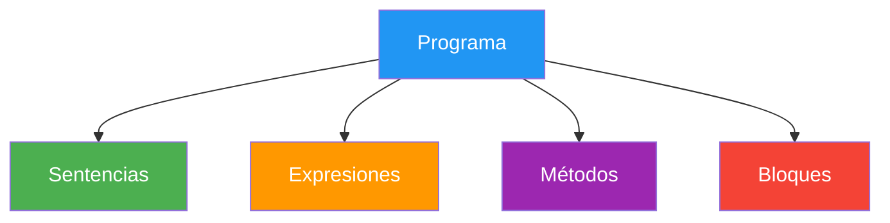

- [4. Estructura de un Programa](#4-estructura-de-un-programa)
  - [4.1. Bloques que componen un programa](#41-bloques-que-componen-un-programa)
  - [4.2. Top-Level Statements (C# 14)](#42-top-level-statements-c-14)
  - [4.3. Estructura clásica vs moderna](#43-estructura-clásica-vs-moderna)
  - [4.4. Namespaces](#44-namespaces)
  - [4.5. Using static: comodidad en la escritura](#45-using-static-comodidad-en-la-escritura)
  - [4.6. El archivo .csproj](#46-el-archivo-csproj)
  - [4.7. El archivo .slnx](#47-el-archivo-slnx)
  - [4.8. Tabla de equivalencias: Pseudocódigo → C# → Java](#48-tabla-de-equivalencias-pseudocódigo--c--java)


# 4. Estructura de un Programa

> 💡 **Punto de partida:** ¿Alguna vez has visto un libro desordenado sin capítulos, sin índice, sin una estructura clara? Es difícil seguirlo. Lo mismo pasa con un programa sin estructura. Vamos a aprender a organizar nuestro código correctamente.

En este tema aprenderás cómo se estructura un programa en C#, qué son los bloques fundamentales, cómo usar Top-Level Statements y la diferencia entre `.slnx` y `.csproj`.

**Objetivos de aprendizaje:**

- Identificar los bloques que componen un programa informático
- Entender la estructura de un programa en C#
- Usar Top-Level Statements correctamente
- Comprender la diferencia entre `.slnx` y `.csproj`
- Usar `using static` para simplificar el código

## 4.1. Bloques que componen un programa

Un programa informático se compone de varios bloques fundamentales:



### Sentencias

Una **sentencia** es una instrucción que realiza una acción. Es la unidad básica de ejecución. Todas terminan con **punto y coma (`;`)**.

```csharp
// Sentencia de declaración
int edad = 22;

// Sentencia de asignación
edad = 23;

// Sentencia de llamada a método
Console.WriteLine("Hola");

// Sentencia vacía (no hace nada, pero es válida)
;
```

> ⚠️ **Advertencia:** Olvidar el punto y coma al final es el error más común de los principiantes. C# es muy estricto con eso.

### Expresiones

Una **expresión** es un código que produce un valor. No es lo mismo que una sentencia.

```csharp
// Esto es una EXPRESIÓN (produce un valor)
5 + 3          // Resultado: 8
edad > 18      // Resultado: true
"Ana" + " Ana" // Resultado: "Ana Ana"

// Esto es una SENTENCIA (realiza una acción)
int resultado = 5 + 3;  // La expresión 5+3 se usa dentro de la sentencia
```

> 💡 **Analogía:** Una expresión es como una pregunta que tiene respuesta ("¿cuánto es 2+2?"). Una sentencia es como una orden ("suma 2+2 y guárdalo").

### Métodos (funciones)

Un **método** es un bloque de código reutilizable que realiza una tarea específica.

```csharp
// Método que no retorna valor (void)
void Saludar()
{
    Console.WriteLine("¡Hola!");
}

// Método que retorna un valor
int Sumar(int a, int b)
{
    return a + b;
}

// Uso
Saludar();                     // Llama al método
int suma = Sumar(5, 3);        // suma = 8
Console.WriteLine(suma);
```

### Bloques

Un **bloque** es un conjunto de sentencias encerradas entre llaves `{}`.

```csharp
// Este es un bloque
{
    int x = 5;
    int y = 10;
    int suma = x + y;
    Console.WriteLine(suma);  // 15
}
// x, y y suma ya no existen aquí
```

## 4.2. Top-Level Statements (C# 14)

**Top-Level Statements** es una característica introducida en C# 9 que permite escribir código sin la estructura tradicional de clases y métodos. Es la forma moderna y recomendada para empezar.

### Sin Top-Level Statements (antes)

```csharp
using System;

namespace MiPrograma
{
    class Program
    {
        static void Main(string[] args)
        {
            Console.WriteLine("¡Hola, mundo!");
        }
    }
}
```

### Con Top-Level Statements (ahora)

```csharp
Console.WriteLine("¡Hola, mundo!");
```

**¡Es exactamente lo mismo!** Pero mucho más limpio y directo.

> 💡 **Analogía:** Top-Level Statements es como escribir una carta sin poner "Estimado señor:" al principio y "Atentamente, yo" al final. Va directo al contenido.

### ¿Cómo funciona por debajo?

El compilador de C# toma tu código y automáticamente lo envuelve en una clase con un método `Main`. Tú no lo ves, pero está ahí:

```csharp
// Lo que escribes (Top-Level):
Console.WriteLine("Hola");
int x = 5;

// Lo que el compilador genera internamente:
using System;

class Program
{
    static void Main(string[] args)
    {
        Console.WriteLine("Hola");
        int x = 5;
    }
}
```

### Reglas de Top-Level Statements

1. Solo puede haber **un archivo** con Top-Level Statements por proyecto
2. Las declaraciones van directamente, sin `class` ni `Main`
3. Los `using` van al inicio del archivo
4. Se pueden definir métodos y usar después

```csharp
using System;

// Esto es Top-Level
Console.WriteLine("Primero se ejecuta esto");

void DecirHola(string nombre)
{
    Console.WriteLine($"Hola, {nombre}!");
}

// Llamar al método definido arriba
DecirHola("Ana");
DecirHola("Carlos");
```

> ⚠️ **Advertencia:** Top-Level Statements es ideal para scripts, prototipos y proyectos pequeños. En proyectos grandes con muchas clases, se sigue usando la estructura tradicional.

📌 **Ejemplo real:** Cuando haces un script para convertir datos o automatizar una tarea, Top-Level Statements te permite escribir el código directamente sin burocracia.

## 4.3. Estructura clásica vs moderna

| Característica | Clásica (con Main) | Moderna (Top-Level) |
|----------------|---------------------|----------------------|
| **Sintaxis** | `class Program { static void Main() {} }` | Código directo |
| **Verbosidad** | Más código ceremonioso | Menos código, más legible |
| **Uso ideal** | Proyectos grandes, multi-clase | Scripts, prototipos, aprendizaje |
| **Métodos** | Se definen dentro de la clase | Se pueden definir y usar libremente |
| **Namespaces** | Se declaran explícitamente | Se pueden usar igual |

### Cuándo usar cada una

- **Top-Level Statements:** Scripts, ejemplos, aprendizaje, prototipos
- **Estructura clásica:** Proyectos reales, APIs, aplicaciones con múltiples clases

> 💡 **Consejo:** Empezaremos con Top-Level Statements para que te centres en aprender los conceptos sin preocuparte por la estructura. Cuando avancemos, veremos la estructura completa.

## 4.4. Namespaces

Un **namespace** (espacio de nombres) es como una "carpeta" que agrupa código relacionado y evita conflictos de nombres.

```csharp
// Sin namespaces, podrías tener dos clases "Cliente" que chocan
class Cliente { }  // ¿Cuál de las dos?

// Con namespaces, cada una está en su "carpeta"
namespace Tienda.Clientes
{
    class Cliente { }  // Este es el de clientes
}

namespace Tienda.Productos
{
    class Cliente { }  // Este es el de productos (confuso, pero válido)
}
```

### Usar namespaces

```csharp
// Declarar un namespace (file-scoped en C# 10+)
namespace MiProyecto.Models;

// Usar un namespace
using MiProyecto.Models;
```

> 📝 **Nota:** En C# 10+ se usa la sintaxis file-scoped con punto y coma: `namespace MiProyecto;` en vez de las llaves. Es más limpio.

### Namespaces implícitos

Gracias a `<ImplicitUsings>enable</ImplicitUsings>` en el `.csproj`, estos namespaces se importan automáticamente:

- `System`
- `System.Collections.Generic`
- `System.IO`
- `System.Linq`
- `System.Net.Http`
- `System.Threading`
- `System.Threading.Tasks`

No necesitas escribir `using System;` — ya está incluido.

## 4.5. Using static: comodidad en la escritura

El `using static` te permite usar los miembros estáticos de una clase **sin escribir el nombre de la clase cada vez**. Es especialmente útil con `Console`.

### Sin using static (siempre escribiendo Console)

```csharp
Console.WriteLine("Hola");
Console.Write("¿Cómo te llamas? ");
string nombre = Console.ReadLine();
Console.WriteLine($"Hola, {nombre}!");
Console.WriteLine("Introduce tu edad: ");
string texto = Console.ReadLine();
int edad = int.Parse(texto);
Console.WriteLine($"Tienes {edad} años");
```

### Con using static (mucho más limpio)

```csharp
using static System.Console;
using static System.Convert;

WriteLine("Hola");
Write("¿Cómo te llamas? ");
string nombre = ReadLine();
WriteLine($"Hola, {nombre}!");
WriteLine("Introduce tu edad: ");
string texto = ReadLine();
int edad = ToInt32(texto);
WriteLine($"Tienes {edad} años");
```

> 💡 **Analogía:** `using static` es como si en tu casa pudieras decir "enciende" en vez de "enciende la luz de la cocina". Es más corto, pero solo funciona si todos saben de qué luz hablas.

### Usos más comunes de using static

```csharp
// Console:Write y Console.WriteLine
using static System.Console;

// Convert:ToInt32, Convert:ToDouble, etc.
using static System.Convert;

// Math:Max, Math:Min, Math:Sqrt, etc.
using static System.Math;

WriteLine("Solo Write y WriteLine");
WriteLine($"El máximo de 5 y 10 es: {Max(5, 10)}");
WriteLine($"La raíz cuadrada de 16 es: {Sqrt(16)}");
```

> ⚠️ **Advertencia:** `using static` puede reducir la legibilidad si se abusa. Úsalo solo con clases que usas muy frecuentemente (como `Console`). No lo uses con clases que tengan nombres genéricos que puedan causar confusión.

## 4.6. El archivo .csproj

El `.csproj` es el archivo de configuración de un proyecto. Define qué framework usar, qué paquetes instalar y cómo compilar.

```xml
<Project Sdk="Microsoft.NET.Sdk">

  <PropertyGroup>
    <OutputType>Exe</OutputType>
    <TargetFramework>net10.0</TargetFramework>
    <ImplicitUsings>enable</ImplicitUsings>
    <Nullable>enable</Nullable>
    <TreatWarningsAsErrors>true</TreatWarningsAsErrors>
    <LangVersion>14</LangVersion>
  </PropertyGroup>

</Project>
```

**Explicación de cada propiedad:**

| Propiedad | Descripción | Valor |
|-----------|-------------|-------|
| `OutputType` | Tipo de salida | `Exe` (ejecutable) o `Library` (biblioteca) |
| `TargetFramework` | Framework de destino | `net10.0` para .NET 10 |
| `ImplicitUsings` | Imports automáticos | `enable` para namespaces comunes |
| `Nullable` | Gestión estricta de nulos | `enable` (recomendado siempre) |
| `TreatWarningsAsErrors` | Avisos como errores | `true` (obliga a código limpio) |
| `LangVersion` | Versión del lenguaje C# | `14` para .NET 10, `15` para .NET 11 |

> 📝 **Nota:** En .NET 10 usamos C# 14. En .NET 11 usaremos C# 15. La propiedad `LangVersion` controla qué features del lenguaje están disponibles.

### Añadir paquetes NuGet al proyecto

```bash
# Desde la CLI
dotnet add package Newtonsoft.Json
```

El `.csproj` se actualiza automáticamente:

```xml
<ItemGroup>
  <PackageReference Include="Newtonsoft.Json" Version="13.0.3" />
</ItemGroup>
```

## 4.7. El archivo .slnx

El `.slnx` es el archivo de solución en el nuevo formato XML. Es más simple y legible que el antiguo `.sln`.

```xml
<Solution>
  <Project Path="MiPrimeraSolucion/MiPrimeraSolucion.csproj" />
</Solution>
```

**Con tests incluidos:**

```xml
<Solution>
  <Project Path="MiPrimeraSolucion/MiPrimeraSolucion.csproj" />
  <Project Path="MiPrimeraSolucion.Test/MiPrimeraSolucion.Test.csproj" />
</Solution>
```

> 📝 **Nota:** El formato `.slnx` es el nuevo estándar de .NET. El antiguo formato `.sln` sigue funcionando pero es más complejo.

### Diferencia entre .slnx y .csproj

| Archivo | Función | Contenido |
|---------|---------|-----------|
| **`.slnx`** | Solución: agrupa proyectos | Referencias a archivos `.csproj` |
| **`.csproj`** | Proyecto: configura un programa | Framework, paquetes, opciones de compilación |

> 💡 **Analogía:** La solución (`.slnx`) es como el plan de estudios de un ciclo. El proyecto (`.csproj`) es como la programación didáctica de una asignatura. La solución agrupa varios proyectos relacionados.

### Crear soluciones y proyectos con la CLI

```bash
# 1. Crear carpeta para la solución
mkdir MiPrimeraSolucion
cd MiPrimeraSolucion

# 2. Crear la solución
dotnet new sln --name MiPrimeraSolucion

# 3. Crear el proyecto de consola
dotnet new console --name MiPrimeraSolucion

# 4. Añadir el proyecto a la solución
dotnet sln add MiPrimeraSolucion/MiPrimeraSolucion.csproj

# 5. Verificar que todo está correcto
dotnet sln list

# 6. Compilar y ejecutar
dotnet run
```

## 4.8. Tabla de equivalencias: Pseudocódigo → C# → Java

Si vienes de pseudocódigo o has visto Java, esta tabla te ayudará:

| Concepto | Pseudocódigo | C# | Java |
|----------|-------------|-----|------|
| **Punto de entrada** | `inicio` / `principal` | Top-Level Statements | `public static void main(String[] args)` |
| **Salida** | `writeLine()` / `imprimir()` | `Console.WriteLine()` | `System.out.println()` |
| **Entrada** | `readLine()` / `leer()` | `Console.ReadLine()` | `Scanner.nextLine()` |
| **Constantes** | `constante IVA = 21` | `const double Iva = 21.0;` | `final double IVA = 21.0;` |
| **Solo lectura** | `soloLectura` | `readonly` (en clases) | `final` |
| **Inferencia de tipo** | `variable x = 5` | `var x = 5;` | `var x = 5;` (Java 10+) |
| **Enumeración** | `enumerar DiasSemana` | `enum DiaSemana` | `enum DiaSemana` |
| **Estructura** | `Clase` | `class` | `class` |
| **Primitivos** | `entero`, `real`, `booleano` | `int`, `double`, `bool` | `int`, `double`, `boolean` |

> 💡 **Consejo:** C# es más parecido a Java que a pseudocódigo. Si vienes de Java, notarás que C# es más conciso (Top-Level Statements) y tiene más azúcar sintáctico (`var`, `??`, `$""`, etc.).

---

**Resumen del punto:**

| Concepto | Descripción |
|----------|-------------|
| **Sentencia** | Instrucción que realiza una acción (termina en `;`) |
| **Expresión** | Código que produce un valor |
| **Método** | Bloque de código reutilizable |
| **Bloque** | Conjunto de sentencias entre `{}` |
| **Top-Level Statements** | Código sin `class` ni `Main` (C# 9+) |
| **Namespace** | Agrupa código relacionado, evita conflictos |
| **using static** | Permite usar miembros estáticos sin nombre de clase |
| **`.csproj`** | Configuración del proyecto (framework, paquetes) |
| **`.slnx`** | Solución: agrupa varios proyectos |
| **`dotnet new`** | Crea proyectos y soluciones |
| **`dotnet build`** | Compila el proyecto |
| **`dotnet run`** | Compila y ejecuta |

En el siguiente punto veremos los tipos de datos en C#: enteros, decimales, texto, booleanos y la inferencia de tipos con `var`.
