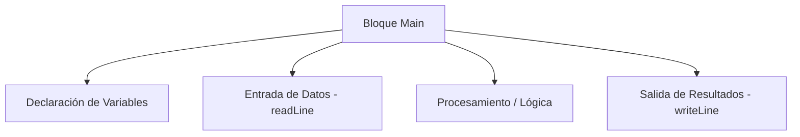

- [4. El Lenguaje de Programación Pseudocódigo DAW](#4-el-lenguaje-de-programación-pseudocódigo-daw)

# 4. El Lenguaje de Programación Pseudocódigo DAW
El pseudocódigo DAW es un lenguaje de programación diseñado para ser sencillo y fácil de entender, ideal para principiantes en programación. Combina elementos de varios lenguajes de programación populares, como C#, Java y Python, para ofrecer una sintaxis clara y concisa.

Se usará para aprender los conceptos fundamentales de la programación antes de pasar a lenguajes más complejos y con ello facilitar la transición a lenguajes de programación reales. Con él se pueden crear programas estructurados y modulares y resolver problemas de programación comunes.

## Estructura Visual de un Programa DAW

## Tabla de Equivalencias Rápidas

| Concepto | Pseudocódigo DAW | C# | Java |
| :--- | :--- | :--- | :--- |
| Punto Entrada | `Main { ... }` | `static void Main() { ... }` | `public static void main(...) { ... }` |
| Salida Consola | `writeLine("...")` | `Console.WriteLine("...")` | `System.out.println("...")` |
| Entrada Consola | `readLine()` | `Console.ReadLine()` | `scanner.nextLine()` |
| Constantes | `const PI = 3.14` | `const double PI = 3.14` | `final double PI = 3.14` |
| Solo lectura | `readonly año = 2024` | `readonly int año = 2024` | `final int año = 2024` |
| Inferencia | `var x = 10` | `var x = 10` | `var x = 10` (Java 10+) |

[Lenguaje de pseudocódigo DAW](/lenguaje_daw.md)
