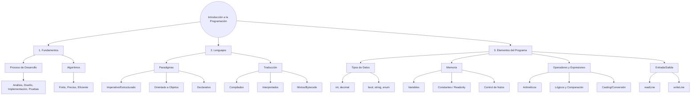

- [5. Resumen](#5-resumen)
  - [Resumen de la Unidad](#resumen-de-la-unidad)
  - [Mapa Conceptual](#mapa-conceptual)

# 5. Resumen

## Resumen de la Unidad

En esta unidad hemos asentado los pilares fundamentales del desarrollo de software. Hemos comenzado entendiendo que **programar** es mucho más que escribir código; es un proceso de resolución de problemas que requiere análisis, diseño y mantenimiento.

Los **algoritmos** son la base lógica de cualquier programa, caracterizándose por ser finitos, precisos y definidos. Hemos explorado la rica diversidad de los **lenguajes de programación**, clasificándolos por su nivel de abstracción (bajo, medio, alto) y sus mecanismos de traducción (compilados, interpretados y mixtos).

Finalmente, nos hemos sumergido en los **elementos básicos de la programación**:
- **Estructura**: El bloque `Main` como punto de entrada.
- **Datos**: El uso de variables, constantes y el manejo de tipos (int, decimal, bool, string).
- **Lógica**: Operadores aritméticos, de comparación y lógicos (Leyes de De Morgan).
- **Interacción**: Entrada (`readLine`) y salida (`writeLine`) de datos, destacando la importancia del casting para la conversión de tipos.

## Mapa Conceptual

## 🚩 Checklist de Supervivencia del Programador

Si puedes responder "SÍ" a estos puntos, estás listo para la Unidad 2:

- [ ] ¿Entiendo que un programa es una solución a un problema y no solo código?
- [ ] ¿Sé la diferencia entre un lenguaje compilado (C++) e interpretado (Python)?
- [ ] ¿Diferencio claramente entre `int` y `decimal` (y por qué no usar `int` para precios)?
- [ ] ¿Tengo claro que `var` no significa que el tipo pueda cambiar luego?
- [ ] ¿Entiendo que `null` es un peligro y que `?` me ayuda a controlarlo?
- [ ] ¿Sé por qué `(5 + 2) * 3` no es lo mismo que `5 + 2 * 3`?
- [ ] ¿Recuerdo que `readLine()` siempre me da un `string` y debo convertirlo?
