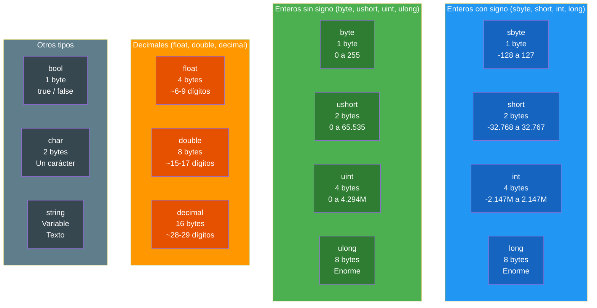
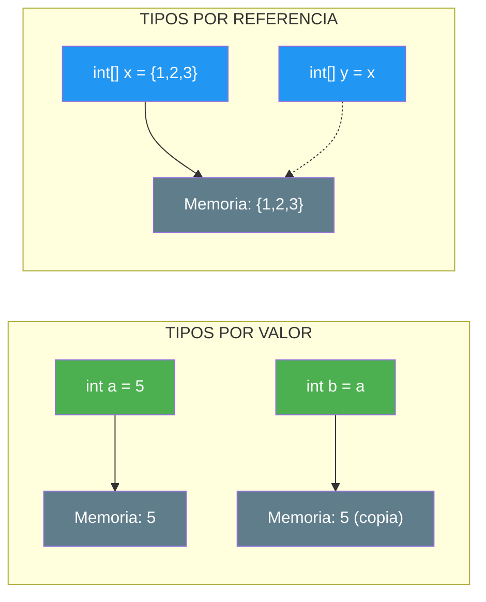

- [5. Tipos de Datos](#5-tipos-de-datos)
  - [5.1. ¿Qué es un tipo de dato?](#51-qué-es-un-tipo-de-dato)
  - [5.2. Tipos de datos numéricos](#52-tipos-de-datos-numéricos)
    - [5.2.1. Enteros con signo](#521-enteros-con-signo)
    - [5.2.2. Enteros sin signo](#522-enteros-sin-signo)
    - [5.2.3. Decimales](#523-decimales)
  - [5.3. Otros tipos de datos](#53-otros-tipos-de-datos)
  - [5.4. Tabla resumen de tipos](#54-tabla-resumen-de-tipos)
  - [5.5. El tipo var y la inferencia](#55-el-tipo-var-y-la-inferencia)
  - [5.6. Tipos por Valor y Tipos por Referencia](#56-tipos-por-valor-y-tipos-por-referencia)


# 5. Tipos de Datos

> 💡 **Punto de partida:** ¿Alguna vez has intentado meter una frase en una calculadora? No funciona, porque la calculadora espera números. Los tipos de datos son las "etiquetas" que le dicen al ordenador qué tipo de información está manejando.

En este tema aprenderás qué tipos de datos existen en C#, cuánta memoria ocupan y por qué es importante elegir el tipo correcto.

**Objetivos de aprendizaje:**

- Conocer los tipos de datos numéricos (con y sin signo)
- Saber cuánta memoria ocupa cada tipo
- Entender la diferencia entre tipos de datos
- Usar `var` y la inferencia de tipos

## 5.1. ¿Qué es un tipo de dato?

Un **tipo de dato** define dos cosas fundamentales:

1. **Qué tipo de valores** puede contener una variable (números, texto, verdadero/falso...)
2. **Cuánta memoria** ocupa en el ordenador (1 byte, 4 bytes, 8 bytes...)

Elegir el tipo correcto es como elegir el contenedor adecuado: no metes agua en una bolsa de papel, y no necesitas un camión para llevar una carta.

> 💡 **Analogía:** Los tipos de datos son como las cajas de una tienda. Tienes cajas pequeñas para anillos (1 byte), cajas medianas para zapatos (4 bytes) y cajas grandes para televisores (8 bytes). Cada tipo de dato tiene un "tamaño" fijo en memoria y un "contenido" (valores que puede guardar).

### Diagrama de tipos y tamaños



> 📝 **Nota:** Cada tipo tiene un tamaño **fijo**. Un `int` siempre ocupa 4 bytes, no importa si guardas el número 1 o el número 2.000.000.000. El tipo **no cambia** según el valor: lo que cambia es si el valor cabe o no en ese tipo.

> ⚠️ **¿Por qué importa elegir bien el tipo?** Elegir el tipo incorrecto puede causar errores graves en aplicaciones reales:
> - Usar `int` para dinero → pierde decimales (imagina una facturación que redondea)
> - Usar `byte` para una puntuación → desborda si el jugador saca más de 255 puntos
> - Usar `double` para una contraseña → pierde caracteres especiales
>
> En esta unidad crearemos una **Pokédex** donde elegiremos `string` para nombre, `int` para CP, `double` para nivel y `bool` para leyenda.

## 5.2. Tipos de datos numéricos

### 5.2.1. Enteros con signo

Los enteros con signo pueden guardar números **positivos y negativos**. El signo ocupa 1 bit, por lo que el rango se reduce a la mitad.

| Tipo | Tamaño | Rango | Memoria | Valor por defecto |
|------|--------|-------|---------|-----------------|
| `sbyte` | 8 bits | -128 a 127 | 1 byte | `0` |
| `short` | 16 bits | -32.768 a 32.767 | 2 bytes | `0` |
| `int` | 32 bits | -2.147.483.648 a 2.147.483.647 | 4 bytes | `0` |
| `long` | 64 bits | -9.223.372.036.854.775.808 a 9.223.372.036.854.775.807 | 8 bytes | `0` |

**Ejemplos de uso:**

```csharp
sbyte temperatura = -10;          // Temperatura bajo cero
short poblacion = 35000;          // Población de un pueblo
int distanciaKm = 1_500_000;     // Distancia en kilómetros
long kilometrosEstelares = 9_000_000_000_000L; // Números enormes
```

> 📝 **Nota:** El guion bajo `_` en los números (`1_500_000`) es solo para legibilidad. El compilador lo ignora. Es como poner puntos en los números: 1.500.000.

> 💡 **Consejo:** Usa `int` por defecto para enteros. Solo usa `long` cuando `int` no es suficiente (números mayores a 2.147 millones).

### 5.2.2. Enteros sin signo

Los enteros sin signo solo guardan números **positivos y cero**. Al no necesitar el bit de signo, el rango se duplica.

| Tipo | Tamaño | Rango | Memoria | Valor por defecto |
|------|--------|-------|---------|-----------------|
| `byte` | 8 bits | 0 a 255 | 1 byte | `0` |
| `ushort` | 16 bits | 0 a 65.535 | 2 bytes | `0` |
| `uint` | 32 bits | 0 a 4.294.967.295 | 4 bytes | `0` |
| `ulong` | 64 bits | 0 a 18.446.744.073.709.551.615 | 8 bytes | `0` |

**Ejemplos de uso:**

```csharp
byte porcentaje = 85;            // Porcentaje de batería (nunca negativo)
ushort edad = 25;                // Edad de una persona
uint usuariosActivos = 1_500_000; // Usuarios de una web
ulong visitasWeb = 3_000_000_000UL; // Contador de visitas
```

> ⚠️ **Advertencia:** Si un tipo sin signo intenta guardar un número negativo, dará error o un resultado inesperado. Solo usa sin signo cuando **necesites** que el valor sea siempre positivo.

📌 **Ejemplo real:** Un `byte` se usa mucho para colores en pantallas. Cada color RGB tiene valores de 0 a 255 por canal. Un `byte` es perfecto para eso.

### 5.2.3. Decimales

Para números con decimales (parte fraccionaria), tenemos varios tipos:

| Tipo | Precisión | Tamaño | Memoria | Valor por defecto |
|------|-----------|--------|---------|-----------------|
| `float` | ~6-9 dígitos | 32 bits | 4 bytes | `0` |
| `double` | ~15-17 dígitos | 64 bits | 8 bytes | `0` |
| `decimal` | ~28-29 dígitos | 128 bits | 16 bytes | `0` |

**Diferencias importantes:**

```csharp
// float: precisión baja, usa sufijo f
float precio = 19.99f;

// double: precisión alta, es el por defecto para decimales
double distancia = 3.14159265358979;

// decimal: máxima precisión, ideal para dinero, usa sufijo m
decimal saldo = 1234.56m;
```

> 💡 **Consejo:** Para dinero y cálculos financieros, **siempre** usa `decimal`. `float` y `double` pueden tener errores de precisión que acumulan diferencias.

📌 **Ejemplo real:** En el año 1999, elCodeAtivo de la sonda Mars Climate Orbiter se perdió porque un equipo usó unidades imperiales y otro métricas. Aunque no es exactamente un error de tipos, ilustra lo que pasa cuando los datos no se representan correctamente. En programación, usar `double` para dinero puede causar diferencias como: `0.1 + 0.2 = 0.30000000000000004` en vez de `0.3`.

> ⚠️ **Advertencia:** `float` y `double` no son exactos. Por ejemplo, `0.1 + 0.2` no da exactamente `0.3` en `double`. Para cálculos que requieren exactitud, usa `decimal`.

## 5.3. Otros tipos de datos

| Tipo | Tamaño | Valores | Memoria | Valor por defecto |
|------|--------|---------|---------|-----------------|
| `bool` | 1 bit | `true` o `false` | 1 byte | `false` |
| `char` | 16 bits | Un carácter Unicode | 2 bytes | `'\0'` (nulo) |
| `string` | Variable | Texto (secuencia de caracteres) | Variable | `null` |

**Ejemplos:**

```csharp
bool esMayorEdad = true;          // Valor verdadero o falso
char inicial = 'A';              // Un solo carácter
string nombre = "Ana García";    // Texto (múltiples caracteres)
```

> 📝 **Nota:** `string` no es un tipo de valor como los demás. Es una referencia. Pero se usa tan frecuente que parece un tipo básico.

### Tipos adicionales

| Tipo | Descripción | Uso típico |
|------|-------------|------------|
| `nint` / `nuint` | Entero nativo de plataforma (32 o 64 bits según el SO) | Índices, punteros |
| `Half` | Punto flotante de 16 bits (menor precisión que float) | Gráficos, IA, ahorro de memoria |
| `DateTime` | Fecha y hora | `DateTime.Now`, `DateTime.Parse("2026-09-07")` |
| `DateOnly` | Solo fecha (sin hora) | `DateOnly.FromDateTime(DateTime.Now)` |
| `TimeOnly` | Solo hora (sin fecha) | `TimeOnly.FromDateTime(DateTime.Now)` |
| `Guid` | Identificador único global | `Guid.NewGuid()` — identificadores únicos |
| `(Tipo1, Tipo2)` | **Tupla** — agrupa varios valores en uno | Devolver varios resultados de una función |

```csharp
DateTime ahora = DateTime.Now;              // 07/09/2026 12:34:56
DateOnly hoy = DateOnly.FromDateTime(ahora); // 07/09/2026
TimeOnly hora = TimeOnly.FromDateTime(ahora); // 12:34:56
Guid id = Guid.NewGuid();                    // a1b2c3d4-e5f6-7890-abcd-ef1234567890
```

### Tuplas: agrupar datos de diferentes tipos

Una **tupla** te permite agrupar varios valores en una sola variable, sin necesidad de crear una clase o struct. Es como un "paquete" de datos.

```csharp
// Tupla con tipos inferidos (usando Item1, Item2)
var persona = ("Ana", 25);
Console.WriteLine(persona.Item1);  // "Ana"
Console.WriteLine(persona.Item2);  // 25

// Tupla con nombres (más legible)
(string nombre, int edad) persona2 = ("Luis", 30);
Console.WriteLine(persona2.nombre);  // "Luis"
Console.WriteLine(persona2.edad);    // 30

// Tupla con 3 elementos
var jugador = ("Carlos", 42, 9800);
Console.WriteLine($"{ jugador.Item1 } - Nivel { jugador.Item2 } - { jugador.Item3 } pts");
```

### Desestructurar tuplas

Puedes extraer los valores de una tupla en variables individuales:

```csharp
// Desestructuración completa
(string nombre, int edad, double nota) = ("Ana", 25, 8.5);
Console.WriteLine($"{ nombre } tiene { edad } años y nota { nota }");

// Descarte con _ (ignorar un valor que no necesitas)
var (nombre, _) = ("Ana", 25);  // Solo nos importa el nombre
Console.WriteLine(nombre);  // "Ana"
```

### Igualdad de tuplas

Las tuplas comparan **por valores**, no por referencias:

```csharp
var a = (1, 2);
var b = (1, 2);
Console.WriteLine(a == b);  // True (mismos valores)

var c = (1, 3);
Console.WriteLine(a == c);  // False (distinto segundo valor)
```

> 💡 **Analogía:** Una tupla es como una **caja de zapatos** donde metes cosas de diferentes tipos: unos zapatos, unas llaves y un billete. Todo va junto en un solo paquete, pero cada cosa mantiene su tipo.

> 💡 **¿Cuándo usar tupla vs variable suelta?** Cuando necesitas agrupar 2-3 valores relacionados y no quieres crear un tipo nuevo. Ejemplo: `(string nombre, int edad)` es más limpio que tener `string nombre` y `int edad` por separado.

## 5.4. Tabla resumen de tipos

| Tipo | Signo | Tamaño | Rango aproximado | Uso típico | Defecto |
|------|-------|--------|------------------|------------|---------|
| `byte` | No | 1 byte | 0 a 255 | Colores, datos binarios | `0` |
| `sbyte` | Sí | 1 byte | -128 a 127 | Enteros pequeños con signo | `0` |
| `short` | Sí | 2 bytes | -32K a 32K | Poblaciones, cantidades | `0` |
| `ushort` | No | 2 bytes | 0 a 65K | Edades, índices | `0` |
| `int` | Sí | 4 bytes | ±2.147M | **Uso general (por defecto)** | `0` |
| `uint` | No | 4 bytes | 0 a 4.294M | Contadores grandes | `0` |
| `long` | Sí | 8 bytes | ±9.22E | Números muy grandes | `0` |
| `ulong` | No | 8 bytes | 0 a 18.4E | Contadores masivos | `0` |
| `float` | - | 4 bytes | ~6-9 dígitos | Gráficos, física | `0` |
| `double` | - | 8 bytes | ~15-17 dígitos | **Decimales (por defecto)** | `0` |
| `decimal` | - | 16 bytes | ~28-29 dígitos | **Dinero, finanzas** | `0` |
| `bool` | - | 1 byte | `true`/`false` | Condiciones, banderas | `false` |
| `char` | - | 2 bytes | Un carácter | Letras, símbolos | `'\0'` |
| `string` | - | Variable | Texto | Nombres, mensajes | `null` |

> 📝 **Nota:** Los **valores por defecto** son los que C# asigna automáticamente a una variable cuando no se inicializa. Los numéricos valen `0`, `bool` vale `false`, `char` vale `'\0'` (carácter nulo) y `string` (al ser una referencia) vale `null`. Esto es importante cuando usas `TryParse`: si la conversión falla, la variable `out` toma este valor por defecto.

## 5.5. El tipo var y la inferencia

En C# puedes dejar que el compilador **infiera** el tipo de una variable. Usas `var` y el compilador deduce el tipo por el valor asignado.

```csharp
// El compilador sabe que 5 es int
var edad = 25;           // tipo: int

// El compilador sabe que "Hola" es string
var mensaje = "Hola";    // tipo: string

// El compilador sabe que 3.14 es double
var pi = 3.14;           // tipo: double

// El compilador sabe que true es bool
var activo = true;       // tipo: bool
```

> 💡 **Consejo:** Usa `var` cuando el tipo es evidente por el contexto. Si no es evidente, escribe el tipo explícitamente para mayor claridad.

```csharp
// ✅ BUENO: el tipo es evidente
var nombre = "Ana";          // Claramente un string
var edad = 25;               // Claramente un int
var precio = 19.99m;         // Claramente un decimal (sufijo m)

// ❌ MALO: el tipo no es evidente
var resultado = ObtenerResultado();  // ¿Qué tipo retorna?
```

## 5.6. Tipos por Valor y Tipos por Referencia

Este concepto es **fundamental**. Explica por qué `==` se comporta de forma diferente según el tipo y por qué `null` solo aparece en ciertos tipos.

### ¿Qué son los tipos por valor?

Los tipos por valor almacenan el **dato directamente** en la variable. Cuando asignas uno a otro, se **copia el contenido completo**.

```csharp
// Tipos por valor: int, double, bool, char, struct, enum
int a = 5;
int b = a;    // b es una COPIA de a
b = 10;
Console.WriteLine(a);  // 5 — a NO cambia
```

### ¿Qué son los tipos por referencia?

Los tipos por referencia almacenan una **dirección de memoria** (una referencia). Cuando asignas uno a otra variable, ambas apuntan al **mismo sitio**.

```csharp
// Tipos por referencia: string, arrays, clases
int[] array1 = { 1, 2, 3 };
int[] array2 = array1;    // array2 es un ALIAS de array1
array2[0] = 999;
Console.WriteLine(array1[0]);  // 999 — ¡array1 también cambió!
```

### Diagrama: ¿Cómo se almacenan en memoria?



### Tabla resumen

| Categoría | Tipos | ¿Dónde se almacenan? | Al copiar... |
| :--- | :--- | :--- | :--- |
| **Por valor** | `int`, `double`, `bool`, `char`, `struct`, `enum` | Directamente en la variable | Se copia el **contenido** |
| **Por referencia** | `string`, `array`, `clase`, `record` | En el montón (heap), variable guarda dirección | Se copia la **referencia** (alias) |

### El problema de `null`

`null` significa **"no apunta a ningún objeto"**. Solo aparece en tipos por referencia (y en tipos valor con `?`).

```csharp
// Tipos por referencia: pueden ser null
string nombre = null;      // ✅ Válido
int[] numeros = null;      // ✅ Válido

// Tipos por valor: NO pueden ser null (por defecto)
int edad = null;           // ❌ Error de compilación

// Pero con ? sí (nullable)
int? nota = null;          // ✅ Válido
```

> ⚠️ **Advertencia:** Intentar usar un valor `null` causa `NullReferenceException`. Es el error más común en programación.

### El problema de `==` con tipos por referencia

```csharp
// ✅ Tipos por valor: == compara CONTENIDO
int a = 5, b = 5;
Console.WriteLine(a == b);  // True — mismos valores

// ❌ Tipos por referencia: == compara REFERENCIA (¿son el mismo objeto?)
int[] x = { 1, 2, 3 };
int[] y = { 1, 2, 3 };
Console.WriteLine(x == y);  // False — son objetos DIFERENTES (en distintas posiciones de memoria)

// Esto SÍ es True (son el mismo objeto)
int[] z = x;
Console.WriteLine(x == z);  // True — apuntan al mismo sitio
```

> 💡 **Analogía:** `==` con tipos por valor es como preguntar "¿tienen el mismo contenido?". Con tipos por referencia es como preguntar "¿son la misma persona?" (la misma dirección de memoria).

> 📝 **Nota:** Los strings son un caso especial. Aunque son tipos por referencia, C# los trata de forma especial con **interning** (reutiliza strings idénticos). Por eso `"Hola" == "Hola"` es `True`. Pero no confíes: siempre usa `.Equals()` para comparar strings en producción.

---

**Resumen del punto:**

| Concepto | Descripción |
|----------|-------------|
| **Tipo de dato** | Define qué valores puede contener una variable |
| **Con signo** | Positivos y negativos (`sbyte`, `short`, `int`, `long`) |
| **Sin signo** | Solo positivos (`byte`, `ushort`, `uint`, `ulong`) |
| **Decimales** | `float` (baja), `double` (media), `decimal` (alta precisión) |
| **`var`** | Inferencia de tipos: el compilador deduce el tipo |
| **Por valor** | `int`, `bool`, `struct`, `enum` — se copia el contenido |
| **Por referencia** | `string`, `array`, `clase` — se copia la referencia (alias) |
| **`null`** | "No apunta a ningún objeto" — solo en tipos por referencia |

En el siguiente punto veremos variables, constantes, literales y enumeraciones en C#.
