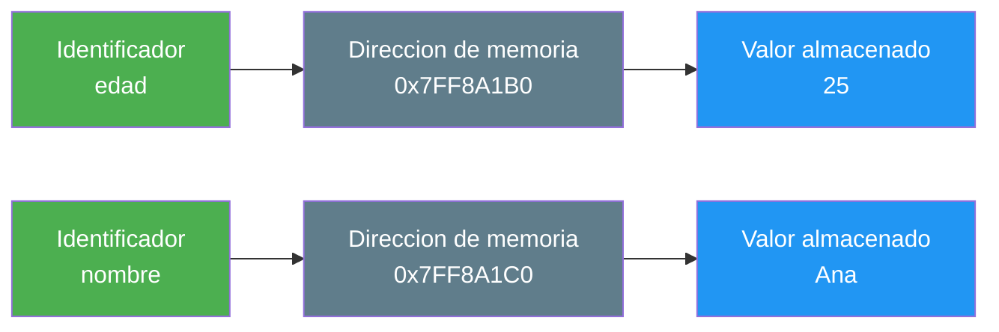
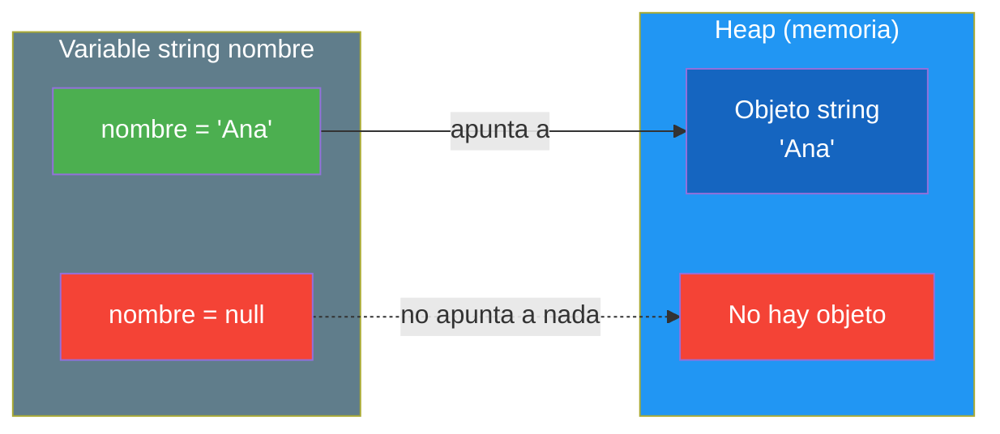

- [6. Variables, Constantes, Literales, Enumeraciones y Structs](#6-variables-constantes-literales-enumeraciones-y-structs)
  - [6.1. Variables](#61-variables)
  - [6.2. Null y Tipos Nullable](#62-null-y-tipos-nullable)
  - [6.3. Constantes](#63-constantes)
  - [6.4. Literales](#64-literales)
  - [6.5. Diferencias entre variable, constante y literal](#65-diferencias-entre-variable-constante-y-literal)
  - [6.6. Enumeraciones](#66-enumeraciones)
  - [6.7. Structs: tipos de valor compuestos](#67-structs-tipos-de-valor-compuestos)
  - [6.8. Tuplas: agrupar datos de diferentes tipos](#68-tuplas-agrupar-datos-de-diferentes-tipos)
  - [6.9. Código autodocumentado](#69-código-autodocumentado)


# 6. Variables, Constantes y Literales

> 💡 **Punto de partida:** Cuando vas al supermercado, llevas una lista de la compra. Cada artículo es como una variable: tiene un nombre y un valor. Las constantes son cosas que no cambian (como el precio del IVA). Los literales son los valores concretos que escribes.

En este tema aprenderás a crear y usar variables, constantes y literales en C#.

> **Proyecto Pokédex:** Declaramos las variables de un Pokémon: `string nombre`, `int cp`, `double nivel`, `bool esLegendario`. La constante `MaxCp` no cambia nunca.

**Objetivos de aprendizaje:**

- Declarar y asignar variables
- Entender el ámbito (scope) de las variables
- Crear constantes con `const`
- Diferenciar variables, constantes y literales

## 6.1. Variables

Una **variable** es un contenedor con nombre que almacena un dato que **puede cambiar** durante la ejecución del programa.

### Declaración y asignación

```csharp
// Declaración: crear la variable
string nombre;

// Asignación: darle un valor
nombre = "Ana";

// Declaración + asignación en una línea
int edad = 25;

// Múltiples declaraciones del mismo tipo
int x, y, z;
x = 1; y = 2; z = 3;
```

### Reglas para nombres de variables

```csharp
// ✅ VÁLIDO
string nombreCliente;      // camelCase (recomendado)
string _edad;              // empieza por guion bajo (campos privados)
string nombre2;            // puede tener números
string miVariableLarga;    // descriptivo

// ❌ INVÁLIDO
string 2nombre;            // No puede empezar por número
string mi-variable;        // No puede tener guiones
string mi variable;        // No puede tener espacios
string class;              // No puede ser palabra reservada
```

> 💡 **Consejo:** Usa siempre **camelCase** para variables: primera palabra en minúsculas, las demás con mayúscula inicial. Ejemplo: `nombreCliente`, `precioTotal`, `esActivo`.

### ¿Qué es un identificador?

Un **identificador** es el nombre que le damos a una variable, constante, método, clase... Es la "etiqueta" que usamos para referirnos a algo.

```csharp
int edad = 25;      // "edad" es el identificador
string nombre = "Ana"; // "nombre" es el identificador
const double Iva = 21.0; // "Iva" es el identificador
```

> 💡 **Analogía:** El identificador es como el nombre que le pones a una entrada en tu agenda de teléfonos. "María" es el identificador, pero por detrás hay un número de teléfono (dirección de memoria) donde se almacena la información.

### Cómo funciona por debajo: memoria

Cuando declaras una variable, el compilador reserva una **zona de memoria** (un "cajón") para almacenar el valor. El identificador apunta a esa zona de memoria:



Cada variable tiene:
- **Un nombre** (identificador): lo que tú escribes en el código
- **Una dirección de memoria**: dónde se guarda físicamente
- **Un tipo**: qué tipo de datos puede almacenar
- **Un valor**: la información que contiene

> 📝 **Nota:** Tú no controlas la dirección de memoria (la asigna el sistema operativo), pero sí controlas el nombre y el valor. Por eso los identificadores deben ser descriptivos: porque son la forma que tienes de "llamar" a esa zona de memoria.

### Inicialización

Siempre es buena práctica inicializar las variables al declararlas:

```csharp
// ✅ BUENO: inicializar al declarar
int edad = 0;
string nombre = "";
bool activo = false;

// ❌ MALO: usar sin inicializar (puede dar error)
int edad;
Console.WriteLine(edad);  // Error: edad no tiene un valor asignado
```

> ⚠️ **Advertencia:** En C#, si una variable local no está inicializada y la intentas usar, el compilador dará error. Esto evita bugs por usar valores "basura" de memoria.

### Ámbito (Scope) de las variables

El **ámbito** es la zona del código donde la variable es visible y puede usarse.

```csharp
int global = 10;  // Variable global (del archivo en Top-Level)

void MiMetodo()
{
    int local = 20;  // Solo existe dentro de este método

    if (true)
    {
        int bloque = 30;  // Solo existe dentro de este bloque
        Console.WriteLine(local);  // ✅ Puede acceder
    }

    Console.WriteLine(bloque);  // ❌ Error: bloque no existe aquí
}

Console.WriteLine(local);  // ❌ Error: local no existe aquí
```

> 💡 **Analogía:** Las variables son como la ropa. Dentro de tu casa (método) puedes usar la ropa que quieras. Pero si dejas la ropa en la calle (fuera del método), otros no pueden usarla.

### Variedad de vida (Lifetime)

Una variable local existe mientras se está ejecutando el bloque donde se declaró. Cuando el bloque termina, la variable desaparece.

```csharp
{
    int temporal = 10;
    Console.WriteLine(temporal);  // 10 — temporal existe aquí
}
// Console.WriteLine(temporal);  // ❌ Error: temporal ya no existe aquí
```

## 6.2. Null y Tipos Nullable

En el punto anterior vimos que los tipos por referencia pueden tener el valor `null`. Ahora profundizamos: qué es `null`, por qué existe, y cómo protegernos de él.

### ¿Qué es `null`?

`null` significa **"no apunta a ningún objeto"**. Es como tener una entrada en tu agenda de teléfonos que dice "María" pero no tiene número asignado. Si intentas llamar, no puedes. Peor aún, si intentas preguntarle algo a María, no hay María a quien preguntar.

```csharp
string nombre = null;  // nombre no apunta a ningún string
int[] numeros = null;  // numeros no apunta a ningún array

// Intentar usar null → error en tiempo de ejecución
Console.WriteLine(nombre.Length);  // ❌ NullReferenceException
```

**La historia del "error de un billón de dólares":**

En 2009, Tony Hoare, el científico que inventó `null` en 1965, se disculpó públicamente llamándolo su "error de un billón de dólares". Lo creó para representar "ausencia de valor" en el lenguaje ALGOL W, pero no previo las consecuencias: miles de millones de bugs en todo el mundo causados por intentar usar `null` sin querer.



### ¿Por qué existen los tipos nullable?

Los tipos por valor (`int`, `bool`, `double`) **no pueden ser null** por defecto. Un `int` siempre tiene un valor (0, 5, -3...). Esto es seguro, pero a veces necesitas representar "ausencia de valor": ¿qué nota tiene un alumno que aún no ha examinado? ¿Qué email tiene un usuario que no lo ha proporcionado?

El operador `?` convierte un tipo en un **contenedor flexible** que puede tener un valor **o** null:

```csharp
int nota = 0;           // Siempre tiene valor (0 por defecto)
int? notaAlumno = null;  // Puede ser null (examen no realizado)

string email = "";           // Siempre tiene valor (string vacío)
string? emailUsuario = null;  // Puede ser null (no proporcionado)
```

> 💡 **Analogía:** Un `int` es una caja cerrada que siempre tiene algo dentro. Un `int?` es una caja con tapa transparente: puedes ver si tiene algo o si está vacía (`null`).

| Sin nullable | Con nullable |
|-------------|-------------|
| `int nota = 0` → ¿Es 0 o no se ha evaluado? | `int? nota = null` → null = no evaluado, 0 = nota cero |
| `string email = ""` → ¿Está vacío o no se dio? | `string? email = null` → null = no proporcionado |

> 📝 **Nota:** En C# con `<Nullable>enable</Nullable>` en el `.csproj`, el compilador te avisa cuando intentas usar un valor que podría ser null. Esto reduce enormemente los bugs.

### Cómo protegernos de null

```csharp
// Operador de coalescencia: si es null, usa otro valor
string? nombre = null;
string nombreSeguro = nombre ?? "Desconocido";  // "Desconocido"

string? apellido = "García";
string apellidoSeguro = apellido ?? "Desconocido";  // "García"

// Otro ejemplo con números
int? nota = null;
int notaFinal = nota ?? 0;  // 0 si no hay nota

int? puntos = 150;
int puntosFinales = puntos ?? 0;  // 150 (no es null, usa el valor)
```

### Operador `is`: comprobación segura de null

El operador `is` permite verificar el tipo y **extraer el valor** en una sola operación:

```csharp
object dato = "Hola";

// Con is + pattern matching: verifica tipo y extrae en una línea
if (dato is string texto)
{
    Console.WriteLine(texto);  // "Hola" — sin casting, ya extraído
}

// Verificar si no es null
if (dato is not null)
{
    Console.WriteLine($"Dato tiene valor: {dato}");
}
```

> 💡 **Consejo:** `is` combina comprobación de nulidad + tipo + extracción en una sola línea. Es la forma moderna y segura de trabajar con nulls en C#.

## 6.3. Constantes

Una **constante** es un valor que **no puede cambiar** una vez asignado. Se declara con `const`.

```csharp
// Declarar una constante
const double Iva = 21.0;
const string Pais = "España";
const int MaximoUsuarios = 100;

// Usar la constante
double precioBase = 100.0;
double precioConIva = precioBase * (1 + Iva / 100);

// Intentar modificarla → ERROR de compilación
Iva = 22.0;  // ❌ Error: no se puede modificar una constante
```

> 💡 **Consejo:** Usa **PascalCase** para constantes: primera letra en mayúscula. Ejemplo: `Iva`, `Pais`, `MaximoUsuarios`.

### Las constantes son de compilación

Las constantes (`const`) se resuelven en **tiempo de compilación**, no en tiempo de ejecución. Esto significa que el compilador las reemplaza directamente por su valor, como un "buscar y reemplazar":

```csharp
const double Iva = 21.0;
double precio = 100.0;
double total = precio * (1 + Iva / 100);
```

Lo que el compilador ve después de "buscar y reemplazar":

```csharp
double precio = 100.0;
double total = precio * (1 + 21.0 / 100);  // Iva se reemplaza por 21.0
```

> 💡 **Analogía:** Una constante es como un post-it en tu monitor donde pones "IVA = 21%". Cada vez que necesitas ese valor, miras el post-it. Pero el compilador es más listo: reemplaza el post-it directamente por el valor en el código final.

**Ventajas de las constantes de compilación:**

- **Rendimiento:** No hay búsqueda en memoria, el valor ya está en el código
- **Seguridad:** No se puede cambiar accidentalmente
- **Claridad:** El nombre describe qué es el valor

> ⚠️ **Advertencia:** Como las constantes se reemplazan en compilación, no puedes usar valores calculados en runtime. Por ejemplo, `const double Iva = DateTime.Now.Month == 12 ? 25.0 : 21.0;` NO funciona.

### ¿Cuándo usar const vs readonly?

| Característica | `const` | `readonly` |
|----------------|---------|------------|
| **Valor** | Se asigna en la declaración | Se puede asignar en el constructor |
| **Tiempo** | Compilación | Runtime (ejecución) |
| **Uso** | Valores que NUNCA cambian | Valores que cambian raramente |

```csharp
// const: valor fijo en compilación
const double Pi = 3.14159265358979;

// readonly: se puede asignar en el constructor
readonly string FechaCreacion;

public MiClase()
{
    FechaCreacion = DateTime.Now.ToString();  // ✅ Válido
}
```

> 📝 **Nota:** En esta unidad solo usaremos `const`. `readonly` lo veremos cuando estudiemos clases.

## 6.4. Literales

Un **literal** es un valor fijo escrito directamente en el código. No es una variable ni una constante — es el valor en sí.

```csharp
// Literales de diferentes tipos
int entero = 42;              // Literal entero
double decimal = 3.14;        // Literal decimal
string texto = "Hola";        // Literal string
char caracter = 'A';          // Literal char
bool booleano = true;         // Literal booleano
```

### Formatos de literales numéricos

```csharp
// Enteros
int decimal = 42;
int hexadecimal = 0x2A;       // 42 en hexadecimal
int binario = 0b101010;       // 42 en binario
int conGuiones = 1_000_000;   // 1.000.000 (guiones para legibilidad)

// Decimales
double pi = 3.14;
double notacionCientifica = 3.14e2;  // 314.0
float precio = 19.99f;               // sufijo f para float
decimal saldo = 1234.56m;            // sufijo m para decimal

// Strings
string saludo = "Hola mundo";
string ruta = @"C:\Users\Ana";       // verbatim string (ignora \)
string interpolado = $"Tengo {edad} años";  // string interpolation
```

> 💡 **Truco:** Los guiones bajos en números (`1_000_000`) son solo visuales. El compilador los ignora. Facilita mucho la lectura de números grandes.

## 6.5. Diferencias entre variable, constante y literal

| Característica | Variable | Constante | Literal |
|----------------|----------|-----------|---------|
| **Nombre** | Sí | Sí | No |
| **Puede cambiar** | Sí | No | No |
| **Se declara** | Con tipo | Con `const` | No se declara |
| **Ejemplo** | `int x = 5;` | `const int X = 5;` | `5` |
| **En memoria** | Dirección variable | Dirección fija | Valor directo |

```csharp
int edad = 25;          // 'edad' es la variable, 25 es el literal
const int Edad = 25;    // 'Edad' es la constante, 25 es el literal

edad = 30;              // ✅ OK: la variable cambia
Edad = 30;              // ❌ Error: la constante no cambia
```

> 💡 **Analogía:** Una variable es como una pizarra donde puedes borrar y escribir. Una constante es como una placa de metal: lo que está grabado, no cambia. Un literal es el dato en sí, como el número "25" escrito en un papel.

## 6.6. Enumeraciones

Una **enumeración** (`enum`) es un tipo de datos que define un conjunto de **valores con nombre**. Es como una lista de opciones fijas.

> 💡 **Analogía:** Un enum es como un semáforo. Solo puede tener 3 estados: Rojo, Amarillo, Verde. No puede ser "azul" ni "morado". El enum fuerza a que solo se usen los valores definidos.

```csharp
// Declarar una enumeración
enum DiaSemana
{
    Lunes,
    Martes,
    Miercoles,
    Jueves,
    Viernes,
    Sabado,
    Domingo
}

// Usar la enumeración
DiaSemana hoy = DiaSemana.Miercoles;

// Comparar con un valor del enum
bool esFinDeSemana = (hoy == DiaSemana.Sabado || hoy == DiaSemana.Domingo);
Console.WriteLine($"¿Es fin de semana? {esFinDeSemana}");  // False

// Imprimir el nombre del enum
Console.WriteLine(hoy);  // Muestra: Miercoles
```

### Valores numéricos de los enums

Por defecto, cada valor empieza en 0 y se incrementa. Pero puedes asignar valores manualmente:

```csharp
// Valores por defecto: Lunes=0, Martes=1, Miercoles=2...
enum Mes
{
    Enero = 1,      // Asignamos 1 manualmente
    Febrero,        // 2
    Marzo,          // 3
    Abril,          // 4
    // ... y así sucesivamente
}

// Obtener el valor numérico
int valorMes = (int)Mes.Marzo;  // 3
```

> 📝 **Nota:** Los enums son muy útiles para representar estados, opciones o categorías fijas. En C# se usan mucho con `switch` y con tipos de datos parametrizables.

## 6.7. Structs: tipos de valor compuestos

Un **struct** es un tipo de dato que permite **agrupar varios campos bajo un mismo nombre**, como una mini-cajita con etiquetas. Es similar a una tupla, pero con nombre y campos con nombre.

> 💡 **Analogía:** Un struct es como una **ficha de usuario**: tiene campos como nombre, edad y correo. Todo junto bajo un mismo nombre, pero sin la complejidad de una clase.

```csharp
// Definir un struct
struct Punto
{
    public int X;
    public int Y;
}

// Crear una instancia
Punto origen;
origen.X = 0;
origen.Y = 0;

// O con inicialización
Punto destino = new() { X = 10, Y = 20 };

Console.WriteLine($"Origen: ({origen.X}, {origen.Y})");   // (0, 0)
Console.WriteLine($"Destino: ({destino.X}, {destino.Y})"); // (10, 20)
```

### Structs vs Tuplas

| Característica | Tupla | Struct |
| :--- | :--- | :--- |
| **Nombre** | No tiene (solo `Item1`, `Item2`) | Tiene nombre (`Punto`, `Jugador`) |
| **Campos** | Genéricos (`Item1`, `Item2`) | Descriptivos (`X`, `Y`, `Nombre`) |
| **Cuándo usar** | Datos temporales, return rápido | Modelos con significado |
| **Legibilidad** | Baja | Alta |

```csharp
// Tupla: rápida pero poco descriptiva
var jugador = ("Ana", 25, 1500);
Console.WriteLine(jugador.Item1);  // ¿Qué es Item1?

// Struct: más claro
struct Jugador
{
    public string Nombre;
    public int Nivel;
    public int Puntos;
}

Jugador ana = new() { Nombre = "Ana", Nivel = 25, Puntos = 1500 };
Console.WriteLine(ana.Nombre);  // Mucho más claro
```

> 📝 **Nota:** Los structs son tipos de **valor** (como `int` o `bool`), no de referencia. Cuando asignas un struct a otra variable, se **copia** todo el contenido. En la UD04 (POO) veremos structs, clases y records en profundidad.

> 💡 **Regla práctica:** Si necesitas agrupar 2-3 valores y no te importa el nombre, usa una **tupla**. Si el modelo tiene sentido propio (un punto, un jugador, un color), usa un **struct**.

## 6.8. Tuplas: agrupar datos de diferentes tipos

Una **tupla** te permite agrupar varios valores en una sola variable, sin necesidad de crear una clase o struct. Es como un "paquete" de datos.

```csharp
// Tupla con tipos inferidos (usando Item1, Item2)
var persona = ("Ana", 25);
Console.WriteLine(persona.Item1);  // "Ana"
Console.WriteLine(persona.Item2);  // 25

// Tupla con nombres (más legible)
(string nombre, int edad) persona2 = ("Luis", 30);
Console.WriteLine(persona2.nombre);  // "Luis"
Console.WriteLine(persona2.edad);    // 30

// Tupla con 3 elementos
var jugador = ("Carlos", 42, 9800);
Console.WriteLine($"{ jugador.Item1 } - Nivel { jugador.Item2 } - { jugador.Item3 } pts");
```

### Desestructurar tuplas

Puedes extraer los valores de una tupla en variables individuales:

```csharp
// Desestructuración completa
(string nombre, int edad, double nota) = ("Ana", 25, 8.5);
Console.WriteLine($"{ nombre } tiene { edad } años y nota { nota }");

// Descarte con _ (ignorar un valor que no necesitas)
var (nombre, _) = ("Ana", 25);  // Solo nos importa el nombre
Console.WriteLine(nombre);  // "Ana"
```

### Igualdad de tuplas

Las tuplas comparan **por valores**, no por referencias (como todos los tipos por valor):

```csharp
var a = (1, 2);
var b = (1, 2);
Console.WriteLine(a == b);  // True (mismos valores)

var c = (1, 3);
Console.WriteLine(a == c);  // False (distinto segundo valor)
```

> 💡 **Analogía:** Una tupla es como una **caja de zapatos** donde metes cosas de diferentes tipos: unos zapatos, unas llaves y un billete. Todo va junto en un solo paquete, pero cada cosa mantiene su tipo.

> 💡 **¿Cuándo usar tupla vs variable suelta?** Cuando necesitas agrupar 2-3 valores relacionados y no quieres crear un tipo nuevo. Ejemplo: `(string nombre, int edad)` es más limpio que tener `string nombre` y `int edad` por separado.

> 📝 **Nota:** Las tuplas son tipos por valor (como vimos en§5.6), por lo que comparan por contenido, no por referencia. `(1, 2) == (1, 2)` es `True`.

## 6.9. Código autodocumentado

Un buen código se explica por sí mismo. El nombre de las variables debe describir qué contiene:

```csharp
// ❌ MALO: nombres poco descriptivos
int d = 30;
string n = "Ana";
bool e = true;

// ✅ BUENO: código autodocumentado
int diasDelMes = 30;
string nombre = "Ana";
bool estaActivo = true;

// ✅ BUENO: el código se entiende sin comentarios
double precioConIva = precio * (1 + Iva / 100);
```

> 💡 **Consejo:** Un buen programador escribe código que se entiende solo. Si necesitas un comentario para explicar qué hace una línea, probablemente el nombre de la variable o método no es bueno.

---

**Resumen del punto:**

| Concepto | Descripción | Ejemplo |
|----------|-------------|---------|
| **Variable** | Contenedor que puede cambiar | `int edad = 25;` |
| **Constante** | Contenedor que NO puede cambiar | `const double Iva = 21.0;` |
| **Literal** | Valor fijo en el código | `25`, `"Hola"`, `true` |
| **Enum** | Conjunto de valores con nombre | `enum DiaSemana { Lunes, ... }` |
| **Struct** | Tipo de valor compuesto con campos | `struct Punto { int X; int Y; }` |
| **Scope** | Dónde es visible la variable | Dentro de su bloque |
| **Lifetime** | Cuánto tiempo vive | Mientras se ejecuta el bloque |

En el siguiente punto veremos los operadores: aritméticos, relacionales, lógicos, de asignación, ternario y de coalescencia.
