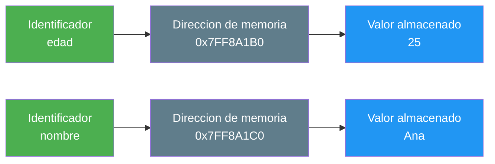

- [6. Variables, Constantes, Literales y Enumeraciones](#6-variables-constantes-literales-y-enumeraciones)
  - [6.1. Variables](#61-variables)
  - [6.2. Constantes](#62-constantes)
  - [6.3. Literales](#63-literales)
  - [6.4. Diferencias entre variable, constante y literal](#64-diferencias-entre-variable-constante-y-literal)
  - [6.5. Enumeraciones](#65-enumeraciones)
  - [6.6. Código autodocumentado](#66-código-autodocumentado)


# 6. Variables, Constantes y Literales

> 💡 **Punto de partida:** Cuando vas al supermercado, llevas una lista de la compra. Cada artículo es como una variable: tiene un nombre y un valor. Las constantes son cosas que no cambian (como el precio del IVA). Los literales son los valores concretos que escribes.

En este tema aprenderás a crear y usar variables, constantes y literales en C#.

**Objetivos de aprendizaje:**

- Declarar y asignar variables
- Entender el ámbito (scope) de las variables
- Crear constantes con `const`
- Diferenciar variables, constantes y literales

## 6.1. Variables

Una **variable** es un contenedor con nombre que almacena un dato que **puede cambiar** durante la ejecución del programa.

### Declaración y asignación

```csharp
// Declaración: crear la variable
string nombre;

// Asignación: darle un valor
nombre = "Ana";

// Declaración + asignación en una línea
int edad = 25;

// Múltiples declaraciones del mismo tipo
int x, y, z;
x = 1; y = 2; z = 3;
```

### Reglas para nombres de variables

```csharp
// ✅ VÁLIDO
string nombreCliente;      // camelCase (recomendado)
string _edad;              // empieza por guion bajo (campos privados)
string nombre2;            // puede tener números
string miVariableLarga;    // descriptivo

// ❌ INVÁLIDO
string 2nombre;            // No puede empezar por número
string mi-variable;        // No puede tener guiones
string mi variable;        // No puede tener espacios
string class;              // No puede ser palabra reservada
```

> 💡 **Consejo:** Usa siempre **camelCase** para variables: primera palabra en minúsculas, las demás con mayúscula inicial. Ejemplo: `nombreCliente`, `precioTotal`, `esActivo`.

### ¿Qué es un identificador?

Un **identificador** es el nombre que le damos a una variable, constante, método, clase... Es la "etiqueta" que usamos para referirnos a algo.

```csharp
int edad = 25;      // "edad" es el identificador
string nombre = "Ana"; // "nombre" es el identificador
const double Iva = 21.0; // "Iva" es el identificador
```

> 💡 **Analogía:** El identificador es como el nombre que le pones a una entrada en tu agenda de teléfonos. "María" es el identificador, pero por detrás hay un número de teléfono (dirección de memoria) donde se almacena la información.

### Cómo funciona por debajo: memoria

Cuando declaras una variable, el compilador reserva una **zona de memoria** (un "cajón") para almacenar el valor. El identificador apunta a esa zona de memoria:



Cada variable tiene:
- **Un nombre** (identificador): lo que tú escribes en el código
- **Una dirección de memoria**: dónde se guarda físicamente
- **Un tipo**: qué tipo de datos puede almacenar
- **Un valor**: la información que contiene

> 📝 **Nota:** Tú no controlas la dirección de memoria (la asigna el sistema operativo), pero sí controlas el nombre y el valor. Por eso los identificadores deben ser descriptivos: porque son la forma que tienes de "llamar" a esa zona de memoria.

### Inicialización

Siempre es buena práctica inicializar las variables al declararlas:

```csharp
// ✅ BUENO: inicializar al declarar
int edad = 0;
string nombre = "";
bool activo = false;

// ❌ MALO: usar sin inicializar (puede dar error)
int edad;
Console.WriteLine(edad);  // Error: edad no tiene un valor asignado
```

> ⚠️ **Advertencia:** En C#, si una variable local no está inicializada y la intentas usar, el compilador dará error. Esto evita bugs por usar valores "basura" de memoria.

### Ámbito (Scope) de las variables

El **ámbito** es la zona del código donde la variable es visible y puede usarse.

```csharp
int global = 10;  // Variable global (del archivo en Top-Level)

void MiMetodo()
{
    int local = 20;  // Solo existe dentro de este método

    if (true)
    {
        int bloque = 30;  // Solo existe dentro de este bloque
        Console.WriteLine(local);  // ✅ Puede acceder
    }

    Console.WriteLine(bloque);  // ❌ Error: bloque no existe aquí
}

Console.WriteLine(local);  // ❌ Error: local no existe aquí
```

> 💡 **Analogía:** Las variables son como la ropa. Dentro de tu casa (método) puedes usar la ropa que quieras. Pero si dejas la ropa en la calle (fuera del método), otros no pueden usarla.

### Variedad de vida (Lifetime)

Una variable local existe mientras se está ejecutando el bloque donde se declaró. Cuando el bloque termina, la variable desaparece.

```csharp
void Contar()
{
    for (int i = 0; i < 5; i++)
    {
        int temporal = i * 2;
        Console.WriteLine(temporal);
    }
    // i y temporal ya no existen aquí
}
```

### El valor null: el error de un billón de dólares

Las variables de tipos **referencia** (`string`, arrays, clases) pueden tener un valor especial llamado `null`. Significa que **la variable no apunta a ningún objeto** — está vacía, como un teléfono sin número asignado.

```csharp
string nombre = null;  // nombre no apunta a ningún string
int[] numeros = null;  // numeros no apunta a ningún array

// Intentar usar null → error en tiempo de ejecución
Console.WriteLine(nombre.Length);  // ❌ NullReferenceException
```

> ⚠️ **Advertencia:** `null` es una de las fuentes más comunes de errores en programación. Si intentas usar una variable que es `null` (como llamar a un método o acceder a una propiedad), el programa falla.

**La historia del "error de un billón de dólares":**

En 2009, Tony Hoare, el científico que inventó `null` en 1965, se disculpó públicamente llamándolo su "error de un billón de dólares". Lo creó para representar "ausencia de valor" en el lenguaje ALGOL W, pero no previo las consecuencias: miles de millones de bugs en todo el mundo causados por intentar usar `null` sin querer.

> 💡 **Analogía:** `null` es como tener una entrada en tu agenda de teléfonos que dice "María" pero no tiene número. Si intentas llamar, no puedes. Peor aún, si intentas preguntarle algo a María, no hay María a quien preguntar.

**Cómo protegerse de null en C#:**

```csharp
// Los tipos pueden ser "nullables" con ?
string? nombre = null;  // Puede ser null

// Operador de coalescencia: si es null, usa otro valor
string nombreSeguro = nombre ?? "Desconocido";

// Operador condicional: accede solo si no es null
int? longitud = nombre?.Length;  // Si nombre es null, longitud será null

// Verificar antes de usar
if (nombre != null)
{
    Console.WriteLine(nombre.Length);
}
```

> 📝 **Nota:** En C# con `<Nullable>enable</Nullable>` en el `.csproj`, el compilador te avisa cuando intentas usar un valor que podría ser null. Esto reduce enormemente los bugs.

## 6.2. Constantes

Una **constante** es un valor que **no puede cambiar** una vez asignado. Se declara con `const`.

```csharp
// Declarar una constante
const double Iva = 21.0;
const string Pais = "España";
const int MaximoUsuarios = 100;

// Usar la constante
double precioBase = 100.0;
double precioConIva = precioBase * (1 + Iva / 100);

// Intentar modificarla → ERROR de compilación
Iva = 22.0;  // ❌ Error: no se puede modificar una constante
```

> 💡 **Consejo:** Usa **PascalCase** para constantes: primera letra en mayúscula. Ejemplo: `Iva`, `Pais`, `MaximoUsuarios`.

### Las constantes son de compilación

Las constantes (`const`) se resuelven en **tiempo de compilación**, no en tiempo de ejecución. Esto significa que el compilador las reemplaza directamente por su valor, como un "buscar y reemplazar":

```csharp
const double Iva = 21.0;
double precio = 100.0;
double total = precio * (1 + Iva / 100);
```

Lo que el compilador ve después de "buscar y reemplazar":

```csharp
double precio = 100.0;
double total = precio * (1 + 21.0 / 100);  // Iva se reemplaza por 21.0
```

> 💡 **Analogía:** Una constante es como un post-it en tu monitor donde pones "IVA = 21%". Cada vez que necesitas ese valor, miras el post-it. Pero el compilador es más listo: reemplaza el post-it directamente por el valor en el código final.

**Ventajas de las constantes de compilación:**

- **Rendimiento:** No hay búsqueda en memoria, el valor ya está en el código
- **Seguridad:** No se puede cambiar accidentalmente
- **Claridad:** El nombre describe qué es el valor

> ⚠️ **Advertencia:** Como las constantes se reemplazan en compilación, no puedes usar valores calculados en runtime. Por ejemplo, `const double Iva = DateTime.Now.Month == 12 ? 25.0 : 21.0;` NO funciona.

### ¿Cuándo usar const vs readonly?

| Característica | `const` | `readonly` |
|----------------|---------|------------|
| **Valor** | Se asigna en la declaración | Se puede asignar en el constructor |
| **Tiempo** | Compilación | Runtime (ejecución) |
| **Uso** | Valores que NUNCA cambian | Valores que cambian raramente |

```csharp
// const: valor fijo en compilación
const double Pi = 3.14159265358979;

// readonly: se puede asignar en el constructor
readonly string FechaCreacion;

public MiClase()
{
    FechaCreacion = DateTime.Now.ToString();  // ✅ Válido
}
```

> 📝 **Nota:** En esta unidad solo usaremos `const`. `readonly` lo veremos cuando estudiemos clases.

## 6.3. Literales

Un **literal** es un valor fijo escrito directamente en el código. No es una variable ni una constante — es el valor en sí.

```csharp
// Literales de diferentes tipos
int entero = 42;              // Literal entero
double decimal = 3.14;        // Literal decimal
string texto = "Hola";        // Literal string
char caracter = 'A';          // Literal char
bool booleano = true;         // Literal booleano
```

### Formatos de literales numéricos

```csharp
// Enteros
int decimal = 42;
int hexadecimal = 0x2A;       // 42 en hexadecimal
int binario = 0b101010;       // 42 en binario
int conGuiones = 1_000_000;   // 1.000.000 (guiones para legibilidad)

// Decimales
double pi = 3.14;
double notacionCientifica = 3.14e2;  // 314.0
float precio = 19.99f;               // sufijo f para float
decimal saldo = 1234.56m;            // sufijo m para decimal

// Strings
string saludo = "Hola mundo";
string ruta = @"C:\Users\Ana";       // verbatim string (ignora \)
string interpolado = $"Tengo {edad} años";  // string interpolation
```

> 💡 **Truco:** Los guiones bajos en números (`1_000_000`) son solo visuales. El compilador los ignora. Facilita mucho la lectura de números grandes.

## 6.4. Diferencias entre variable, constante y literal

| Característica | Variable | Constante | Literal |
|----------------|----------|-----------|---------|
| **Nombre** | Sí | Sí | No |
| **Puede cambiar** | Sí | No | No |
| **Se declara** | Con tipo | Con `const` | No se declara |
| **Ejemplo** | `int x = 5;` | `const int X = 5;` | `5` |
| **En memoria** | Dirección variable | Dirección fija | Valor directo |

```csharp
int edad = 25;          // 'edad' es la variable, 25 es el literal
const int Edad = 25;    // 'Edad' es la constante, 25 es el literal

edad = 30;              // ✅ OK: la variable cambia
Edad = 30;              // ❌ Error: la constante no cambia
```

> 💡 **Analogía:** Una variable es como una pizarra donde puedes borrar y escribir. Una constante es como una placa de metal: lo que está grabado, no cambia. Un literal es el dato en sí, como el número "25" escrito en un papel.

## 6.5. Enumeraciones

Una **enumeración** (`enum`) es un tipo de datos que define un conjunto de **valores con nombre**. Es como una lista de opciones fijas.

> 💡 **Analogía:** Un enum es como un semáforo. Solo puede tener 3 estados: Rojo, Amarillo, Verde. No puede ser "azul" ni "morado". El enum fuerza a que solo se usen los valores definidos.

```csharp
// Declarar una enumeración
enum DiaSemana
{
    Lunes,
    Martes,
    Miercoles,
    Jueves,
    Viernes,
    Sabado,
    Domingo
}

// Usar la enumeración
DiaSemana hoy = DiaSemana.Miercoles;

// Comparar
if (hoy == DiaSemana.Sabado || hoy == DiaSemana.Domingo)
{
    Console.WriteLine("¡Es fin de semana!");
}
else
{
    Console.WriteLine("A trabajar");
}

// Imprimir el nombre del enum
Console.WriteLine(hoy);  // Muestra: Miercoles
```

### Valores numéricos de los enums

Por defecto, cada valor empieza en 0 y se incrementa. Pero puedes asignar valores manualmente:

```csharp
// Valores por defecto: Lunes=0, Martes=1, Miercoles=2...
enum Mes
{
    Enero = 1,      // Asignamos 1 manualmente
    Febrero,        // 2
    Marzo,          // 3
    Abril,          // 4
    // ... y así sucesivamente
}

// Obtener el valor numérico
int valorMes = (int)Mes.Marzo;  // 3
```

> 📝 **Nota:** Los enums son muy únicos para representar estados, opciones o categorías fijas. En C# se usan mucho con `switch` y con tipos de datos parametrizables.

## 6.6. Código autodocumentado

Un buen código se explica por sí mismo. El nombre de las variables debe describir qué contiene:

```csharp
// ❌ MALO: nombres poco descriptivos
int d = 30;
string n = "Ana";
bool e = true;

// ✅ BUENO: código autodocumentado
int diasDelMes = 30;
string nombre = "Ana";
bool estaActivo = true;

// ✅ BUENO: el código se entiende sin comentarios
double precioConIva = precio * (1 + Iva / 100);
```

> 💡 **Consejo:** Un buen programador escribe código que se entiende solo. Si necesitas un comentario para explicar qué hace una línea, probablemente el nombre de la variable o método no es bueno.

---

**Resumen del punto:**

| Concepto | Descripción | Ejemplo |
|----------|-------------|---------|
| **Variable** | Contenedor que puede cambiar | `int edad = 25;` |
| **Constante** | Contenedor que NO puede cambiar | `const double Iva = 21.0;` |
| **Literal** | Valor fijo en el código | `25`, `"Hola"`, `true` |
| **Scope** | Dónde es visible la variable | Dentro de su bloque |
| **Lifetime** | Cuánto tiempo vive | Mientras se ejecuta el bloque |

En el siguiente punto veremos los operadores: aritméticos, relacionales, lógicos, de asignación, ternario y de coalescencia.
