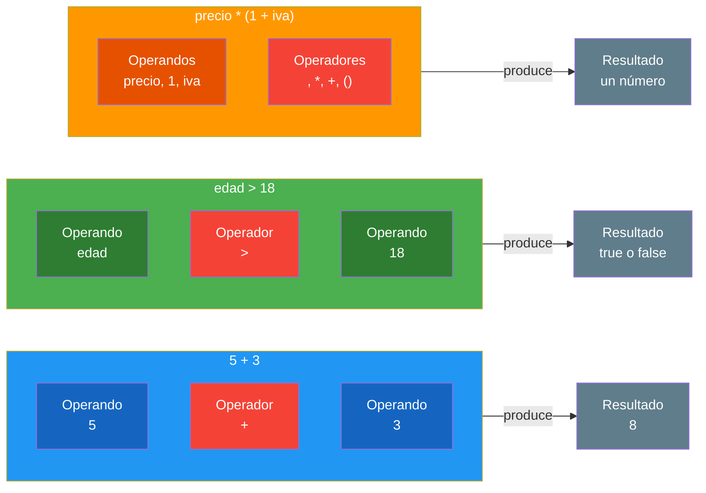
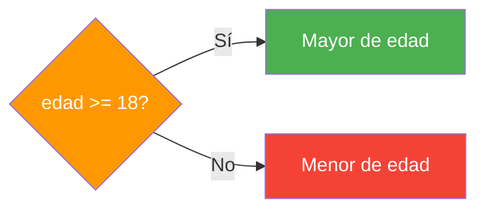
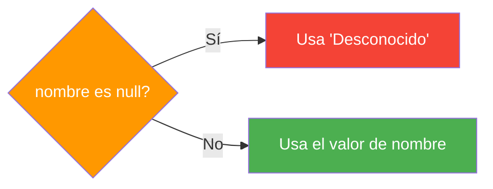

- [7. Operadores y Expresiones](#7-operadores-y-expresiones)
  - [7.1. ¿Qué es una expresión?](#71-qué-es-una-expresión)
  - [7.2. Operadores aritméticos](#72-operadores-aritméticos)
  - [7.3. Operadores de asignación](#73-operadores-de-asignación)
  - [7.4. Operadores relacionales](#74-operadores-relacionales)
  - [7.5. Operadores lógicos](#75-operadores-lógicos)
  - [7.6. Precedencia de operadores](#76-precedencia-de-operadores)


# 7. Operadores y Expresiones

> 💡 **Punto de partida:** ¿Alguna vez has usado una calculadora? Estás usando operadores: + para sumar, - para restar, * para multiplicar. En programación, los operadores son las herramientas que transforman datos. Sin ellos, las variables serían solo datos estáticos sin vida.

En este tema aprenderás los diferentes tipos de operadores de C# y cómo combinarlos en expresiones.

**Objetivos de aprendizaje:**

- Usar operadores aritméticos para cálculos
- Aplicar operadores de asignación
- Comparar valores con operadores relacionales
- Combinar condiciones con operadores lógicos
- Conocer la precedencia de operadores

## 7.1. ¿Qué es una expresión?

Una **expresión** es una combinación de valores, variables, constantes y operadores que produce un resultado.

```csharp
// Expresiones simples
5 + 3           // Resultado: 8
edad > 18       // Resultado: true o false
"Ana" + " Ana"  // Resultado: "Ana Ana"

// Expresiones complejas
(edad >= 18) && (nombre.Length > 3)
```

> 💡 **Analogía:** Una expresión es como una receta de cocina. Los ingredientes son los valores/variables, y los operadores son las instrucciones (mezclar, calentar, cortar). El resultado es el plato final.

### Anatomía de una expresión

Toda expresión se compone de **operandos** y **operadores**:

- **Operando:** Es el dato sobre el que se opera (un número, una variable, un valor)
- **Operador:** Es la instrucción que se aplica sobre los operandos (`+`, `-`, `>`, `&&`...)
- **Expresión:** Es el resultado de combinar operandos con operadores



| Parte | ¿Qué es? | Ejemplo en `5 + 3` |
| :--- | :--- | :--- |
| **Operando** | El dato sobre el que se opera | `5` y `3` |
| **Operador** | La instrucción que se aplica | `+` |
| **Expresión** | La combinación completa | `5 + 3` |
| **Resultado** | Lo que produce la expresión | `8` |

> 📝 **Nota:** Una expresión puede tener muchos operandos y operadores: `precio * (1 + iva) / descuento` tiene 3 operandos (`precio`, `1`, `iva`, `descuento`) y 4 operadores (`*`, `+`, `(`, `)`, `/`). Pero siempre produce **un solo resultado**.

## 7.2. Operadores aritméticos

| Operador | Nombre | Ejemplo | Resultado |
|----------|--------|---------|-----------|
| `+` | Suma | `5 + 3` | `8` |
| `-` | Resta | `5 - 3` | `2` |
| `*` | Multiplicación | `5 * 3` | `15` |
| `/` | División | `5 / 3` | `1` (entero) |
| `%` | Módulo (resto) | `5 % 3` | `2` |
| `++` | Incremento | `x++` | `x = x + 1` |
| `--` | Decremento | `x--` | `x = x - 1` |

**Ejemplos:**

```csharp
int a = 10;
int b = 3;

Console.WriteLine(a + b);   // 13 (suma)
Console.WriteLine(a - b);   // 7  (resta)
Console.WriteLine(a * b);   // 30 (multiplicación)
Console.WriteLine(a / b);   // 3  (división entera: 10/3 = 3.33... → 3)
Console.WriteLine(a % b);   // 1  (módulo: resto de 10/3)

// Incremento y decremento
int contador = 0;
contador++;     // contador = 1
contador++;     // contador = 2
contador--;     // contador = 1
```

> ⚠️ **Advertencia:** La división entre enteros trunca el resultado (no redondea). `10 / 3` da `3`, no `3.33`. Para obtener decimales, al menos uno de los operandos debe ser decimal:

```csharp
int a = 10;
int b = 3;

double resultado1 = a / b;        // 3.0 (se convierte DESPUÉS)
double resultado2 = (double)a / b; // 3.333... (se convierte ANTES)
```

📌 **Ejemplo real:** El módulo (`%`) se usa para saber si un número es par: `numero % 2 == 0` significa que el resto al dividir entre 2 es cero, es decir, es par.

## 7.3. Operadores de asignación

| Operador | Ejemplo | Equivalente |
|----------|---------|-------------|
| `=` | `x = 5` | Asignación simple |
| `+=` | `x += 3` | `x = x + 3` |
| `-=` | `x -= 3` | `x = x - 3` |
| `*=` | `x *= 3` | `x = x * 3` |
| `/=` | `x /= 3` | `x = x / 3` |
| `%=` | `x %= 3` | `x = x % 3` |

**Ejemplos:**

```csharp
int total = 100;

total += 50;    // total = 150
total -= 20;    // total = 130
total *= 2;     // total = 260
total /= 4;     // total = 65
total %= 10;    // total = 5
```

> 💡 **Consejo:** Los operadores de asignación compuesta (`+=`, `-=`, etc.) son más legibles y concisos que escribir `x = x + 3`.

### ⚠️ Cuidado: `+=` no es lo mismo que `=+`

Este es un error muy común de principiantes. Aunque parecen iguales, significan cosas completamente diferentes:

```csharp
int x = 5;

x += 3;   // x = x + 3  →  x = 8  ✅ Suma 3 a x
x = +3;   // x = (+3)    →  x = 3  ❌ Asigna +3 a x (el + es unario)

int y = 10;
y += 5;   // y = y + 5  →  y = 15  ✅ Suma 5 a y
y = +5;   // y = (+5)    →  y = 5   ❌ Asigna +5 a y
```

> ⚠️ **Advertencia:** `+=` es "suma y asigna" (el operador de suma compuesto). `=+` es "asigna un positivo" (asignación + operador unario `+`). No los confundas, porque el compilador no da error pero el resultado es muy diferente.

| Expresión | Significado | Resultado con x=5 |
|-----------|-------------|-------------------|
| `x += 3` | x = x + 3 | x = 8 |
| `x = +3` | x = (+3) | x = 3 |
| `x -= 3` | x = x - 3 | x = 2 |
| `x = -3` | x = (-3) | x = -3 |

## 7.4. Operadores relacionales

Los operadores relacionales comparan valores y devuelven un `bool` (`true` o `false`).

| Operador | Nombre | Ejemplo | Resultado |
|----------|--------|---------|-----------|
| `==` | Igual a | `5 == 5` | `true` |
| `!=` | Distinto de | `5 != 3` | `true` |
| `>` | Mayor que | `5 > 3` | `true` |
| `<` | Menor que | `5 < 3` | `false` |
| `>=` | Mayor o igual | `5 >= 5` | `true` |
| `<=` | Menor o igual | `3 <= 5` | `true` |

**Ejemplos:**

```csharp
int edad = 25;

bool esMayorDeEdad = edad >= 18;    // true
bool esMenor = edad < 18;           // false
bool esIgual = edad == 25;          // true
bool esDistinto = edad != 30;       // true

// Usando en una condición
if (edad >= 18)
{
    Console.WriteLine("Eres mayor de edad");
}
```

> ⚠️ **Advertencia:** `==` (comparación) no es lo mismo que `=` (asignación). Es un error muy común confundirlos:

```csharp
// ❌ MALO: esto asigna, no compara
if (x = 5) { }  // Error de compilación

// ✅ BUENO: esto compara
if (x == 5) { }
```

## 7.5. Operadores lógicos

Los operadores lógicos combinan expresiones booleanas.

| Operador | Nombre | Ejemplo | Resultado |
|----------|--------|---------|-----------|
| `&&` | AND (y) | `true && false` | `false` |
| `\|\|` | OR (o) | `true \|\| false` | `true` |
| `!` | NOT (no) | `!true` | `false` |

**Tabla de verdad del AND (`&&`):**

| A | B | A && B |
|---|---|--------|
| true | true | true |
| true | false | false |
| false | true | false |
| false | false | false |

**Tabla de verdad del OR (`||`):**

| A | B | A \|\| B |
|---|---|----------|
| true | true | true |
| true | false | true |
| false | true | true |
| false | false | false |

**Tabla de verdad del NOT (`!`):**

| A | !A |
|---|-----|
| true | false |
| false | true |

> 📝 **Nota:** El NOT solo tiene **un operando**. Simplemente invierte el valor: lo que era `true` se convierte en `false` y viceversa.

**Ejemplos:**

```csharp
int edad = 25;
bool tienePermiso = true;

// AND: ambas condiciones deben ser true
bool puedeEntrar = (edad >= 18) && tienePermiso;  // true

// OR: al menos una debe ser true
bool esFinDeSemana = (dia == "Sabado") || (dia == "Domingo");  // true

// NOT: invierte el valor
bool noEsActivo = !activo;  // Si activo es true, esto es false
```

> 💡 **Analogía:** AND es como pedir prestado dinero: el banco te pide que cumplas TODAS las condiciones (tener trabajo Y no tener deudas). OR es como una puerta con dos cerraduras: con abrir una de las dos es suficiente.

📌 **Ejemplo real:** Netflix usa operadores lógicos para recomendarte contenido: "si te gustó la película X **Y** es de género suspense **O** es de terror, entonces te recomendamos..."

### Leyes de De Morgan

Las Leyes de De Morgan permiten simplificar expresiones lógicas negando por separado:

| Ley | Expresión original | Equivalente simplificado |
|-----|--------------------|--------------------------|
| **Ley 1** | `!(A && B)` | `!A \|\| !B` |
| **Ley 2** | `!(A \|\| B)` | `!A && !B` |

**¿Por qué son equivalentes?** Veámoslo con tablas de verdad. Si compruebas columna por columna, los resultados son **idénticos**:

#### Ley 1: `!(A && B)` es lo mismo que `!A || !B`

| A | B | A && B | **!(A && B)** | !A | !B | **!A \|\| !B** |
|:---:|:---:|:------:|:-------------:|:---:|:---:|:--------------:|
| true | true | true | **false** | false | false | **false** |
| true | false | false | **true** | false | true | **true** |
| false | true | false | **true** | true | false | **true** |
| false | false | false | **true** | true | true | **true** |

> Las columnas en negrita son **idénticas**: `!(A && B)` y `!A || !B` siempre dan el mismo resultado.

#### Ley 2: `!(A || B)` es lo mismo que `!A && !B`

| A | B | A \|\| B | **!(A \|\| B)** | !A | !B | **!A && !B** |
|:---:|:---:|:-------:|:---------------:|:---:|:---:|:------------:|
| true | true | true | **false** | false | false | **false** |
| true | false | true | **false** | false | true | **false** |
| false | true | true | **false** | true | false | **false** |
| false | false | false | **true** | true | true | **true** |

> Las columnas en negrita son **idénticas**: `!(A || B)` y `!A && !B` siempre dan el mismo resultado.

```csharp
// Ley 1: Negación de un AND
bool a = true;
bool b = false;

bool original1 = !(a && b);     // true (no son ambos true)
bool simplificado1 = !a || !b;  // true (a es false O b es true)

// Ley 2: Negación de un OR
bool original2 = !(a || b);     // false (al menos uno es true)
bool simplificado2 = !a && !b;  // false (a no es true Y b no es true)
```

> 💡 **Consejo:** Las Leyes de De Morgan son muy útiles para simplificar condiciones complejas y hacer el código más legible.

### Cortocircuito (Short-circuit)

Los operadores `&&` y `||` usan **cortocircuito**: si el resultado final ya está determinado por el primer operando, no evalúa el segundo.

```csharp
// Si x es 0, NO evalúa la división (evita error)
if (x != 0 && 10 / x > 2)
{
    // Solo llega aquí si x no es 0
}
```

### Asignación nula condicional (??=)

El operador `??=` asigna un valor **solo si la variable es null**. Es útil para inicializar variables de forma condicional:

```csharp
string? nombre = null;

// Sin ??=
if (nombre == null)
{
    nombre = "Anónimo";
}

// Con ??= (mucho más conciso)
nombre ??= "Anónimo";  // Solo asigna si es null

// Otro ejemplo: inicializar una lista solo si es null
List<string>? items = null;
items ??= new List<string>();  // Crea la lista solo si no existía
```

> 💡 **Consejo:** `??=` es especialmente útil en constructores y métodos de inicialización donde quieres establecer un valor por defecto solo si nadie lo ha establecido antes.

## 7.6. Precedencia de operadores

Cuando una expresión tiene varios operadores, se evalúan en un orden determinado (**precedencia**):

| Prioridad | Operadores | Descripción |
|-----------|------------|-------------|
| 1 (alta) | `()` | Paréntesis |
| 2 | `++` `--` `!` | Unarios |
| 3 | `*` `/` `%` | Multiplicación, división, módulo |
| 4 | `+` `-` | Suma, resta |
| 5 | `<` `>` `<=` `>=` | Relacionales |
| 6 | `==` `!=` | Igualdad |
| 7 | `&&` | AND lógico |
| 8 (baja) | `\|\|` | OR lógico |

```csharp
// Sin paréntesis: primero *, luego +
int resultado1 = 2 + 3 * 4;    // 14 (3*4=12, luego 2+12)

// Con paréntesis: primero lo que está dentro
int resultado2 = (2 + 3) * 4;  // 20 (2+3=5, luego 5*4)
```

> 💡 **Consejo:** Cuando dudes de la precedencia, usa paréntesis. Es más legible y evita errores.

📌 **Ejemplo real de error por precedencia:** Imagina que estás calculando el precio con IVA y un descuento en una tienda online:

```csharp
// ❌ ERROR REAL: el programador pensó que primero se sumaba el IVA
double precioFinal = precioBase + iva * (1 - descuento);
// Si precioBase=100, iva=21, descuento=0.1:
// El programa calcula: 100 + 21 * 0.9 = 100 + 18.9 = 118.9
// El programador quería: (100 + 21) * 0.9 = 108.9

// ✅ CORRECTO: con paréntesis explícitos
double precioFinal = (precioBase + iva) * (1 - descuento);
// Resultado: 108.9 ✅
```

> ⚠️ **Advertencia:** Este tipo de error **no produce error de compilación** — el código compila perfectamente, pero el resultado es incorrecto. Son los errores más peligrosos porque pasan desapercibidos.

### Operador ternario (`? :`)

El operador ternario elige **uno de dos valores** dependiendo de una condición. Es como una pregunta con dos posibles respuestas:

```
(condición) ? valor_si_true : valor_si_false
```

```csharp
int edad = 20;

// Si edad >= 18, elige "Mayor de edad". Si no, elige "Menor de edad"
string mensaje = (edad >= 18) ? "Mayor de edad" : "Menor de edad";

Console.WriteLine(mensaje);  // "Mayor de edad"
```



> 💡 **Analogía:** Es como un semáforo: si está en verde, vas. Si está en rojo, paras. Una condición, dos caminos posibles.

### Operador de coalescencia nula (`??`)

El operador `??` mira si un valor es `null`. Si **no es null**, usa ese valor. Si **es null**, usa el valor de la derecha como alternativa:

```csharp
string? nombre = null;
string nombreFinal = nombre ?? "Desconocido";
Console.WriteLine(nombreFinal);  // "Desconocido" (porque nombre era null)

string? apellido = "García";
string apellidoFinal = apellido ?? "Desconocido";
Console.WriteLine(apellidoFinal);  // "García" (porque apellido NO era null)
```



> 📝 **Nota:** `??` es muy útil para asignar valores por defecto cuando una variable puede ser `null`. Verás más sobre `null` en el punto anterior (§6.2).

---

**Resumen del punto:**

| Tipo de operador | Operadores | Uso |
|------------------|------------|-----|
| **Aritméticos** | `+`, `-`, `*`, `/`, `%`, `++`, `--` | Cálculos matemáticos |
| **Asignación** | `=`, `+=`, `-=`, `*=`, `/=`, `%=` | Asignar valores |
| **Relacionales** | `==`, `!=`, `>`, `<`, `>=`, `<=` | Comparar valores |
| **Lógicos** | `&&`, `\|\|`, `!` | Combinar condiciones |
| **Ternario** | `? :` | If-else abreviado |
| **Coalescencia** | `??` | Valor por defecto si es null |

En el siguiente punto veremos las conversiones de tipo: implícitas, explícitas, Parse, TryParse y Convert.
