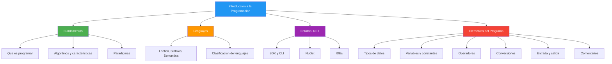

- [11. Resumen de la Unidad](#11-resumen-de-la-unidad)
  - [11.1. Mapa conceptual](#111-mapa-conceptual)
  - [11.2. Checklist de supervivencia](#112-checklist-de-supervivencia)
  - [11.3. Errores comunes a evitar](#113-errores-comunes-a-evitar)
  - [11.4. Lo que hemos aprendido](#114-lo-que-hemos-aprendido)

# 11. Resumen de la Unidad

> 💡 **Punto de partida:** Llevas toda la unidad aprendiendo conceptos. Ahora es el momento de ordenar todo en tu cabeza. ¿Qué te llevas de aquí?

## 11.1. Mapa conceptual

## 11.2. Checklist de supervivencia

Comprueba si dominas estos puntos antes de pasar a la siguiente unidad:

- [ ] Sé explicar qué es un programa y qué es un algoritmo
- [ ] Conozco las 6 características de un algoritmo (finito, definido, preciso, entrada, salida, efectividad)
- [ ] Sé la diferencia entre léxico, sintaxis y semántica
- [ ] Sé crear una solución y un proyecto con la CLI (`dotnet new sln`, `dotnet new console`)
- [ ] Entiendo la diferencia entre `.slnx` y `.csproj`
- [ ] Sé usar Top-Level Statements en C# 14
- [ ] Conozco los tipos de datos: `int`, `long`, `float`, `double`, `decimal`, `bool`, `char`, `string`
- [ ] Sé la diferencia entre enteros con signo y sin signo
- [ ] Sé declarar variables y constantes
- [ ] Conozco los operadores aritméticos, relacionales, lógicos, de asignación, ternario y de coalescencia
- [ ] Sé la diferencia entre conversión implícita y explícita
- [ ] Sé usar `Console.WriteLine` y `Console.ReadLine`
- [ ] Conozco la interpolación de strings con `$""`
- [ ] Sé escribir comentarios de una línea, varias líneas y documentación XML
- [ ] Entiendo qué es `using static` y para qué sirve

## 11.3. Errores comunes a evitar

| Error | Por qué está mal | Cómo evitarlo |
|-------|------------------|---------------|
| Olvidar `;` al final | C# es estricto con punto y coma | Revisar cada línea |
| Confundir `=` y `==` | `=` es asignación, `==` es comparación | Usar `==` en condiciones |
| División entre enteros | `10/3` da `3`, no `3.33` | Convertir a `double` antes: `(double)10/3` |
| No inicializar variables | Puede dar error al usarlas | Siempre asignar un valor al declarar |
| Usar `Parse` sin validar | Si el usuario no mete un número, salta excepción | Usar `TryParse` |
| Confundir `Write` y `WriteLine` | `Write` no salta de línea | `WriteLine` para nueva línea |

## 11.4. Lo que hemos aprendido

| Tema | Lo más importante |
|------|-------------------|
| **Fundamentos** | Programar es resolver problemas con instrucciones precisas |
| **Algoritmos** | Plan ordenado con 6 características: finito, definido, preciso, entrada, salida, efectividad |
| **Entorno .NET** | SDK, CLI, NuGet, IDE (Rider recomendado) |
| **Soluciones y proyectos** | `.slnx` agrupa proyectos, `.csproj` configura uno |
| **Estructura** | Top-Level Statements para empezar fácil |
| **Tipos de datos** | `int` por defecto, `decimal` para dinero, `string` para texto |
| **Variables** | camelCase, siempre inicializar |
| **Constantes** | `const`, nunca cambian, PascalCase |
| **Operadores** | Aritméticos, relacionales, lógicos, ternario `? :`, coalescencia `??` |
| **Conversiones** | Implícita (segura), explícita (casting), `TryParse` (seguro) |
| **Entrada/Salida** | `WriteLine`, interpolación `$""`, `ReadLine` |
| **Comentarios** | `//` una línea, `/* */` varias, `///` documentación XML |

> 💡 **Consejo para el examen:** Repasa el checklist. Si marcas todos los puntos, estás listo para el examen de esta unidad. Si falta alguno, revisa el tema correspondiente.

> 🔧 **Truco:** La mejor forma de aprender programación es practicando. No leas solo los apuntes: abre el IDE y prueba cada ejemplo. Modifícalos, rompelos, arreglalos. Eso es como se aprende.
